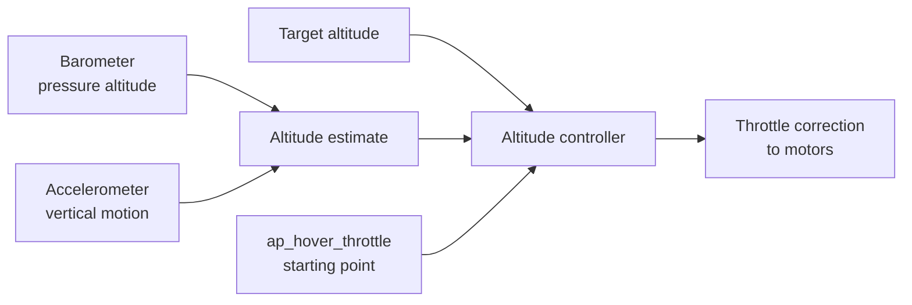

Betaflight Altitude Hold (`ALTHOLD`) automatically changes motor throttle to keep a quad near a target altitude. It is useful when the pilot wants to pause a climb or descent, reduce throttle workload during a steady shot, or gain time during an unexpected distraction.

This guide covers a **real, generic FPV quad using a barometer only**. It targets the latest stable firmware at the time of writing, **Betaflight 2025.12.5**. It does not cover Position Hold, autonomous flight, GPS altitude, or rangefinder setup.

!!! danger "Altitude Hold is an aid, not an autonomous safety system"
    The quad can still drift horizontally. Wind, prop wash, temperature changes, incorrect hover throttle, or bad sensor data can cause it to climb or descend. Test line of sight in an empty outdoor area and remain ready to disable the mode or disarm.

## What Altitude Hold controls



When the mode is engaged, Betaflight records the current altitude as the target. It starts near `ap_hover_throttle`, then the altitude controller adds or removes throttle to correct vertical error.

Altitude Hold does **not** hold horizontal position. The pilot retains roll, pitch, and yaw control, and the quad can drift with wind. The mode uses self-level behavior, so the stick response differs from normal Acro flight.

## Throttle-stick behavior

| Throttle input | Result |
| --- | --- |
| Inside the deadband around hover throttle | Hold the current target altitude |
| Above the deadband | Climb; more stick produces a faster climb |
| Below the deadband | Descend |
| All the way to zero while `ALTHOLD` remains active | Hold altitude rather than stop the motors |

!!! warning "Take control when leaving Altitude Hold"
    If the throttle stick is at zero when `ALTHOLD` is disabled, normal throttle control returns immediately and the quad can drop. Before disabling the mode, move the stick to approximately the manual hover position and be ready to correct it.

## Hardware and firmware requirements

- A multirotor flight controller with a supported barometer.
- A working accelerometer with correct board alignment.
- Betaflight `2025.12.5` firmware built with **Altitude Hold** and the correct barometer driver.
- A spare AUX switch for the `ALTHOLD` mode.
- OSD flight-mode and altitude elements, strongly recommended.
- Enough open space to perform the first test line of sight.

GPS and a magnetometer are not required for the barometer-only procedure.

## Protect the barometer

A barometer estimates altitude from atmospheric pressure. It cannot distinguish a real altitude change from a short pressure disturbance caused by prop wash, wind, or heat.

Cover an exposed sensor with a small piece of clean, dry **open-cell foam**. The foam allows slow atmospheric-pressure changes through while reducing short pressure pulses.

Do not:

- use closed-cell foam;
- seal the pressure port with tape or glue;
- compress the foam tightly against the sensor;
- apply conformal coating over the barometer port; or
- assume more foam is better when the board already has a protected barometer.

The sensor must still respond when the quad is lifted by approximately one metre. Excessively dense or compressed foam can make it respond too slowly.

## Back up before changing anything

Remove the propellers, connect the flight controller, open the CLI, and save the current configuration:

```text
version
status
diff all
dump all
```

Use the CLI **Save to File** function to store both `diff all` and `dump all`. The smaller `diff all` is normally the useful restore file; `dump all` is a complete reference.

Record the current Altitude Hold settings separately:

```text
get altitude_source
get altitude_prefer_baro
get altitude_lpf
get altitude_d_lpf
get ap_hover_throttle
get ap_throttle_min
get ap_throttle_max
get ap_altitude
get alt_hold
```

!!! info "Screenshot: configuration backup"
    Capture the CLI after `version` and `diff all`, including the firmware version and target. Save it as `images/01-cli-backup.png` when preparing the final hardware screenshots.

## Confirm the correct firmware build

In the Firmware Flasher, select stable `2025.12.5`, choose the exact flight-controller target, and include:

- `ALTITUDE_HOLD`;
- the accelerometer/gyro drivers required by the board; and
- the barometer driver required by the board.

Do not flash until the current configuration is backed up and the exact target is confirmed.

After flashing, reconnect and verify:

```text
version
status
```

The `status` output should report both the accelerometer and barometer as detected.

!!! info "Screenshot: firmware build options"
    Capture the Firmware Flasher with the target, stable version, `ALTITUDE_HOLD`, and barometer build options visible. Save it as `images/02-firmware-options.png`.

## Verify the accelerometer

Place the quad on a truly level, motionless surface and calibrate the accelerometer from the Setup tab. Then lift and rotate the quad by hand. The 3D model must follow the real quad correctly on roll, pitch, and yaw.

An incorrect board orientation or poor accelerometer calibration makes self-level modes unsafe. Correct that before testing Altitude Hold.

!!! info "Screenshot: Setup tab"
    Capture the level quad in the Setup tab with the accelerometer and barometer indicators active. Save it as `images/03-setup-sensors.png`.

## Verify the barometer

Open the Sensors tab, select the barometer/altitude trace, and leave the quad stationary for a few minutes.

Check that:

- the altitude does not continuously run away while stationary;
- lifting the quad about one metre produces approximately one metre of change;
- returning it to the same surface brings the reading near its starting value; and
- gently moving air near the flight controller does not cause extreme spikes.

Some noise and delay are normal. A strong response to air movement indicates that the barometer needs better protection.

For a deeper check:

```text
set debug_mode = BARO
save
```

The `BARO` debug mode exposes the sensor state, pressure, temperature, and barometer-only altitude. Restore the previous debug mode after testing if another feature uses it.

!!! info "Screenshot: barometer trace"
    Capture the Sensors tab at rest and during a controlled one-metre lift. Save it as `images/04-baro-one-meter-test.png`.

## Force barometer-only altitude

For this guide, use the barometer as the only altitude source:

```text
set altitude_source = BARO_ONLY
save
```

Confirm it after reconnecting:

```text
get altitude_source
```

`altitude_prefer_baro` only controls weighting when `altitude_source` is `DEFAULT` and both GPS and barometer data are available. It has no practical tuning role in this `BARO_ONLY` setup.

## Configure the mode switch

In the Modes tab:

1. Find `ALTHOLD`.
2. Assign it to an unused AUX channel.
3. Set a range that activates only in the intended switch position.
4. Confirm the indicator enters and leaves the range reliably.
5. Keep `ALTHOLD` off while arming.

A three-position switch is useful:

| Position | Suggested function |
| --- | --- |
| 1 | Normal flight |
| 2 | Angle mode for checking self-level behavior |
| 3 | Altitude Hold |

!!! info "Screenshot: Modes tab"
    Capture the `ALTHOLD` AUX assignment with the switch marker inside the active range. Save it as `images/05-althold-mode.png`.

## Configure the OSD

Enable at least:

- flight mode;
- altitude;
- throttle position;
- warnings; and
- battery voltage.

The flight-mode element confirms that `ALTHOLD` actually engaged. Altitude and throttle help diagnose the engagement response without looking away from the aircraft for long.

!!! info "Screenshot: OSD elements"
    Capture the OSD tab with these elements highlighted. Save it as `images/06-osd-elements.png`.

## Understand the parameters

Defaults and allowed ranges below are from the Betaflight `2025.12.5` source.

| Parameter | Default | Purpose | First-flight advice |
| --- | ---: | --- | --- |
| `ap_hover_throttle` | `1275` | Initial throttle used when hold engages | Tune this first |
| `ap_throttle_min` | `1100` | Lowest throttle the controller may request | Leave at default initially |
| `ap_throttle_max` | `1700` | Highest throttle the controller may request | Leave at default initially |
| `alt_hold_climb_rate` | `50` | Maximum commanded vertical speed; `50` represents 5 m/s | Reduce for gentler response if needed |
| `alt_hold_deadband` | `20` | Percentage of throttle travel around hover where altitude is held | Leave at default initially |
| `ap_altitude_p` | `15` | Correction proportional to altitude error | Leave at default until basic tests pass |
| `ap_altitude_i` | `15` | Corrects persistent altitude error | Leave at default until logs are available |
| `ap_altitude_d` | `15` | Damps vertical motion | Leave at default until logs are available |
| `ap_altitude_f` | `15` | Feed-forward contribution | Leave at default until logs are available |
| `altitude_lpf` | `300` | Altitude low-pass cutoff, value divided by 100 Hz | Default equals 3 Hz |
| `altitude_d_lpf` | `100` | Vertical-derivative low-pass cutoff, value divided by 100 Hz | Default equals 1 Hz |

## Find the real hover throttle

`ap_hover_throttle` is the most important practical setting. If it is too low, the quad drops when Altitude Hold engages. If it is too high, the quad climbs.

1. Use a normally charged battery—not a nearly empty or unusually fresh pack.
2. Fly in calm conditions.
3. Establish a stable manual hover in Angle mode.
4. Observe the OSD throttle value for several seconds.
5. Land and disarm.
6. Use that value as the initial `ap_hover_throttle`.

Example only:

```text
set ap_hover_throttle = 1275
save
```

Do not copy `1275` blindly. A heavy quad, different propeller, battery voltage, throttle scaling, or motor-output limit changes the real hover point.

## Safety-first test flight

Choose a large, empty outdoor area with flat ground, calm wind, no people nearby, and no obstacles above the test area. Use line of sight; do not begin through goggles.

Before takeoff:

- confirm props, motor direction, controls, failsafe, and battery condition;
- confirm the barometer trace passed the stationary and one-metre tests;
- verify Angle mode self-leveling in a previous flight;
- verify the `ALTHOLD` switch begins off;
- rehearse which switch direction disables the mode; and
- decide on a safe disarm action if the quad accelerates unexpectedly.

Test procedure:

1. Arm with `ALTHOLD` off.
2. Take off normally and establish a stable hover at approximately 2–3 m.
3. Center the quad over an empty area and keep the throttle near manual hover.
4. Enable `ALTHOLD` for one or two seconds.
5. Disable immediately if the quad climbs, drops, oscillates, or tilts unexpectedly.
6. If engagement is calm, leave it active briefly and make small roll, pitch, and yaw corrections.
7. Test a small climb and descent using gentle throttle movement.
8. Return the throttle to approximately manual hover before disabling `ALTHOLD`.
9. Disable the mode, take over throttle smoothly, then land.

Do not tune during the flight. Land, disarm, change one value, record it, and repeat.

## Practical tuning order

### 1. Correct engagement with `ap_hover_throttle`

- Immediate drop: increase `ap_hover_throttle` slightly.
- Immediate climb: decrease it slightly.
- No obvious bump: continue to the hold test.

Use small changes, for example 10–20 units at a time, and repeat the same engagement test.

### 2. Adjust climb response

If full-stick climb or descent is too fast for safe testing, reduce `alt_hold_climb_rate`:

```text
set alt_hold_climb_rate = 30
save
```

Here, `30` represents approximately 3 m/s at full command. Confirm the value supported by the connected firmware with `get alt_hold_climb_rate` before changing it.

### 3. Adjust the throttle deadband only if necessary

A larger `alt_hold_deadband` makes it easier to remain in hold but requires more stick movement to command a climb or descent. A smaller value feels more responsive but makes accidental altitude commands easier.

```text
set alt_hold_deadband = 20
save
```

Keep the default for the first flights.

### 4. Leave altitude gains and filters for logged tuning

Do not use `ap_altitude_p/i/d/f`, `altitude_lpf`, or `altitude_d_lpf` to hide a bad barometer installation. First resolve airflow, temperature, vibration, calibration, and hover-throttle problems.

Advanced gain and filter tuning should wait until a repeatable test and Blackbox data are available.

## Troubleshooting

| Symptom | Likely cause | First action |
| --- | --- | --- |
| Drops as soon as `ALTHOLD` engages | `ap_hover_throttle` too low | Increase it in small steps |
| Climbs as soon as it engages | `ap_hover_throttle` too high | Decrease it in small steps |
| Altitude wanders slowly | Temperature drift or pressure changes | Warm up, inspect placement, repeat stationary test |
| Altitude jumps in wind or prop wash | Barometer exposed to turbulent air | Add or improve open-cell foam protection |
| Rapid vertical oscillation | Noisy altitude/vertical-speed estimate or aggressive gains | Stop testing; inspect sensor data before changing gains |
| Hold responds too slowly | Excessive filtering or low gains | Record a log before adjusting advanced settings |
| Cannot arm | `ALTHOLD` switch already active | Disable it before arming |
| Quad drops when mode is disabled | Throttle stick was too low during handover | Match manual hover throttle before disabling |
| Mode is missing | Firmware lacks `ALTITUDE_HOLD` | Rebuild for the exact target with the feature enabled |
| Barometer is not detected | Driver omitted, wrong bus configuration, or sensor needs LiPo power | Remove props, verify build and test with required power |

## Restore the original configuration

The safest restore method is to paste the previously saved `diff all` into the CLI and then run:

```text
save
```

To restore only the settings changed by this guide, use the values recorded before starting:

```text
set altitude_source = <original value>
set ap_hover_throttle = <original value>
set alt_hold_climb_rate = <original value>
set alt_hold_deadband = <original value>
save
```

## What about a rangefinder?

Betaflight 2026.6 documentation describes optical-flow and laser-rangefinder altitude hold with the Upixel UP-T1-001-Plus. That is a different estimator and hardware workflow from this stable `2025.12.5` barometer-only guide.

A downward rangefinder measures distance to the surface beneath the quad, not barometric altitude relative to takeoff. Slopes, roofs, trees, water, sensor tilt, and the maximum measurement range all affect it. Treat rangefinder integration as a separate future guide and do not assume a seamless rangefinder-to-barometer transition without hardware testing.

## Next step: Blackbox tuning

Once several safe flights are repeatable, record Blackbox data containing altitude, barometer, accelerometer, throttle, motors, flight-mode flags, and altitude-controller debug fields. That data can support a separate advanced guide for tuning gains and filters instead of guessing from visual behavior.

## References

- [Betaflight Position Hold and Altitude Hold guide](https://betaflight.com/docs/wiki/guides/current/Position-Hold-2025-12){:target="_blank"}
- [Betaflight Barometer guide](https://betaflight.com/docs/wiki/guides/current/Barometer){:target="_blank"}
- [Betaflight CLI reference](https://betaflight.com/docs/wiki/guides/current/Cli){:target="_blank"}
- [Betaflight 2025.12.5 release](https://github.com/betaflight/betaflight/releases/tag/2025.12.5){:target="_blank"}
- [Oscar Liang: Position Hold and Altitude Hold](https://oscarliang.com/betaflight-position-hold/){:target="_blank"}
