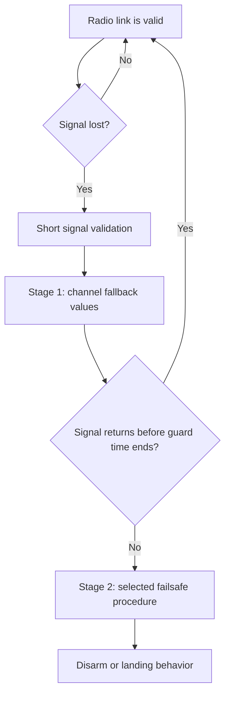

## What Failsafe Does

Failsafe is the behavior Betaflight uses when the flight controller loses a valid radio control signal.

For normal FPV quads, configure the receiver to send **no pulses / no data** on signal loss. This lets Betaflight detect the lost link and run its own failsafe logic. If the receiver keeps sending fake channel values, Betaflight may think the link is still valid.

## Failsafe Flow

## Stage 1

Stage 1 is the guard period after Betaflight detects bad or missing receiver data.

In this stage Betaflight applies the **Channel Fallback Settings**:

- `Auto`: roll, pitch, and yaw go to center; throttle goes low.
- `Hold`: keep the last valid channel value.
- `Set`: use a fixed value that you choose.

By default, Stage 1 lasts for `failsafe_delay`, commonly shown as the guard time for Stage 2 activation. The common default is `1.5s`, but check your firmware version and Configurator values.

If the signal returns during Stage 1, Betaflight exits failsafe and gives control back to the pilot.

!!! warning
    The default Stage 1 throttle fallback is low throttle, so the quad can start falling before Stage 2 begins.

## Stage 2

Stage 2 starts when the signal is still lost after the Stage 1 guard time and the quad is armed.

This is where the **Stage 2 Failsafe Procedure** is used. In the Failsafe tab you will usually see these procedures:

| Procedure | Meaning | Typical result |
| --- | --- | --- |
| `Drop` | Immediately stop motors and disarm | The quad falls straight down |
| `Land` | Try to descend using a configured throttle value | The quad keeps motors active for the landing delay, then disarms |

`Drop` is the default and simplest option. It is often the safest choice for freestyle or racing because the quad stops flying instead of drifting away.

`Land` can be useful only when you understand the required throttle value. If the throttle is too high, the quad may climb. If it is too low, it may fall quickly. Wind, battery voltage, prop size, payload, and tune all affect the result.

At the end of the Stage 2 procedure, Betaflight disarms. After a failsafe disarm, you normally must move the arm switch back to disarmed before you can arm again.

## Failsafe Switch

You can configure a transmitter switch in the Modes tab to trigger failsafe behavior manually.

Common switch behavior:

- `Stage 1`: run Stage 1 first, then Stage 2 if the switch stays active longer than the guard time.
- `Stage 2`: skip Stage 1 and activate the selected Stage 2 procedure immediately.
- `Kill`: disarm immediately.

Use this carefully and test without props first.

## Practical Setup Notes

- Use flight-controller based failsafe, not receiver-only failsafe.
- Receiver signal loss should produce no data to the flight controller.
- For small FPV quads, start with `Drop` unless you have a clear reason to use `Land`.
- Test with props removed: arm, raise throttle a little, turn off the transmitter, and confirm the motors stop after the expected delay.
- Do not rely on `Land` until it has been tested in a safe open area.

## Related CLI Settings

| Setting | Purpose |
| --- | --- |
| `failsafe_delay` | Stage 1 guard time before Stage 2 starts |
| `failsafe_procedure` | Selected Stage 2 procedure |
| `failsafe_off_delay` | Time before motors turn off in landing mode |
| `failsafe_switch_mode` | Behavior when failsafe is triggered from an AUX switch |

## References

- [Betaflight Failsafe Tab](https://betaflight.com/docs/wiki/app/failsafe-tab)
- [Betaflight Failsafe Guide](https://betaflight.com/docs/wiki/guides/current/Failsafe)
