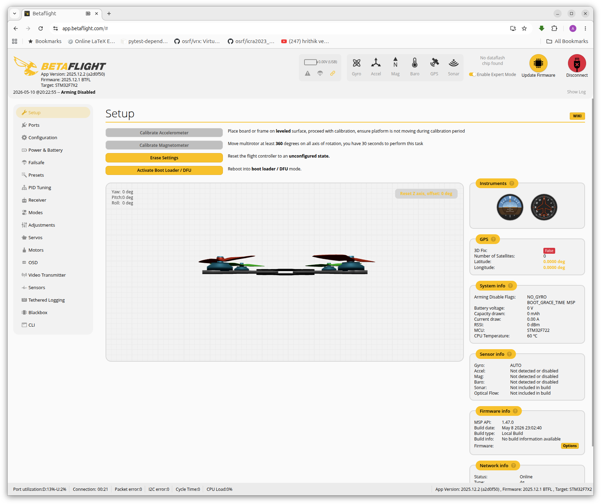
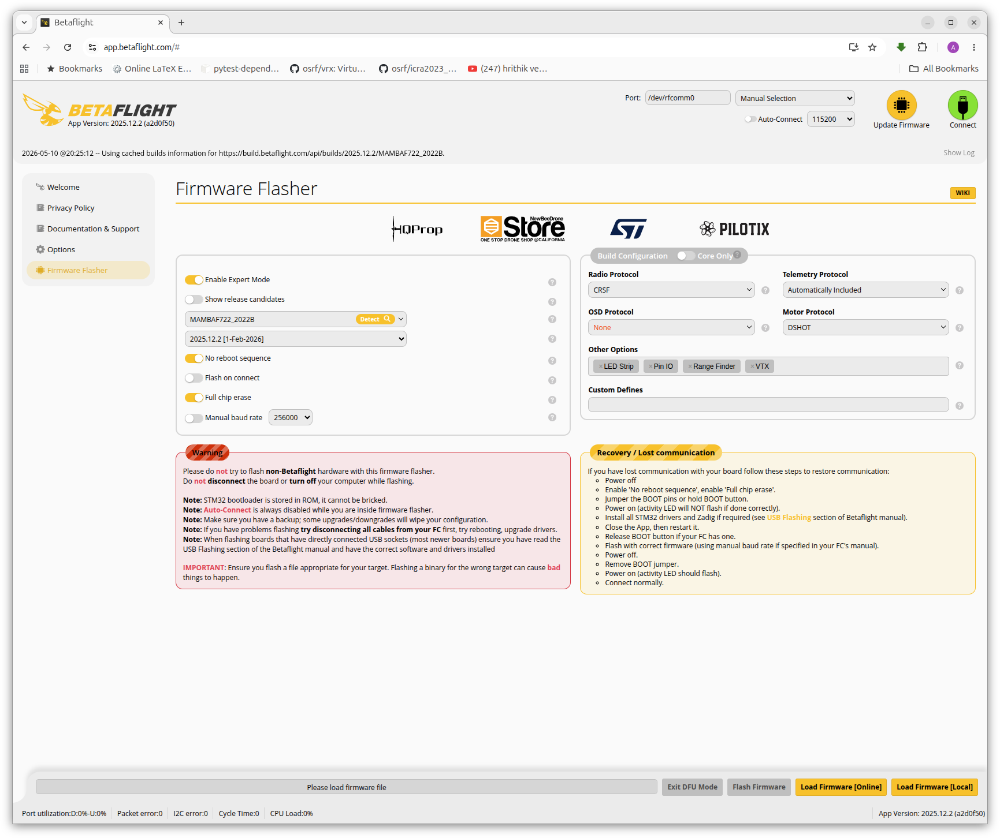
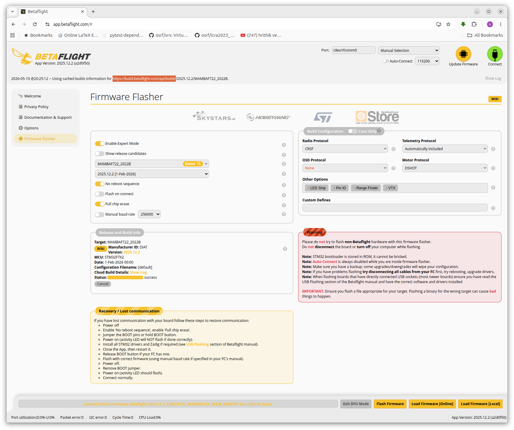
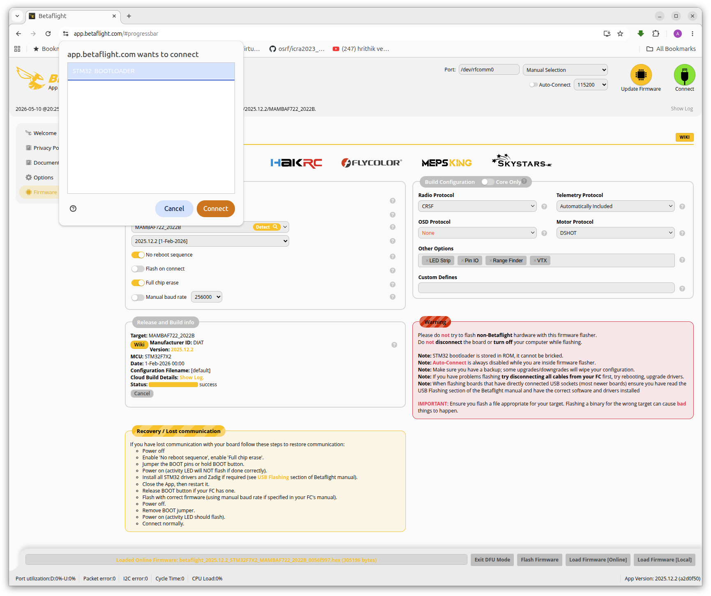

## Demo: using configure









---

## Demo: using dfu-util

```bash title="lsusb"
Bus 003 Device 044: ID 0835:8502 Action Star Enterprise Co., Ltd USB HID
Bus 003 Device 045: ID 2109:8886 VIA Labs, Inc. USB Billboard Device   
Bus 003 Device 066: ID 0483:5740 STMicroelectronics Virtual COM Port
Bus 004 Device 001: ID 1d6b:0003 Linux Foundation 3.0 root hub

```

```bash title="lsusb"
Bus 003 Device 045: ID 2109:8886 VIA Labs, Inc. USB Billboard Device   
Bus 003 Device 068: ID 0483:df11 STMicroelectronics STM Device in DFU Mode
Bus 004 Device 001: ID 1d6b:0003 Linux Foundation 3.0 root hub
```

### dfu-util

```
sudo apt install dfu-util
```

```bash title="size"
sudo dfu-util --list
dfu-util 0.11

...

Found DFU: [0483:df11] ver=2200, devnum=63, cfg=1, intf=0, path="3-2", alt=3, name="@Device Feature/0xFFFF0000/01*004 e", serial="STM32FxSTM32"
Found DFU: [0483:df11] ver=2200, devnum=63, cfg=1, intf=0, path="3-2", alt=2, name="@OTP Memory /0x1FF07800/01*528e", serial="STM32FxSTM32"
Found DFU: [0483:df11] ver=2200, devnum=63, cfg=1, intf=0, path="3-2", alt=1, name="@Option Bytes  /0x1FFF0000/01*048 e", serial="STM32FxSTM32"
Found DFU: [0483:df11] ver=2200, devnum=63, cfg=1, intf=0, path="3-2", alt=0, name="@Internal Flash  /0x08000000/04*016Kg,01*64Kg,03*128Kg", serial="STM32FxSTM32"
```

This means that flash size:

- 04*016Kg
  - 4 sectors × 16 KB
- 01*64Kg
  - 1 sector × 64 KB
- 03*128Kg
  - 3 sectors × 128 KB

```
4 × 16 KB  =  64 KB
1 × 64 KB  =  64 KB
3 × 128 KB = 384 KB
--------------------
Total      = 512 KB

Total size:
512 × 1024 = 524288 bytes
```


```bash title="stm => file"
sudo dfu-util -p 3-2 -a 0   -s 0x08000000:524288   -U flash_dump.bin
```

```bash title="file => stm"
sudo dfu-util -p 3-2 -a 0 -s 0x08000000:force:mass-erase:leave   -D flash_dump.bin
```

### udev rule

```bash
sudo usermod -a -G plugdev $USER
sudo usermod -a -G dialout $USER
sudo systemctl stop ModemManager.service
sudo systemctl disable ModemManager.service
```

```bash title="add udev"
(echo '# DFU (Internal bootloader for STM32 and AT32 MCUs)'
	echo 'ACTION=="add", SUBSYSTEM=="usb", ATTRS{idVendor}=="2e3c", ATTRS{idProduct}=="df11", MODE="0664", GROUP="plugdev"'
	echo 'ACTION=="add", SUBSYSTEM=="usb", ATTRS{idVendor}=="0483", ATTRS{idProduct}=="df11", MODE="0664", GROUP="plugdev"') | sudo tee /etc/udev/rules.d/45-stdfu-permissions.rules > /dev/null
```

```bash
sudo udevadm control --reload-rules
sudo udevadm trigger
```

---

## Reference
- [betaflight wiki](https://betaflight.com/docs/wiki/getting-started/firmware-installation)
- [How to Setup Betaflight on Your FPV Drone for the First Flight: Beginners Masterclass](https://oscarliang.com/install-betaflight-configurator-web-app/)