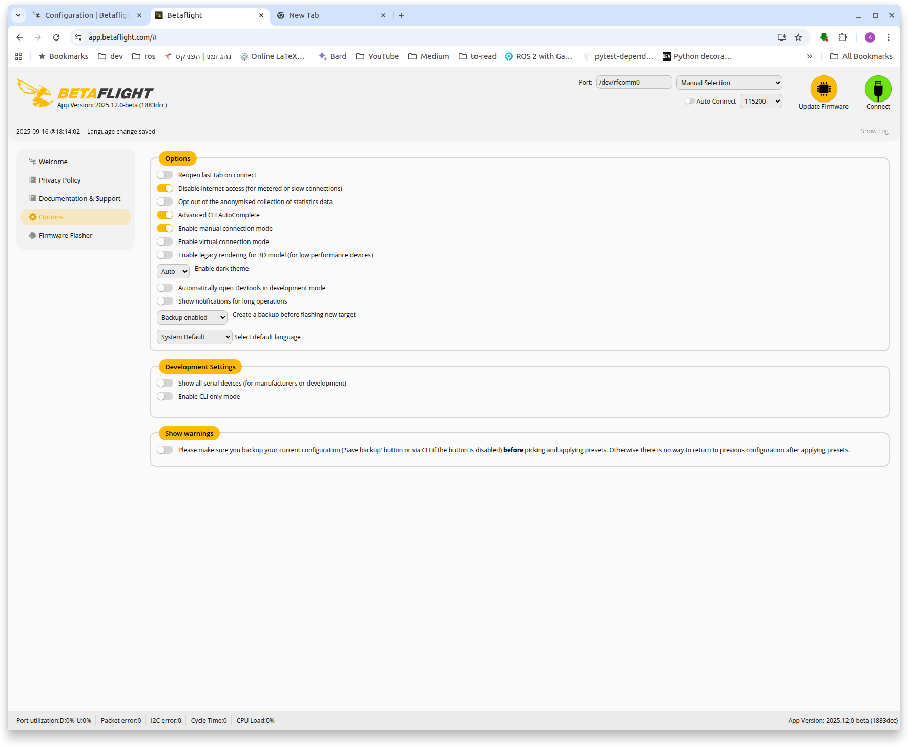
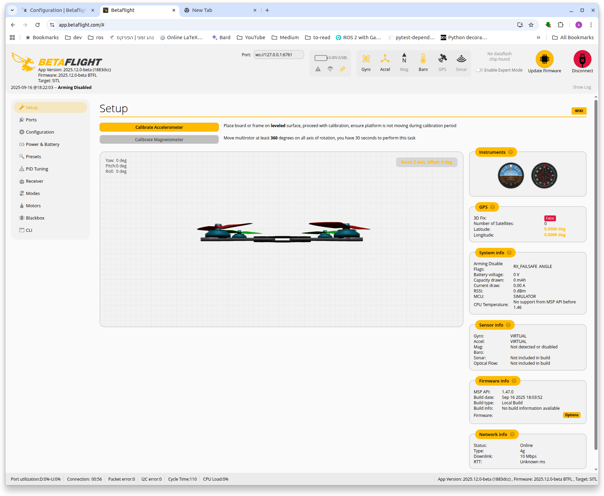
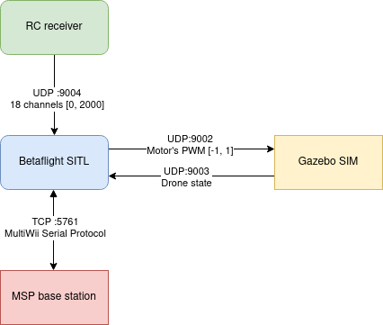

---
tags:
    - betaflight
---

<div class="grid-container">
    <div class="grid-item">
        <a href="firmware_install">
        <p>install firmware</p>
        </a>
    </div>
    <div class="grid-item">
        <a href="msp">
        <p>msp</p>
        </a>
    </div>
    <div class="grid-item">
        <a href="hardware">
        <p>hardware</p>
        </a>
    </div>
    <div class="grid-item">
        <a href="pid_tune">
        <p>pid tuning</p>
        </a>
    </div>
    <div class="grid-item">
        <a href="failsafe">
        <p>failsafe</p>
        </a>
    </div>
</div>

{{ page_folder_links() }}

[TO CHECK](https://betaflight.com/docs/development/autopilot/SITL_Autopilot_Testing_Gazebo)

- [aeroloop](https://github.com/betaflight/aeroloop_gazebo/tree/gz/)
- [Testing Betaflight Autopilot with SITL and Gazebo on Ubuntu 24.04](https://betaflight.com/docs/development/autopilot/SITL_Autopilot_Testing_Gazebo)
- [Fix calib arm disable flag for SITL#15073](https://github.com/betaflight/betaflight/pull/15073)
    - [SITL + Gazebo remains stuck on ARMING_DISABLED_CALIBRATING even though IMU attitude updates from Gazebo #15022](https://github.com/betaflight/betaflight/discussions/15022)


---

## Build firmware
### MAMBAF722

```
sudo apt update
sudo apt install git make gcc-arm-none-eabi binutils-arm-none-eabi
git clone https://github.com/betaflight/betaflight.git
cd betaflight
git submodule update --init --recursive
make MAMBAF722
```

# old

## betaflight sitl

!!! tip "build sitl as static binary"
    ```
    make TARGET=SITL OPTIONS=SITL_STATIC
    ```

```bash
sudo apt update && sudo apt upgrade
sudo apt -y install build-essential git curl clang-18 python3 python-is-python3
git clone https://github.com/betaflight/betaflight.git
cd betaflight
make arm_sdk_install
make configs
make TARGET=SITL OPTIONS=SITL_STATIC
```

### betaflight web app
[betaflight documentation ](https://betaflight.com/docs/development/SITL)

```bash
git clone git@github.com:novnc/websockify-other.git
cd websockify-other/c
make

```

```bash title="run proxy"
./websockify 127.0.0.1:6761 127.0.0.1:5761
```

```bash title="run sitl"
./obj/betaflight_2025.12.0-beta_SITL
```

#### config web app to manual connection

!!! warning "work only with chrome base"
     


Then establish a connection by using address ws://127.0.0.1:6761 in the Port field and clicking Connect.




---

## vehicle_gateway
[github](https://github.com/osrf/vehicle_gateway/tree/main)

- [betaflight_gazebo](): gazebo plugin
- [betaflight_sim](): Gazebo worlds and iris model config with betaflight plugin
- [betaflight_demo](): using vehicle_gateway to control to quadcopter
- [betaflight_controller](): using port 9004 to control the quadcopter, translate joy message to motors channel control



---

## Resources
- [SimITL - Sim In the Loop](https://github.com/AJ92/SimITL)
- [pr0p is a quadcopter racing simulator](https://pr0p.dev/)
- [FPV autonomous operation with Betaflight and Raspberry Pi](https://medium.com/illumination/fpv-autonomous-operation-with-betaflight-and-raspberry-pi-0caeb4b3ca69)
- [Autopilot for FPV Combat Drone on Betaflight (Empty version)](https://github.com/under0tech/autopilot_bee_ept)
