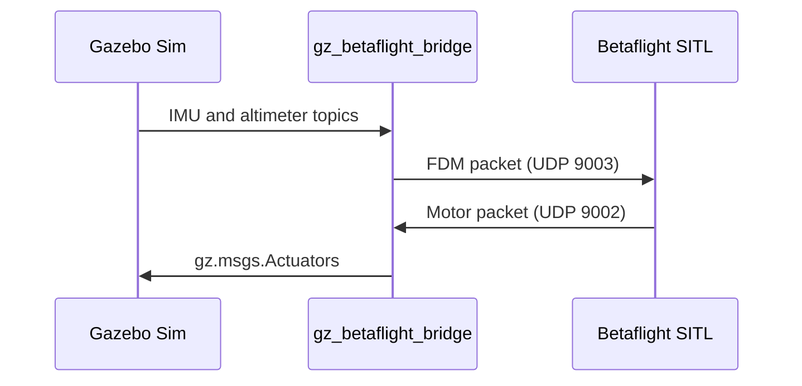
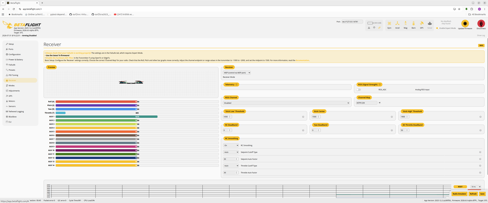
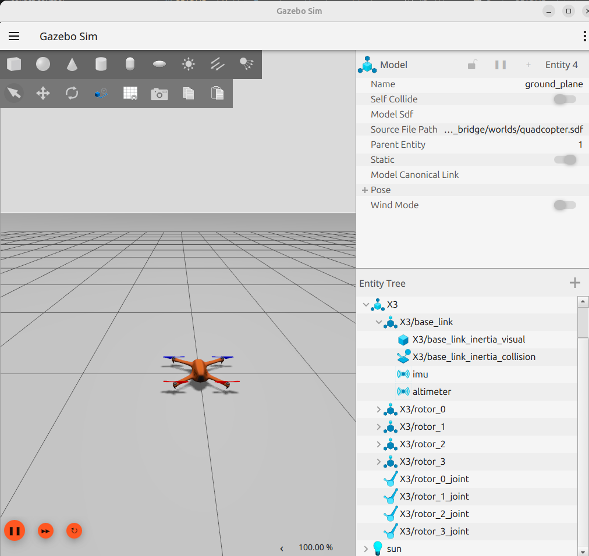
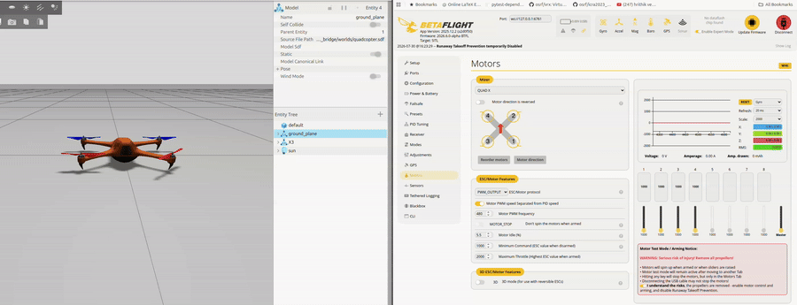

[`gz_betaflight_bridge`](https://github.com/robobe/gz_betaflight_bridge){:target="_blank"} is a standalone C++ bridge between Betaflight SITL and Gazebo Sim Harmonic. Gazebo simulates the vehicle and sensors, Betaflight calculates motor outputs, and the bridge translates data between their transport formats.

## Data flow



The bridge converts Betaflight's normalized motor commands into rotor velocities for Gazebo's `MulticopterMotorModel`. Betaflight's MSP interface remains available on TCP port `5761` for the Betaflight App and Python controllers.

| Endpoint | Direction | Purpose |
| --- | --- | --- |
| Gazebo IMU and altimeter topics | Gazebo → bridge | Simulated sensor feedback |
| UDP `9003` | Bridge → Betaflight | Flight dynamics model packet |
| UDP `9002` | Betaflight → bridge | Motor output packet |
| `/X3/gazebo/command/motor_speed` | Bridge → Gazebo | `gz.msgs.Actuators` rotor command |
| TCP `5761` | Client ↔ Betaflight | MSP configuration and control |
| WebSocket `6761` | Browser → TCP `5761` | Betaflight App connection through websockify |

## Get the project

```bash
git clone https://github.com/robobe/gz_betaflight_bridge.git
cd gz_betaflight_bridge
```

The repository includes the bridge source, an X3 quadcopter model, a Gazebo world, a Betaflight SITL executable, configuration files, launch scripts, and MSP control examples.

## Prerequisites

- Ubuntu with Gazebo Sim Harmonic development packages
- CMake 3.23 or newer
- Ninja
- A C++20 compiler, such as GCC 13
- `yaml-cpp` and `spdlog`
- `uv` for the optional Python environment and websockify
- VS Code with C/C++ and CMake Tools when using the supplied tasks

Install the core build tools:

```bash
sudo apt update
sudo apt install build-essential cmake ninja-build gdb \
    libyaml-cpp-dev libspdlog-dev
```

Install the Gazebo Harmonic development packages appropriate for your Ubuntu installation before configuring the project.

## Build the bridge

The repository provides a debug CMake preset:

```bash
cmake --preset debug
cmake --build --preset debug
```

The resulting executable is:

```text
build/debug/betaflight_gazebo_bridge
```

Create the optional Python environment and install websockify:

```bash
uv venv
uv pip install websockify
```

## Configure Betaflight SITL

Connect to Betaflight SITL and apply the following CLI batch. It enables MSP receiver input and maps `AUX1` to ARM and `AUX2` to ANGLE mode:

```text
batch start

feature -RX_UDP
feature -TELEMETRY
feature RX_MSP

aux 0 0 0 1700 2100 0 0
aux 1 1 1 1700 2100 0 0

profile 0
rateprofile 0
battery_profile 0

batch end
save
```




## Gazebo model

The world in `worlds/quadcopter.sdf` includes the local X3 model from `models/betaflight_x3/model.sdf`. Each rotor uses Gazebo's `MulticopterMotorModel` system and reads one actuator index from the bridge's motor-speed message.



The key tuning values are:

- `<maxRotVelocity>`: the maximum simulated rotor speed.
- `<motorConstant>`: converts squared rotor speed to thrust.
- `<momentConstant>`: controls reaction torque.
- `<turningDirection>`: sets clockwise or counter-clockwise rotation.
- `motors.max_rotor_velocity_rad_s` in `config/bridge.yaml`: must match the Gazebo rotor limit.

Gazebo calculates rotor thrust using:

```text
thrust_N = motorConstant * rotor_speed_rad_s²
```

If the vehicle needs excessive throttle to lift, verify that the bridge and model velocity limits match before changing the motor constant.

## Run the complete stack

### VS Code tasks

Open the Command Palette and select:

```text
Tasks: Run Task → Stack: run all
```

The task starts four terminals:

| Task | Command |
| --- | --- |
| Gazebo | `scripts/run_quadcopter_world.sh -r` |
| Betaflight SITL | `scripts/run_betaflight_sitl.sh` |
| Bridge | `scripts/run_bridge.sh config/bridge.yaml` |
| websockify | `uv run websockify 127.0.0.1:6761 127.0.0.1:5761` |

### tmuxp

For a terminal-only workflow, install `tmux` and `tmuxp`, then load the supplied session:

```bash
sudo apt install tmux tmuxp
tmuxp load config/run_sim.yaml
```

The session runs Gazebo, SITL, the bridge, and websockify in tiled panes.

## Connect the Betaflight App

With websockify running, open the browser-based Betaflight App and use its manual connection option:

```text
ws://127.0.0.1:6761
```

The proxy forwards the browser's WebSocket connection to Betaflight's MSP TCP server on `127.0.0.1:5761`.

## Verify motor order

Start the complete stack and confirm that each Betaflight motor output drives the expected Gazebo rotor before attempting flight. An incorrect motor index or turning direction can produce immediate roll or yaw instability.



## Try MSP hover control

After the bridge is receiving Gazebo sensor data, start the included Python hover controller in another terminal:

```bash
scripts/hover_msp_controller.py \
    --target-altitude 5 \
    --duration 45 \
    --hover-throttle 1750 \
    --kp 120 \
    --ki 15 \
    --kd 60
```

Treat these gains and the hover-throttle value as starting points. They depend on the simulated vehicle mass, motor model, and rotor-speed mapping.

## Troubleshooting

- No sensor feedback: confirm Gazebo publishes the configured IMU and altimeter topics and that UDP `9003` is free.
- No motor response: check UDP `9002`, the actuator topic, motor indices, and `config/bridge.yaml`.
- Betaflight App cannot connect: verify SITL listens on TCP `5761` and websockify listens on WebSocket `6761`.
- Vehicle flips on takeoff: recheck Betaflight motor order, actuator indices, and every rotor's turning direction.
- Weak or excessive thrust: match `max_rotor_velocity_rad_s` with `<maxRotVelocity>`, then tune the motor constant.

## Project documentation

The repository contains deeper notes on configuration, packet formats, coordinate frames, motor modeling, observability, joystick control, MSP hover control, and autonomous test scenarios. Start with the [project README](https://github.com/robobe/gz_betaflight_bridge#readme){:target="_blank"} and the [documentation index](https://github.com/robobe/gz_betaflight_bridge/blob/main/docs/index.md){:target="_blank"}.
