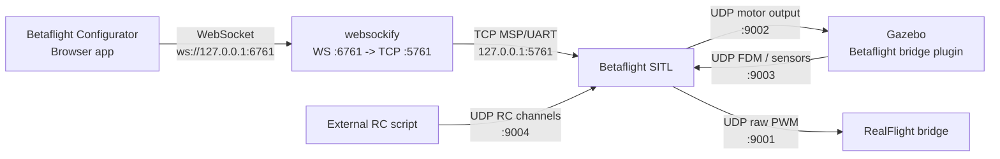

## SITL network flow



## Betaflight SITL port usage

Source: [Betaflight SITL Autopilot Testing with Gazebo](https://betaflight.com/docs/development/autopilot/SITL_Autopilot_Testing_Gazebo)

| Port | Protocol | Direction | Usage |
| --- | --- | --- | --- |
| 9001 | UDP | Betaflight SITL -> RealFlight | Raw PWM output for the RealFlight bridge. |
| 9002 | UDP | Betaflight SITL -> Gazebo | Motor speed commands consumed by the Gazebo Betaflight bridge plugin. |
| 9003 | UDP | Gazebo -> Betaflight SITL | Flight dynamics model data, including IMU, position, velocity, GPS, and barometer state. |
| 9004 | UDP | External RC script -> Betaflight SITL | RC channel input, typically 16 channels in the 1000-2000 range. |
| 5761 | TCP | Betaflight App/configurator -> Betaflight SITL | SITL UART/MSP connection exposed by Betaflight. |
| 6761 | WebSocket | Betaflight App -> websockify -> TCP 5761 | Browser-friendly proxy endpoint, for example `ws://127.0.0.1:6761`. |

When started manually, Betaflight SITL opens UDP servers on `9003` and `9004`, sends motor output to Gazebo on `9002`, and can also send raw PWM output to RealFlight on `9001`.


### RC Port 9004

<details>
<summary>Send RC command</summary>
```python
--8<-- "docs/Robotics/uav/betaflight/sitl/code/takeoff_pitch_land.py"
```
</details>

<video controls width="100%">
  <source src="images/rc_flight.mp4" type="video/mp4">
  Your browser does not support the video tag.
</video>

---

## files

```
├── bin
│      ├── libBetaflightPlugin.so
│      └── betaflight_2025.12.2_SITL    
├── models
│   └── betaloop_iris_with_standoffs
│      └── meshes
├── plugins (source)
├── worlds
│   └── betaloop_iris_with_standoffs.sdf
└── scripts
    └── start_gz.sh

```

- [gazebo plugin precompile](code/libBetaflightPlugin.so)
- [betaflight sitl precompile](code/betaflight_2025.12.2_SITL)
- [gazebo world](code/betaloop_iris_betaflight_demo_harmonic.sdf)
- [iris models](code/modes.zip)
- [start script](code/start_gz.sh)