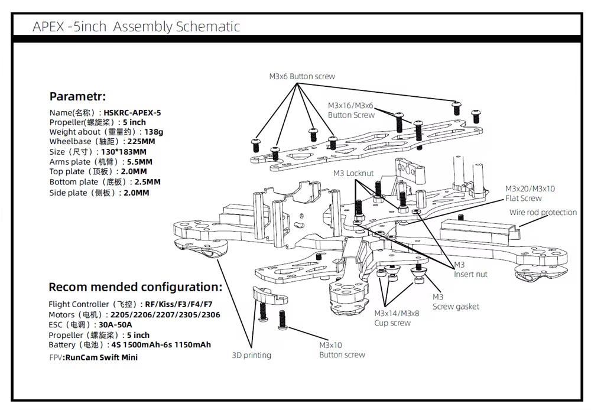
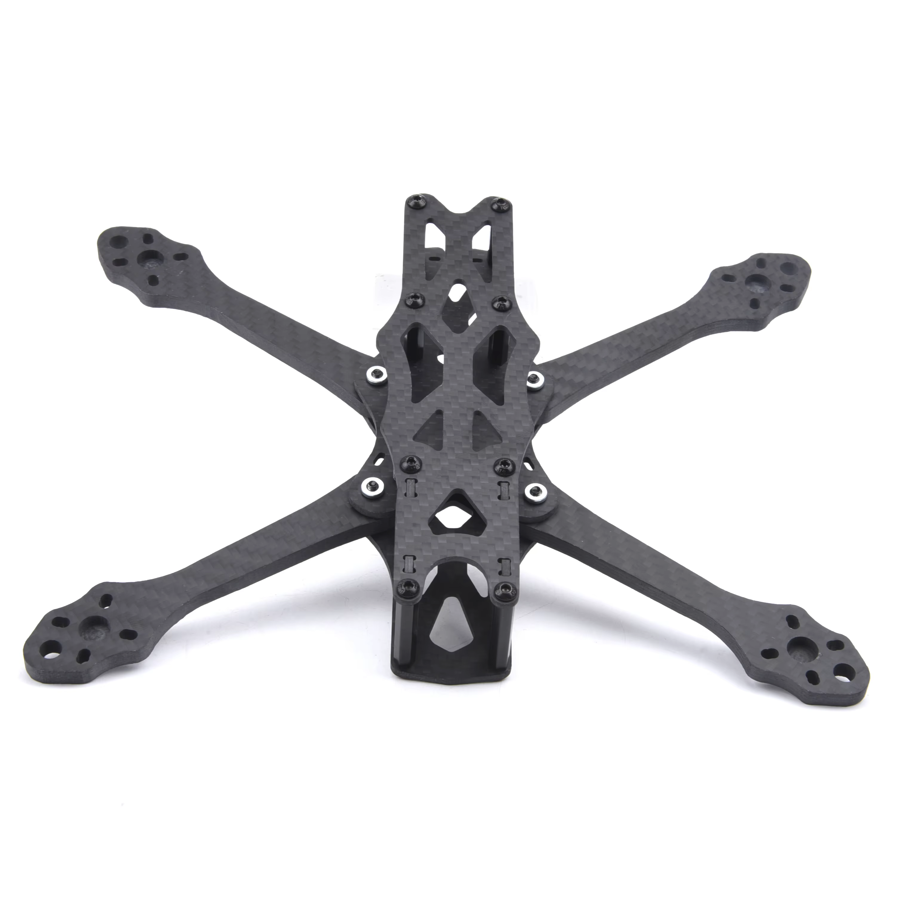
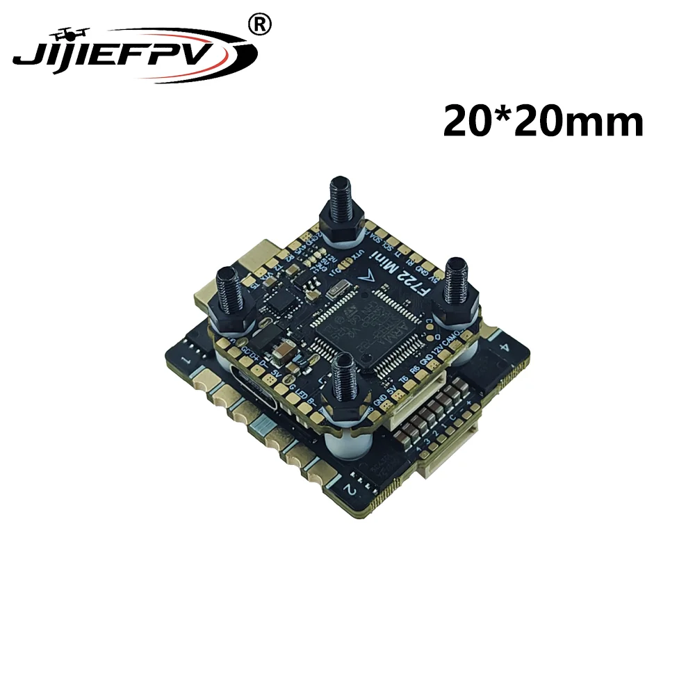
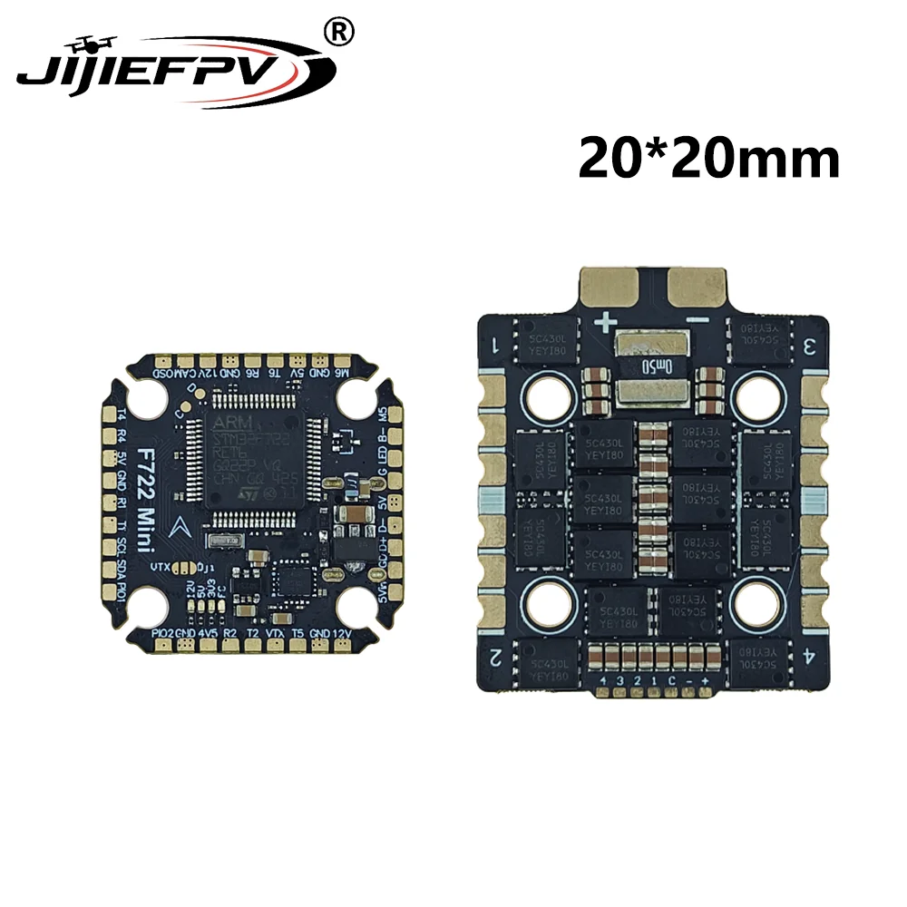

This is a step-by-step build log for my first 5-inch FPV quad. This part covers assembling the Apex 5-inch frame, mounting the flight-controller stack, and connecting its main power lead.

!!! danger "Work without propellers"
    Remove all propellers and keep the LiPo disconnected while assembling or soldering. Use a smoke stopper for the first battery connection.

## Parts used in this stage

- [Apex 5-inch frame](https://www.aliexpress.com/item/1005007050176242.html)
- [JiJieFPV F722 Mini 20×20 mm FC and ESC stack](https://www.aliexpress.com/item/1005009474189574.html)
- XT60 battery lead and capacitor supplied with the stack
- Hex drivers, soldering iron, solder, flux, heat-shrink, multimeter, and smoke stopper

The AliExpress stack listing contains several ESC variants. Check the exact option in the order details and the markings on the received boards before choosing a battery. Do not use the product title alone as the electrical specification.

## Assemble the frame

1. Lay out the four arms, bottom plates, top plate, standoffs, camera plates, and screws. Compare them with the assembly schematic before tightening anything.
2. Place the arms between the center plates and install their screws loosely. Confirm that every arm is fully seated and that the frame lies flat.
3. Install the front and rear printed parts, side plates, and standoffs.
4. Tighten the frame gradually, alternating between screws. Use threadlocker only where a metal screw enters metal; threadlocker can damage plastic.
5. Check the carbon-fibre edges for loose fibres or sharp spots, then remove conductive carbon dust from the frame.
6. Leave the top plate off so the electronics remain accessible.

Before continuing, confirm that the arms cannot move and that no screw protrudes into the battery or electronics area.

## Inspect and dry-fit the flight stack

*Product image from the [AliExpress listing](https://www.aliexpress.com/item/1005009474189574.html).*

The ESC is the lower board with the large battery and motor pads. The flight controller is the upper board with the USB connector and small signal pads.

1. Inspect both boards for damaged components, solder splashes, or bent connectors.
2. Find the frame's 20×20 mm mounting pattern and dry-fit the supplied screws and soft grommets. Do not drill the carbon or force the stack onto a different pattern.
3. Put the ESC on the bottom and the flight controller above it. Keep both boards clear of the conductive carbon frame.
4. Point the flight-controller arrow toward the front when practical and keep the USB connector accessible. If the board must face another direction, record the rotation for the later Betaflight setup.
5. Check that the battery lead can exit the frame without touching an arm or propeller.
6. Tighten the stack nuts only enough to remove play. Do not crush the soft vibration-isolation grommets.

## Connect the main power lead

*Product image from the [AliExpress listing](https://www.aliexpress.com/item/1005009474189574.html). Always follow the labels printed on the received board.*

!!! warning "Verify before soldering"
    Variants in this listing have different ESC and voltage ratings. Confirm the purchased variant and capacitor voltage from the order details or included documentation. The steps below identify polarity but do not establish a safe battery-cell count.

1. Remove the stack from the carbon frame before soldering.
2. On the ESC, identify the large battery pads marked `+` and `−`. Verify the markings on the physical board, not only in the image.
3. Cut the XT60 lead only as long as needed, then slide on any required heat-shrink before soldering.
4. Tin the ESC battery pads and the stripped wire ends. Solder the red wire to `+` and the black wire to `−`.
5. Solder the capacitor across the same pads with short leads. Connect its `−` lead—the side marked with a stripe—to the ESC `−` pad.
6. Inspect for solder bridges, loose wire strands, and joints that can touch the frame. Insulate exposed connections where necessary.
7. With no battery connected, use a multimeter to confirm there is no hard short between the ESC `+` and `−` pads. A resistance reading may start low while the capacitor charges, but it must not remain near zero.
8. Reinstall the stack and connect the FC-to-ESC harness only after comparing the pin labels at both ends. A plug fitting mechanically does not prove that its pin order is correct.
9. Recheck polarity, keep the propellers removed, and make the first battery connection through a smoke stopper. Disconnect immediately if it trips, a component heats up, or anything smells abnormal.

## Checkpoint

At the end of this stage:

- the frame is rigid and the top plate is still removable;
- the stack cannot touch the carbon frame;
- the USB connector and battery lead are accessible;
- the XT60 lead and capacitor have correct polarity;
- there is no measured hard short across the battery input; and
- first power-up succeeds through a smoke stopper.

## Reference

- [How to assemble the Apex frame](https://youtu.be/Q8BfHbKZXsw)

The next stage is motor installation and wiring.
