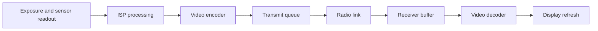

# FPV camera and video-system design

An FPV camera is the first part of a complete video system. A good design must
consider:
- motion distortion
-  latency
-  field of view
-  low-light performance
-  encoding
-  radio bandwidth
-  power noise
-  mechanical mounting
-  sensor resolution.

## Camera shutter types

The shutter describes how the sensor exposes its pixels.

### Rolling shutter

A rolling-shutter sensor exposes and reads the image one row after another.
Different rows therefore represent slightly different moments in time.

Advantages:

- Common, inexpensive sensors
- High resolution
- Good image quality and dynamic range
- Many compact camera modules available

Disadvantages for FPV:

- Fast rotation can bend vertical objects.
- Propellers can appear curved or broken.
- Motor vibration can produce a wobbling **jello** image.
- Longer exposure in low light increases motion blur.

Rolling shutter is normally acceptable for general FPV when the camera is
mounted rigidly, vibration is controlled, and exposure time remains short.

### Global shutter

A global-shutter sensor exposes all pixels during the same time interval. It
greatly reduces the geometric distortion created by rapid motion and vibration.

Advantages:

- Better representation of fast motion
- Less rolling-shutter wobble and skew
- Useful for visual odometry, machine vision, and synchronized cameras

Disadvantages:

- Often lower resolution or more expensive
- May require a larger module and external lens
- Does not eliminate ordinary motion blur; exposure time still matters

Raspberry Pi explains the difference using rotating propellers: a rolling
shutter scans them line by line, while its Global Shutter Camera captures all
pixels together. [Raspberry Pi camera documentation](https://www.raspberrypi.com/documentation/accessories/camera.html)

### Mechanical shutter

A mechanical shutter physically blocks and exposes the sensor. It is common in
still cameras but uncommon in FPV because it adds weight, moving parts, delay,
and wear. FPV video systems normally use electronic rolling or global shutters.

---

## Video: global shutter versus rolling shutter

    <iframe
        src="https://www.youtube-nocookie.com/embed/YmEH8z1JWgc"
        title="Global Shutter vs. Rolling Shutter"
        style="position: absolute; inset: 0; width: 100%; height: 100%; border: 0;"
        loading="lazy"
        referrerpolicy="strict-origin-when-cross-origin"
        allow="accelerometer; autoplay; clipboard-write; encrypted-media; gyroscope; picture-in-picture; web-share"
        allowfullscreen>
    </iframe>

## Raspberry Pi camera comparison

The frame rates below are maximum documented sensor/video modes, not guaranteed
end-to-end FPV display rates. Encoding, the Raspberry Pi model, radio link, and
receiver can reduce the delivered frame rate.

| Camera | Sensor | Shutter | Full resolution | Example maximum video modes |
| --- | --- | --- | ---: | --- |
| Camera Module 2 | Sony IMX219 | Rolling | 3280 × 2464, 8 MP | 1080p47; 1640 × 1232p41; 640 × 480p206 |
| Camera Module 3 | Sony IMX708 | Rolling | 4608 × 2592, 11.9 MP | 2304 × 1296p56; HDR p30; 1536 × 864p120 |
| Camera Module 3 Wide | Sony IMX708 | Rolling | 4608 × 2592, 11.9 MP | 2304 × 1296p56; HDR p30; 1536 × 864p120 |
| High Quality Camera | Sony IMX477 | Rolling | 4056 × 3040, 12.3 MP | 2028 × 1080p50; 2028 × 1520p40; 1332 × 990p120 |
| AI Camera | Sony IMX500 | Rolling | 4056 × 3040, 12.3 MP | 2028 × 1520p30; full resolution p10 |
| Global Shutter Camera | Sony IMX296 | Global | 1456 × 1088, 1.58 MP | 1456 × 1088p60 |

These specifications come from Raspberry Pi's [camera hardware comparison](https://www.raspberrypi.com/documentation/accessories/camera.html#hardware-specifications). The [AI Camera product brief](https://datasheets.raspberrypi.com/camera/ai-camera-product-brief.pdf) also specifies 30 fps in its 2×2-binned mode and 10 fps at full resolution.

### Which camera fits which job?

| Goal | Good starting option | Reason |
| --- | --- | --- |
| General digital FPV | Camera Module 3 Wide | Compact, autofocus, wide view, and useful high-frame-rate modes |
| Lowest geometric motion distortion | Global Shutter Camera | Exposes all pixels together |
| Interchangeable lenses | HQ or Global Shutter Camera | C/CS-mount lens support |
| Onboard object detection | AI Camera | IMX500 includes neural-network acceleration |
| Low-cost experiment | Camera Module 2 | Small and widely supported |

The AI Camera can produce image and inference streams, but onboard AI does not
automatically reduce pilot-view latency. Choose it when inference is part of the
mission, not merely because it is newer. [Raspberry Pi AI Camera documentation](https://www.raspberrypi.com/documentation/accessories/ai-camera.html)

## End-to-end latency

FPV latency is the sum of every pipeline stage:

Measure glass-to-glass latency—from a real-world event in front of the camera
until that event appears on the display. Camera FPS alone does not describe this
delay.

At 60 fps, one frame lasts approximately:

\[
\frac{1}{60} = 16.7\text{ ms}
\]

Every extra queued frame can therefore add about 16.7 ms before considering
encoding, radio, decoding, and display delay.

For low latency:

- Avoid unnecessary frame queues.
- Use a hardware encoder when available.
- Disable B-frames when the encoder supports a low-latency mode.
- Use a short GOP when quick recovery matters, accepting the bitrate cost.
- Configure receiver buffers deliberately instead of accepting large defaults.
- Measure under packet loss, not only on a workbench.

## Resolution, frame rate, and bandwidth

Resolution and FPS increase both image detail and required processing and radio
bandwidth. Uncompressed BGR video requires approximately:

\[
bitrate = width \times height \times 3 \times FPS \times 8
\]

For 1920 × 1080 at 60 fps:

\[
1920 \times 1080 \times 3 \times 60 \times 8
\approx 2.99\text{ Gbit/s}
\]

An FPV radio link therefore normally sends compressed video such as H.264 or
H.265. Actual compressed bitrate depends strongly on motion, scene detail,
encoder settings, and acceptable quality.

Choose the operating mode for the complete link. A stable 720p60 stream can be
more useful for piloting than a delayed or frequently corrupted 4K stream.

## Field of view and lens

A wider lens shows more of the environment and makes rapid rotation feel less
disorienting, but distant objects become smaller and edge distortion increases.
A narrow lens shows more detail ahead but provides less peripheral awareness.

Check:

- Horizontal, vertical, and diagonal field of view
- Lens focal length
- Fixed focus versus autofocus
- Minimum focus distance
- Aperture or f-number
- Replaceable-lens support
- Whether the frame or propellers appear in the image

Autofocus can hunt during rapid scene changes. A fixed focus, or locked
autofocus position, may provide more predictable FPV behavior.

## Exposure, low light, and dynamic range

Short exposure reduces motion blur but collects less light. Increasing analog
gain brightens the image but adds noise. For outdoor flight, the camera must
also handle bright sky and dark ground in the same frame.

Evaluate:

- Sensor and pixel size
- Lens aperture
- Maximum useful gain
- Minimum practical exposure time
- HDR or wide-dynamic-range mode
- Highlight recovery and shadow noise
- Daylight, sunset, and indoor behavior

HDR may improve dynamic range but can reduce maximum frame rate or add processing
latency. Test the exact mode used by the video link.

## Camera interface and processing hardware

Raspberry Pi cameras normally use CSI-2. Confirm:

- Camera connector type and ribbon-cable compatibility
- Number of CSI lanes and supported sensor mode
- Raspberry Pi model and hardware-encoder capabilities
- ISP capacity when capturing multiple streams
- Memory bandwidth and CPU/GPU load
- Software support in `libcamera`, `rpicam-apps`, or Picamera2
- Whether recording, AI inference, and streaming can run together at the target
  FPS

Do not assume that a sensor's maximum mode can also be encoded, transmitted,
decoded, and displayed at that rate.

## Power and electrical noise

Motors and ESCs create substantial switching noise. A camera or transmitter
powered from a noisy rail can show horizontal lines, resets, or corrupted data.

Plan for:

- Correct input-voltage range
- Peak and average power consumption
- A regulator with enough current and thermal margin
- Input and local decoupling capacitors
- Short power and ground paths
- Separation from ESC phase wires and high-current battery wiring
- Ground-loop avoidance
- Filtering validated under full motor load

