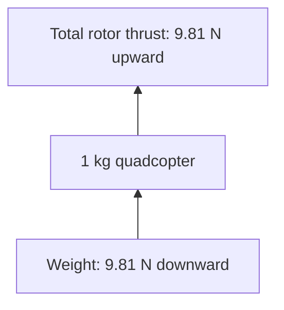
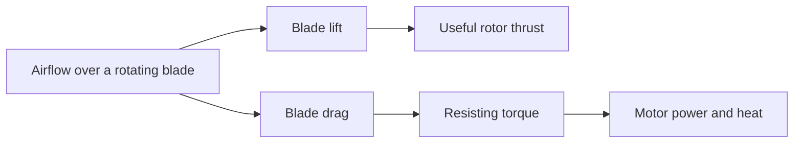
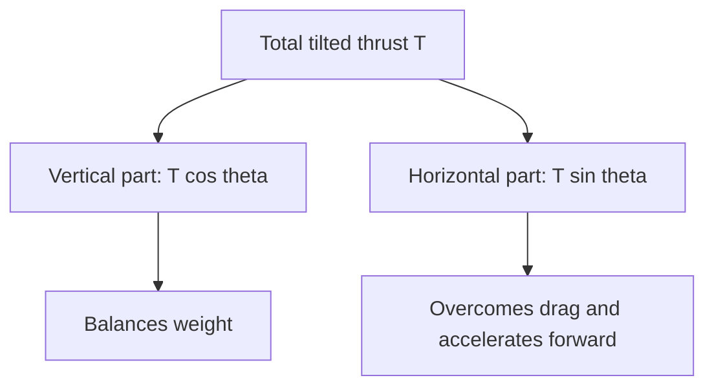
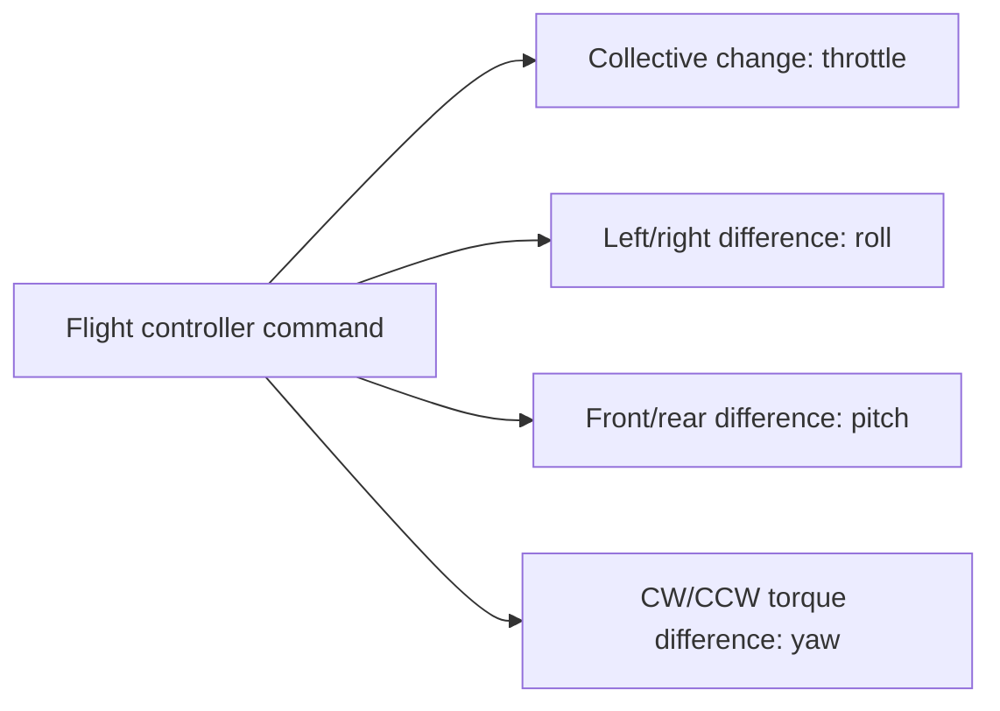
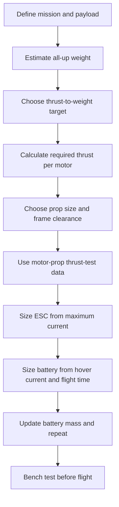

# Quadcopter Forces and Design

This tutorial starts with one simple question: what must a quadcopter do to hover? From there, it builds a practical method for choosing the propellers, motors, ESCs, and battery for a new design.

## Start With A Simple Hover

Imagine a `1 kg` quadcopter sitting on the ground. Gravity pulls it downward with its weight:

\[
W = mg = 1 \cdot 9.81 = 9.81\ \text{N}
\]

To hover, the four rotors must produce exactly the same force upward:

\[
T_{total} = W = 9.81\ \text{N}
\]

If all four rotors share the load equally, each rotor produces:

\[
T_{rotor} = \frac{9.81}{4} = 2.45\ \text{N} \approx 250\ \text{gf}
\]

`gf` means gram-force. Motor test tables often use it even though newtons are the scientific unit. A useful conversion is:

\[
1\ \text{N} \approx 102\ \text{gf}
\]

The forces are balanced, so acceleration is zero. The quad can be stationary, but the motors are still doing work continuously to move air downward.

## Are Lift And Drag Related?

Yes, but it helps to separate the **propeller-blade view** from the **whole-aircraft view**.

A propeller blade is a rotating wing. As it moves through the air, its airfoil produces:

- Lift, mostly perpendicular to the blade's local airflow
- Drag, parallel and opposite to that airflow

The useful parts of the blade forces combine into **rotor thrust**. Thrust pushes air downward, and the reaction force pushes the rotor and quadcopter upward. Blade drag resists rotation, so the motor must supply torque and electrical power to keep the propeller spinning.

At the whole-aircraft level, we normally use these names:

- **Thrust:** the combined force produced by the rotors, along the quadcopter's vertical body axis
- **Weight:** gravity acting toward Earth
- **Aerodynamic drag:** force opposing the quadcopter's motion relative to the air

Therefore, lift and drag are related aerodynamic forces on each blade, but quadcopter calculations usually call the rotors' combined useful force **thrust**.

## The Four Main Forces

### Weight

Weight depends on the complete flying mass, called **all-up weight** or `AUW`. Include the frame, motors, electronics, wiring, payload, propellers, and battery.

\[
W = mg
\]

Adding payload or a larger battery increases the required hover thrust. A larger battery can provide more energy, but its extra mass also consumes some of that benefit.

### Thrust

Thrust depends on the complete motor-propeller system, not on the motor alone. Important inputs include propeller diameter, pitch, blade count, motor size and KV, battery voltage, air density, and RPM.

Use measured thrust-table data for the exact motor, propeller, and voltage combination whenever possible. The [propeller](../props/index.md) and [motor](../motors/index.md) pages explain these choices in more detail.

### Drag

The drag on the complete vehicle can be approximated by:

\[
D = \frac{1}{2}\rho C_D A v^2
\]

Where:

- \(\rho\) is air density in `kg/m³`
- \(C_D\) is the drag coefficient
- \(A\) is frontal area in `m²`
- \(v\) is airspeed in `m/s`

Drag grows with the square of airspeed. Doubling airspeed creates approximately four times the drag when the other values stay constant. Wind matters because drag follows speed relative to the air, not speed relative to the ground.

### Rotor Torque

The motor must apply torque to turn a propeller against blade drag. The frame feels an equal reaction torque in the opposite direction. Two rotors turn clockwise and two turn counter-clockwise so their reaction torques approximately cancel during hover.

## From Hover To Motion

Newton's second law connects unbalanced force to acceleration:

\[
\sum F = ma
\]

- If thrust equals weight, vertical acceleration is zero.
- If thrust is greater than weight, the quad accelerates upward.
- If thrust is less than weight, the quad accelerates downward.

### Forward Flight

A quadcopter has no separate forward-facing engine. It tilts so part of its thrust points forward.

For level flight at a constant altitude:

\[
T\cos\theta = mg
\]

Therefore:

\[
T = \frac{mg}{\cos\theta}
\]

At a tilt angle of `30°`, a `1 kg` quad needs:

\[
T = \frac{9.81}{\cos 30^\circ} \approx 11.33\ \text{N}
\]

That is about `15.5%` more total thrust than hover just to maintain altitude. More thrust is needed while accelerating or fighting drag.

## How Four Motors Control The Quad

The flight controller changes individual motor thrust while managing total thrust.

- **Throttle:** all four motors increase or decrease together.
- **Roll:** motors on one side speed up while motors on the other side slow down.
- **Pitch:** rear motors and front motors change relative thrust.
- **Yaw:** one rotation pair speeds up while the opposite pair slows down, changing net reaction torque.

This is why thrust margin matters. A motor already at maximum throttle cannot speed up to correct attitude or reject a wind disturbance.

## A Practical Design Workflow

### 1. Define The Mission

Write down the payload, desired flight time, maximum size, expected speed, wind, operating altitude, and whether the goal is efficiency or agility. These requirements determine the design; there is no universally best quadcopter.

### 2. Estimate All-Up Weight

Make a mass budget before selecting parts. Keep a row for every component and a margin for fasteners, connectors, wires, and landing gear. Early estimates will be imperfect, so sizing is an iterative process.

### 3. Choose A Thrust-To-Weight Target

\[
Thrust\ Ratio = \frac{Maximum\ Total\ Thrust}{All\text{-}Up\ Weight}
\]

Useful starting points are:

| Mission | Starting target |
| --- | --- |
| Efficient hover or gentle cruising | `2:1` to `3:1` |
| Camera or utility quad | `2:1` to `4:1` |
| FPV freestyle | `4:1` to `8:1` |
| FPV racing | `6:1` to `10:1` |

Higher ratios improve acceleration and control authority, but usually add current, heat, noise, and component mass.

### 4. Calculate Thrust Per Motor

For a quadcopter:

\[
T_{motor,max} = \frac{m g \cdot target\ ratio}{4}
\]

This value is a minimum performance requirement. Do not select a motor from KV or size alone.

### 5. Match The Propeller, Motor, And Voltage

Start with the largest practical propeller for an efficiency-focused design, then choose a frame with safe prop clearance. Find measured data for the exact propeller, motor, and battery voltage.

The test table must show:

- Thrust at the expected hover point
- Current and electrical power at hover
- Maximum thrust and current
- Motor and ESC temperature limits
- Efficiency, often shown as `g/W`

### 6. Size The ESC

A useful first estimate is:

\[
I_{ESC,rated} \geq 1.2 \cdot I_{motor,max}
\]

Then verify the manufacturer's continuous-current conditions, burst rating, cooling, voltage rating, and ambient temperature. A rating printed on an ESC is not a substitute for thermal testing.

### 7. Size The Battery

If total average current is known, ideal required capacity is:

\[
C_{Ah} = \frac{I_{average} \cdot t_{hours}}{usable\ fraction}
\]

Using `0.8` as the usable fraction leaves a `20%` reserve. The battery must also supply maximum current:

\[
I_{battery,max} \geq C_{Ah} \cdot C\text{-rating}
\]

Treat advertised C-ratings cautiously and add current margin. Verify battery voltage sag, connector rating, wire size, and temperature during testing.

## Worked Example: A 1 kg Utility Quadcopter

### Requirements

- All-up mass: `1.0 kg`, including payload and battery
- Desired flight time: `15 minutes`
- Battery reserve: `20%`
- Thrust-to-weight target: `2:1`
- Four motors
- Operation near sea level in moderate conditions

### Thrust Requirements

Hover thrust per motor:

\[
T_{hover} = \frac{1 \cdot 9.81}{4} = 2.45\ \text{N} \approx 250\ \text{gf}
\]

Minimum maximum thrust per motor:

\[
T_{max} = \frac{1 \cdot 9.81 \cdot 2}{4} = 4.91\ \text{N} \approx 500\ \text{gf}
\]

The motor-propeller combination must therefore produce at least `500 gf` per motor at the chosen battery voltage. A larger margin may be required for altitude, heat, wind, or aggressive maneuvering.

### Illustrative Thrust-Test Data

Suppose a candidate propeller and motor on `4S` has verified bench data like this:

| Operating point | Thrust per motor | Current per motor |
| --- | ---: | ---: |
| Expected hover | `250 gf` | `3 A` |
| Design maximum | `500 gf` | `7 A` |

These numbers are an educational example, not a recommendation for a specific product. Real component selection must use the manufacturer's data and your own bench test.

The ESC estimate is:

\[
I_{ESC,rated} \geq 1.2 \cdot 7 = 8.4\ \text{A}
\]

A higher standard rating, such as a `15 A` or `20 A` ESC with the correct voltage rating and cooling, provides practical margin.

If avionics consume another `0.8 A`, estimated hover current is:

\[
I_{hover,total} = 4 \cdot 3 + 0.8 = 12.8\ \text{A}
\]

Fifteen minutes is `0.25 hours`, so required capacity with a `20%` reserve is:

\[
C = \frac{12.8 \cdot 0.25}{0.8} = 4.0\ \text{Ah}
\]

This suggests starting the mass iteration with a `4S 4000 mAh` battery. Estimated maximum system current is:

\[
I_{max,total} = 4 \cdot 7 + 0.8 = 28.8\ \text{A}
\]

The mathematical minimum battery discharge rating is:

\[
C\text{-rating}_{min} = \frac{28.8}{4.0} = 7.2C
\]

Choose a battery with credible margin above this result and verify it under load. Next, add its real mass to the mass budget. If the design now exceeds `1 kg`, recalculate hover thrust, current, and capacity until the estimates converge.

### Resulting Requirements-Based Specification

| Component | Minimum design requirement |
| --- | --- |
| Frame | Fits the selected propellers with safe clearance and supports a `1 kg` AUW |
| Propeller | Efficient near `250 gf` per rotor and capable of at least `500 gf` with the selected motor |
| Motor | Meets both thrust points on `4S` without exceeding current or temperature limits |
| ESC | Correct for `4S`; at least `8.4 A` by calculation, with a higher practical continuous rating |
| Battery | Approximately `4S 4000 mAh`; credible discharge capability above `28.8 A` |
| Power wiring | Connector and conductors rated above maximum measured system current |

This is enough to search real thrust-test tables and create a shortlist. It is not enough to buy parts blindly: the propeller diameter affects the [frame](../frame/index.md), and every real motor-propeller combination must be checked together.

## Conditions That Change The Result

- High altitude and hot air reduce air density and available thrust.
- Wind increases required tilt, thrust, and energy.
- Propeller guards and payloads increase mass and drag.
- Ground effect can reduce hover power close to the ground, so it should not be used for normal-flight sizing.
- Battery voltage falls during flight, reducing maximum motor speed and thrust.
- Manufacturing data may use a fresh battery and short tests that do not reveal steady-state heating.

## Design Checklist

Before committing to a design, confirm:

- The mass budget includes the battery, payload, wiring, and hardware.
- Hover and maximum thrust come from exact motor-propeller-voltage test data.
- The quad has enough thrust margin for tilted flight and control corrections.
- ESC, battery, connector, and wire current ratings include margin.
- Battery capacity meets flight time after accounting for reserve and voltage sag.
- The selected battery mass has been fed back into the calculations.
- Propellers have safe frame clearance.
- The complete power system will be bench-tested with guards and safe procedures.

After the physics and requirements are clear, continue with the detailed [propeller](../props/index.md), [motor](../motors/index.md), [frame](../frame/index.md), and [5-inch build guide](../build_guide/index.md) pages.
