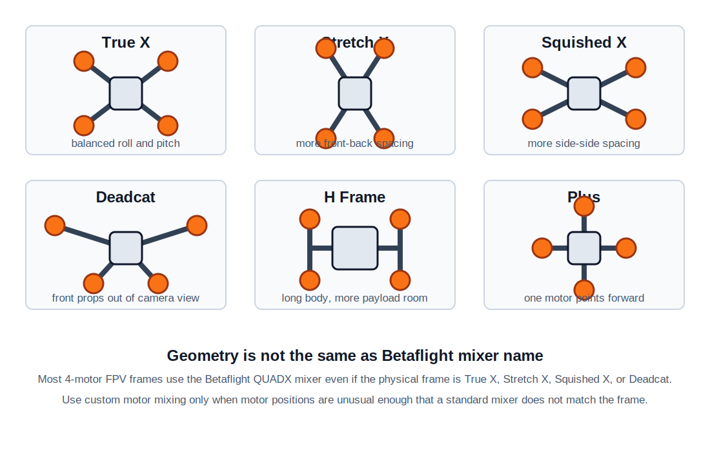

## Frame Job

The frame holds all FPV drone parts in the right position:

- Motors and propellers
- Flight controller and ESC stack
- Battery
- FPV camera and video transmitter
- Receiver, antennas, GPS, buzzer, and action camera

The frame affects flight feel, crash strength, vibration, camera view, prop size, and how easy the build is to repair.

## Frame Types



| Frame type | Best for | Pros | Cons |
| ---------- | -------- | ---- | ---- |
| `True X` | racing, freestyle, general 5 inch builds | Balanced motor spacing, similar roll and pitch feel, easy to tune | Props may appear in HD camera view |
| `Stretch X` | racing, fast freestyle | More pitch stability and forward-flight feel, good for cornering | Less symmetrical than True X, can feel different on roll vs pitch |
| `Squished X` | compact freestyle, some cine/freestyle builds | Wider side-to-side motor spacing, compact length | Less pitch authority than Stretch X, props can still be visible |
| `Deadcat` | cinematic FPV, HD camera builds | Front props are usually out of camera view | Asymmetric layout, yaw and tuning can feel less clean on some builds |
| `H frame` | long range, payload, roomy builds | More space for battery, camera, VTX, GPS, and wiring | Longer arms or heavier center body, usually less agile |
| `Plus` | simple experimental quads | Simple motor layout and supported by Betaflight | One motor is directly in front of the camera, uncommon for modern FPV |

!!! note
    A physical `Deadcat`, `Stretch X`, or `Squished X` frame is often still configured as `QUADX` in Betaflight. The mixer describes motor control geometry, not the marketing name printed on the frame.

## Material

Most modern FPV frames use carbon fiber plates because carbon fiber gives high stiffness and strength for low weight.

Common materials:

| Material | Use | Pros | Cons |
| -------- | --- | ---- | ---- |
| Carbon fiber | Main plates and arms | Light, stiff, strong, good crash resistance | Conductive, sharp edges, dust is unsafe when cutting |
| Aluminum | Standoffs, camera cages, hardware | Strong threads, easy machining | Heavier than plastic, can bend, transmits vibration |
| Steel | Screws and press nuts | Strong, cheap | Heavy |
| Titanium | Premium screws or hardware | Strong and light | Expensive |
| TPU | Antenna mounts, camera bumpers, GPS mounts, arm guards | Flexible, absorbs impact, easy to print | Too flexible for main arms |
| Plastic / polycarbonate | Ducts, whoop frames, camera protection | Cheap, light, impact tolerant | Less stiff than carbon, can cause vibration on larger builds |

For 5 inch freestyle, a common starting point is carbon arms around `5-6 mm` thick, with thinner top plates around `2 mm`. Racing frames often save more weight. Long-range frames usually prioritize stiffness and lower vibration over crash strength.

## Frame Size

Frame size normally means the largest propeller the frame can safely use.

| Prop size | Common use |
| --------- | ---------- |
| `2-2.5 inch` | tiny whoop, micro indoor, lightweight park flying |
| `3-3.5 inch` | small freestyle, sub-250 g builds |
| `4 inch` | efficient lightweight freestyle or long range |
| `5 inch` | standard freestyle and racing |
| `6 inch` | cruiser, heavier freestyle |
| `7 inch` | long range |
| `8-10 inch` | heavy long range, payload, efficient cruising |

Larger frames usually carry larger props and bigger batteries, but they are heavier and need more space to fly safely.

## Selection Factors

Check these before buying a frame:

- Prop clearance: the frame must fit your prop diameter without the props touching the frame, camera, battery strap, or wires.
- Stack mounting: common sizes are `30.5x30.5 mm`, `25.5x25.5 mm`, and `20x20 mm`.
- Camera mounting: check analog micro, DJI, Walksnail, HDZero, or action camera support.
- Motor mounting: common small motors use `9x9 mm` or `12x12 mm`; 5 inch motors often use `16x16 mm`.
- Battery space: long top plate or bottom plate space matters for LiPo size and center of gravity.
- Arm design: replaceable arms are easier to repair than unibody plates.
- Arm thickness and width: thicker and wider arms are stronger and stiffer but heavier.
- Carbon quality: poor carbon can delaminate or vibrate more.
- Vibration path: soft camera mounts and clean arm design help the gyro and video.
- Electronics protection: side plates, camera cages, and TPU bumpers help protect expensive parts.
- Weight: lighter frames feel sharper and fly longer, heavier frames usually survive crashes better.
- Access: check if you can remove arms without taking apart the whole stack.
- Hardware: use good screws, threadlocker on metal-to-metal screws, and avoid over-tightening carbon.

## Unibody vs Replaceable Arms

| Design | Pros | Cons |
| ------ | ---- | ---- |
| Unibody | Light, simple, fewer screws | One broken arm can require replacing the whole bottom plate |
| Replaceable arms | Easier and cheaper crash repair, common on freestyle frames | More screws, more weight, possible arm slop if hardware loosens |
| Sandwich arms | Strong arm clamping between plates | More parts and stack height |

For learning freestyle, replaceable arms are usually the practical choice.

## Betaflight Support

Betaflight supports built-in mixers and custom motor mixing. Use the Betaflight Configurator or CLI:

```text
mixer list
mixer QUADX
save
```

Common Betaflight airframe mixers:

| Mixer | Meaning | Typical FPV use |
| ----- | ------- | --------------- |
| `QUADX` | Quadcopter X | Most FPV quads: True X, Stretch X, Squished X, Deadcat |
| `QUADP` | Quadcopter Plus | Plus-shaped quad |
| `TRI` | Tricopter | 3 motors with a yaw servo |
| `Y4` | Y4-copter | 4 motors in Y layout |
| `Y6` | Y6-copter | 6 motors, coaxial Y layout |
| `HEX6`, `HEX6X`, `HEX6H` | Hexacopter layouts | 6-motor builds |
| `OCTOX8`, `OCTOFLATP`, `OCTOFLATX` | Octocopter layouts | 8-motor builds |
| `VTAIL4`, `ATAIL4` | Tail quad layouts | uncommon experimental frames |
| `CUSTOM` | User-defined motor mix | unusual motor positions |
| `CUSTOM AIRPLANE` | User-defined fixed wing | fixed wing, not normal FPV quad |
| `CUSTOM TRICOPTER` | User-defined tricopter | unusual tricopter layouts |

Summary:

- Most modern FPV quad frames use `QUADX`.
- Frame marketing names like `Deadcat` or `Stretch X` usually do not require a special Betaflight mixer.
- Use `CUSTOM` only if the motors are not close enough to a normal X mixer or if the frame has a special geometry.
- After changing frame type or mixer, always verify motor order and motor direction before flying.

## References

- [Betaflight Mixer documentation](https://betaflight.com/docs/wiki/guides/current/Mixer)
- [GetFPV: All About Multirotor FPV Drone Frames](https://www.getfpv.com/learn/new-to-fpv/all-about-multirotor-fpv-drone-frame/)
- [GetFPV: Designing Your First FPV Drone Frame](https://www.getfpv.com/learn/fpv-diy-repairs-and-mods/designing-first-fpv-drone-frame/)
- [HobbyDrone: Frame Geometry, Deadcat, Squished X, or True X](https://www.hobbydrone.cz/en/blog/frame-geometry--deadcat--squished-x--or-true-x/)
