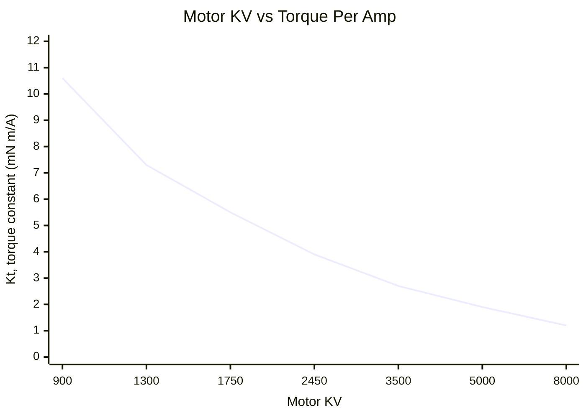
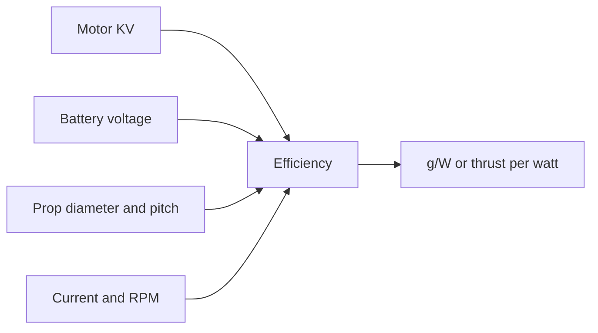
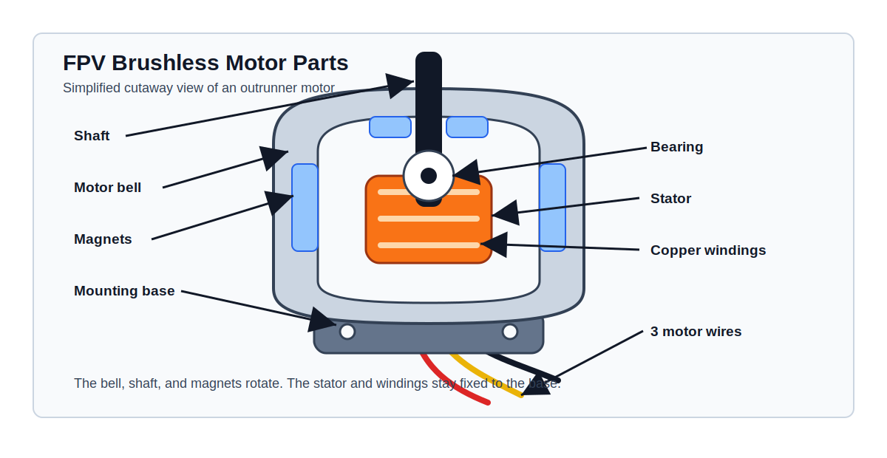
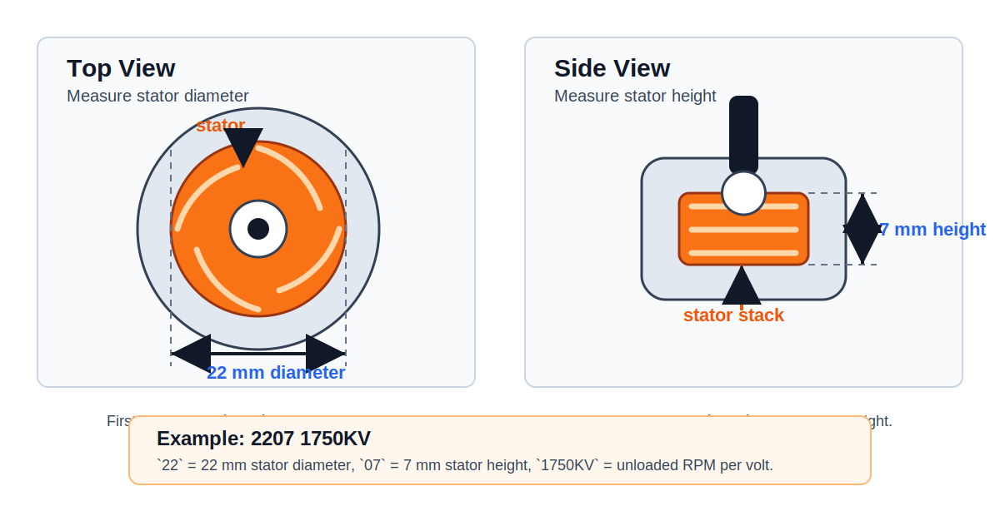
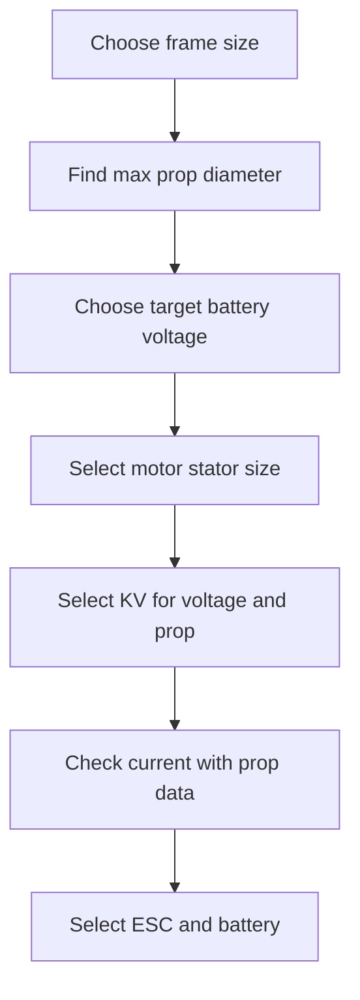

## Motor KV

`KV` means motor speed constant. It describes the unloaded motor RPM per volt.

\[
RPM_{no-load} = KV \cdot V
\]

Example:

- `1750KV` on `6S` at about `22.2V`: \(1750 \cdot 22.2 \approx 38850 RPM\)
- `2450KV` on `4S` at about `14.8V`: \(2450 \cdot 14.8 \approx 36260 RPM\)

This is no-load RPM. With a propeller installed, the real RPM is lower because the prop loads the motor.

High KV:

- More RPM per volt
- Sharper throttle response
- More current draw with the same prop
- More heat if the prop is too large or too high pitch
- Usually paired with lower voltage or smaller props

Low KV:

- Less RPM per volt
- More suitable for higher voltage
- Easier to run larger props
- Usually more efficient for long range or heavy builds
- Often feels smoother and less aggressive

## KV, Torque, And Efficiency

KV alone can show the theoretical torque-per-amp trend. Lower KV gives more torque per amp, and higher KV gives less torque per amp.

\[
K_t \approx \frac{60}{2 \pi \cdot KV}
\]

Where:

- `KV` is in RPM per volt.
- `Kt` is the motor torque constant in N m/A.



This graph does not show motor efficiency. Efficiency needs the real working point:



For a useful efficiency graph, use real thrust-test data:

- X-axis: throttle, RPM, or current
- Y-axis: efficiency in `g/W`
- Separate lines: different propellers on the same motor

## Motor Parts

FPV drones use brushless outrunner motors. `Outrunner` means the outside bell rotates around the fixed stator.



Main parts:

- Shaft: The propeller mounts to the shaft.
- Bell: The outside rotating shell of the motor.
- Magnets: Fixed inside the bell and rotate with it.
- Stator: The fixed iron core inside the motor.
- Copper windings: Coils wrapped around the stator. The ESC energizes these coils to create a rotating magnetic field.
- Bearing: Supports the shaft and lets the bell spin smoothly.
- Base: The fixed part that bolts to the frame.
- Motor wires: Three phase wires from the ESC to the motor.

The ESC switches current through the three motor wires. This creates a changing magnetic field in the stator windings. The magnets in the bell follow that field, so the bell and shaft rotate.

## Motor Number

FPV brushless motors are usually named by stator size and KV.

Example:

```text
2207 1750KV
```

Meaning:

- `22`: stator diameter in millimeters
- `07`: stator height in millimeters
- `1750KV`: unloaded RPM per volt

The stator is the metal part inside the motor that creates torque. Larger stator volume usually means more torque, but also more motor weight.



Measure only the stator, not the outside motor bell. The bell, magnets, shaft, and base make the complete motor larger than the number printed in the motor name.

Common examples:

| Motor size | Meaning | Typical use |
| ---------- | ------- | ----------- |
| `1103` | 11 mm diameter, 3 mm height | tiny whoop, micro builds |
| `1404` | 14 mm diameter, 4 mm height | 2.5-3.5 inch light builds |
| `1804` | 18 mm diameter, 4 mm height | 4 inch lightweight |
| `2207` | 22 mm diameter, 7 mm height | 5 inch freestyle and racing |
| `2306` | 23 mm diameter, 6 mm height | 5 inch freestyle |
| `2806.5` | 28 mm diameter, 6.5 mm height | 7 inch long range |
| `3115` | 31 mm diameter, 15 mm height | heavy lift and large props |

## KV, Voltage, Prop, Current, And Thrust

The same motor can behave very differently with different voltage and propellers. Higher voltage, higher KV, larger diameter, higher pitch, and more blades all increase motor load.

The table below is a practical starting point. Current and thrust are approximate ranges because real values depend on the exact motor, prop model, battery sag, ESC timing, air density, and test stand.

| Frame size | Motor example | Battery | Prop example | Typical current per motor | Approx thrust per motor | Notes |
| ---------- | ------------- | ------- | ------------ | ------------------------- | ----------------------- | ----- |
| 2 inch | `1103 8000KV` | 2S | `2x2.5x3` | 4-8 A | 80-160 g | light micro quad |
| 2.5 inch | `1204 5000KV` | 3S | `2.5x2.5x3` | 6-12 A | 150-300 g | responsive micro freestyle |
| 3 inch | `1404 3500KV` | 4S | `3x3x3` | 10-18 A | 300-550 g | common 3 inch setup |
| 3.5 inch | `1604 2800KV` | 4S | `3.5x2.8x3` | 12-22 A | 450-750 g | efficient small freestyle |
| 4 inch | `1804 2450KV` | 4S | `4x3x3` | 15-28 A | 650-1000 g | light long range or freestyle |
| 5 inch | `2207 2450KV` | 4S | `5x4.3x3` | 30-45 A | 1200-1700 g | classic 4S freestyle |
| 5 inch | `2207 1750KV` | 6S | `5x4.3x3` | 25-40 A | 1300-1800 g | common 6S freestyle |
| 6 inch | `2507 1500KV` | 6S | `6x4x3` | 30-50 A | 1800-2600 g | heavier freestyle or cruiser |
| 7 inch | `2806.5 1300KV` | 6S | `7x3.5x2` | 20-40 A | 1800-2800 g | long range efficiency |
| 10 inch | `3115 900KV` | 6S | `10x4.5x2` | 35-70 A | 3500-6000 g | heavy lift or large cruiser |

!!! warning
    Do not size the ESC only from average current. Use full-throttle current and add margin. If a motor can pull 40 A with your prop, use an ESC that can handle more than that.

## Selecting Motor To Frame Size

Start from prop diameter. The frame decides the largest prop you can safely use. The prop size then decides the motor torque requirement.



General rules:

- Small props need high RPM, so they usually use higher KV.
- Large props need more torque, so they usually use larger stators and lower KV.
- Higher battery voltage usually needs lower KV.
- More prop pitch or more blades needs more torque and current.
- Heavy frames need more thrust margin than light frames.

## Frame Size Guide

Use these as starting points, then check real thrust data for the motor and prop you plan to buy.

| Frame / prop size | Typical motor size | Typical KV on 4S | Typical KV on 6S | Common prop |
| ----------------- | ------------------ | ---------------- | ---------------- | ----------- |
| 2 inch | `1103`, `1104` | 6500-9000KV | not common | `2x2.5x3` |
| 2.5 inch | `1204`, `1303` | 4500-6500KV | not common | `2.5x2.5x3` |
| 3 inch | `1404`, `1505` | 3000-4500KV | 1800-2500KV | `3x3x3` |
| 3.5 inch | `1604`, `1804` | 2500-3600KV | 1500-2200KV | `3.5x2.8x3` |
| 4 inch | `1804`, `2004` | 2200-3000KV | 1400-2000KV | `4x3x3` |
| 5 inch | `2207`, `2306` | 2300-2700KV | 1600-1900KV | `5x4.3x3` |
| 6 inch | `2507`, `2408` | 1700-2200KV | 1300-1600KV | `6x4x3` |
| 7 inch | `2806.5`, `2807` | 1300-1700KV | 1100-1400KV | `7x3.5x2` |
| 10 inch | `3110`, `3115` | not common | 700-1000KV | `10x4.5x2` |

## Thrust To Weight Ratio

For FPV, motor choice should give enough total thrust for the aircraft weight.

\[
Thrust\ Ratio = \frac{Total\ Max\ Thrust}{All\ Up\ Weight}
\]

Where:

- `Total Max Thrust` is thrust per motor multiplied by motor count.
- `All Up Weight` is the complete drone with battery.

Typical targets:

| Flying style | Good thrust ratio |
| ------------ | ----------------- |
| Smooth cruising | 2:1 to 3:1 |
| Long range | 2:1 to 4:1 |
| Cinewhoop | 2:1 to 4:1 |
| Freestyle | 4:1 to 8:1 |
| Racing | 6:1 to 10:1 |

Example:

- Drone weight with battery: `700 g`
- Motor thrust: `1500 g`
- Motor count: `4`
- Total thrust: `6000 g`

\[
Thrust\ Ratio = \frac{6000}{700} = 8.57
\]

That is a strong freestyle or racing thrust ratio.

## Motor Selection Checklist

Before buying motors, check:

- Frame supports the prop size.
- Motor mounting pattern matches the frame.
- Shaft size matches the prop hub.
- KV matches battery voltage.
- Stator size can handle the prop diameter and pitch.
- ESC current rating is higher than expected full-throttle current.
- Battery can supply the expected current.
- Motor weight fits the build goal.
- Thrust data exists for a similar prop and voltage.

!!! tip
    If the motor is hot, reduce prop pitch, reduce blade count, use a smaller prop, or choose a lower KV motor.
