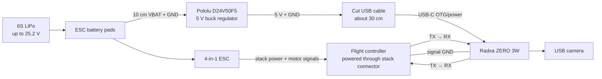
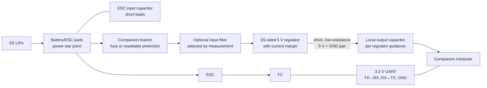
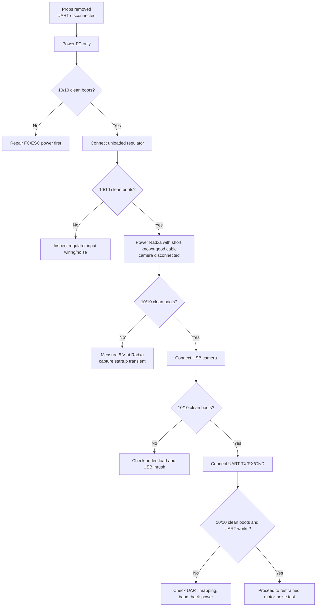
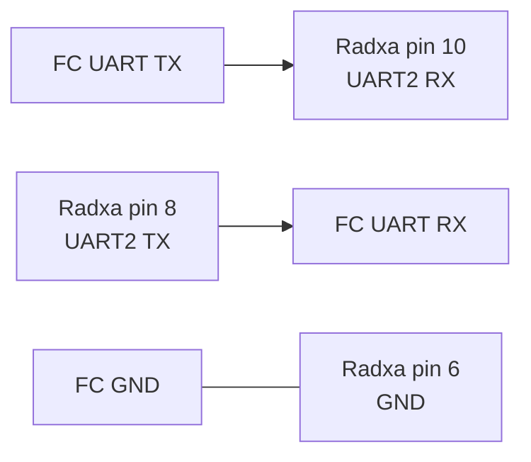

A companion computer adds cameras, networking, autonomy, and high-level processing to an FPV quad, but it also adds a pulsed electrical load beside noise-sensitive flight electronics. A system that works when the computer has a separate supply can fail when both devices share the flight battery.

This page develops a generic, measurement-first wiring pattern from a real test setup:

| Item | Test setup |
| --- | --- |
| Battery | 6S LiPo, up to 25.2 V when full |
| ESC/FC | iFlight F435 stack, with the final design intended to remain stack-independent |
| Companion computer | Radxa ZERO 3W |
| Regulator | Pololu D24V50F5, fixed 5 V, typical maximum 5 A |
| Computer input | USB 2.0 OTG/power USB-C port |
| Camera | USB camera, approximately 100 mA expected load |
| UART | Radxa physical pin 8 TX, pin 10 RX, pin 6 GND |
| Regulator input | Directly from the ESC battery pads |
| Cabling | About 10 cm from battery pads to regulator and 30 cm from regulator to Radxa |

The observed failure is intermittent: sometimes the flight controller does not boot correctly, UART communication is unavailable, and connecting FC USB does not recover it. Battery power must be removed and reapplied. The Radxa has also occasionally failed to power. The FC works reliably when the Radxa uses a separate supply.

!!! danger "Bench-test without propellers"
    Remove every propeller before changing power or UART wiring. Use a current-limited bench supply when possible. A wiring mistake on a 6S system can destroy the FC, ESC, computer, or USB host and can start a fire.

## Working diagnosis

The UART pin selection is valid: the Radxa uses 3.3 V GPIO, physical pin 8 is `UART2_TX_M0`, pin 10 is `UART2_RX_M0`, and pin 6 is ground. A level shifter is normally unnecessary when the selected FC UART is also 3.3 V.

The strongest evidence points to the shared power path:

- The problem was seen even with UART disconnected.
- The FC boots when the Pololu remains on the battery pads with no Radxa load.
- The FC and UART work when the Radxa uses an independent supply while signal ground remains connected.
- The Radxa occasionally fails to start from the onboard regulator.

That does not prove one specific fault. The main candidates are:

1. A short 5 V dip during simultaneous FC and Radxa startup.
2. Voltage loss through the cut 30 cm USB cable.
3. High-frequency regulator ripple or switching noise coupled through the shared battery and ground.
4. Battery-pad transients during connection.
5. An intermittent USB-C power lead or solder joint.
6. Startup inrush exceeding the regulator, cable, connector, or battery-pad path for a fraction of a second.

A multimeter showing `5 V` does not rule these out. It usually averages the signal and can miss a millisecond-scale dip that resets a processor.

## Current connection



The topology is reasonable, but it needs verified wiring, adequate conductors, local energy storage, and clean startup behavior.

## Recommended generic topology



Design goals:

- Branch the companion supply at the main battery/ESC pads, not through an FC 5 V rail.
- Keep companion load current out of FC traces and connectors.
- Run 5 V and ground together as a short, low-resistance pair.
- Put any added output capacitor close to the companion input, not only at the regulator.
- Keep the buck regulator and its power wiring away from the gyro, receiver antenna, GPS, magnetometer, and UART wiring.
- Cross noisy power wiring and signal wiring at right angles when separation is not possible.
- Use one intentional signal-ground connection between the FC and companion computer.

## Why the cable matters

The Radxa documentation specifies a 5 V, 2 A supply. Its instantaneous demand can change during boot, CPU activity, Wi-Fi startup, and USB-camera initialization.

The Pololu output is fixed at 5 V with 4% accuracy. At the low end, it can be close to 4.8 V before cable and connector losses. A thin or damaged USB cable can remove more voltage during a current pulse:

```text
voltage_drop = current × total_wire_resistance
```

The total resistance includes both the 5 V conductor and the return conductor. Measuring only at the regulator can therefore show a healthy voltage while the Radxa sees a lower value.

First replace the cut cable with a short, known-good USB power cable or a purpose-built lead rated for at least 3 A. Measure at the Radxa end while it remains connected.

## Isolation test sequence

Change one condition at a time and record whether both devices boot correctly over at least ten power cycles.



### Test 1: cable and load

1. Remove props and disconnect UART.
2. Disconnect the USB camera.
3. Replace the cut cable with the shortest known-good high-current lead available.
4. Power-cycle at least ten times.
5. Add the camera and repeat.

If this changes the result, the original cable or connector is a major suspect.

### Test 2: measure at the load

Measure between Radxa 5 V and ground as close to the board as safely possible while it boots. Do not rely only on the regulator pads.

Preferred tools, in order:

1. Oscilloscope with a short ground spring.
2. Multimeter with fast minimum-value capture.
3. USB power meter with transient logging.
4. Ordinary multimeter, useful for steady voltage but not decisive for startup dips.

Record:

- minimum 5 V rail during connection;
- minimum during Radxa boot;
- change when the camera initializes;
- regulator temperature; and
- whether the FC 5 V rail changes at the same time.

### Test 3: local output capacitance

A capacitor close to the Radxa can supply brief current pulses that the cable cannot deliver quickly. Do not select a value by guesswork alone:

- confirm that the regulator permits the intended output capacitance;
- use a correctly polarized, low-ESR capacitor with adequate voltage rating;
- place it across 5 V and ground near the Radxa input;
- keep its leads short; and
- check inrush and startup behavior after installation.

A common experimental range for a 5 V SBC rail is several hundred to about 1000 µF, combined with a smaller ceramic capacitor, but the final value must be validated with the actual regulator, cable, and load. Larger is not automatically safer because it increases startup inrush.

### Test 4: delayed companion startup

The Pololu regulator is enabled by default and provides an `ENABLE` input that can shut it down when pulled low. Delaying the companion computer until the FC has completed its initial boot can separate two simultaneous inrush events.

Use an open-drain/open-collector control or a correctly designed supervisor circuit; do not drive `ENABLE` high from a 3.3 V GPIO because the Pololu board pulls it toward its input supply. Validate the circuit on a bench before flight.

Delayed startup is a useful diagnostic and may improve robustness, but it should not conceal inadequate wiring or a collapsing supply.

## UART connection

For the Radxa ZERO 3W header:

| Physical pin | Function | Connect to FC |
| ---: | --- | --- |
| 6 | GND | FC ground |
| 8 | UART2 TX | FC UART RX |
| 10 | UART2 RX | FC UART TX |



Both sides must use 3.3 V logic. Verify the replacement FC rather than assuming every pad is identical.

UART lines can back-power an unpowered device through its input-protection diodes. During testing:

- power both devices before enabling UART applications;
- avoid leaving one side driving while the other side is unpowered;
- check each TX line with a meter when its destination is off; and
- consider small series resistors or a UART buffer with power-off protection in the final design.

Do not add a level shifter unless the actual logic levels require it; a poor auto-direction level shifter can break high-speed UART communication.

## Grounding and layout

The high-current Radxa return should run directly to the regulator and battery/ESC star point. Do not route Radxa supply current through an FC ground pad.

The UART ground is a signal reference. Keep it short and route it beside TX/RX. Because all grounds eventually meet at the battery/ESC pads, the goal is not to create isolated grounds; it is to control where load current flows.

Recommended physical arrangement:

```text
Battery/ESC pads
├── ESC and FC stack branch
└── protected regulator branch
    ├── 5 V power pair → Radxa
    └── local capacitor → Radxa input

FC UART
├── TX → Radxa RX
├── RX ← Radxa TX
└── signal GND → Radxa GND
```

## Pre-flight verification

Do not install props until all checks pass:

- FC, Radxa, and camera complete at least ten clean cold boots.
- FC remains accessible over USB after shared-battery startup.
- UART communicates without frame or checksum errors.
- Radxa reports no undervoltage or storage errors.
- The 5 V rail remains within the computer's allowed range during boot and camera startup.
- Regulator, cable, and connectors remain cool.
- Receiver, GPS, compass, video, and radio-link performance do not degrade.
- With the airframe restrained safely, motor operation does not reset either computer.
- Failsafe works without companion-computer assistance.

The companion computer must never be required for basic manual control or disarming.

## Findings to record next

The next physical test should collect:

1. Voltage at the Radxa end of the cable during boot.
2. Results with a short, known-good high-current USB lead.
3. Ten-cycle results with and without the camera.
4. FC `status` and arming-disable flags after any failed startup.
5. Regulator and FC rail waveforms if an oscilloscope is available.
6. The existing ESC input capacitor capacitance and voltage rating.
7. Exact wire gauge and connector construction for the final airframe.

## References

- [Pololu D24V50F5 specifications](https://www.pololu.com/product/2851){:target="_blank"}
- [Radxa ZERO 3W hardware interfaces and 40-pin header](https://docs.radxa.com/en/zero/zero3/hardware-design/hardware-interface){:target="_blank"}
- [Radxa ZERO 3 overview and 5 V/2 A power requirement](https://docs.radxa.com/en/zero/zero3){:target="_blank"}
