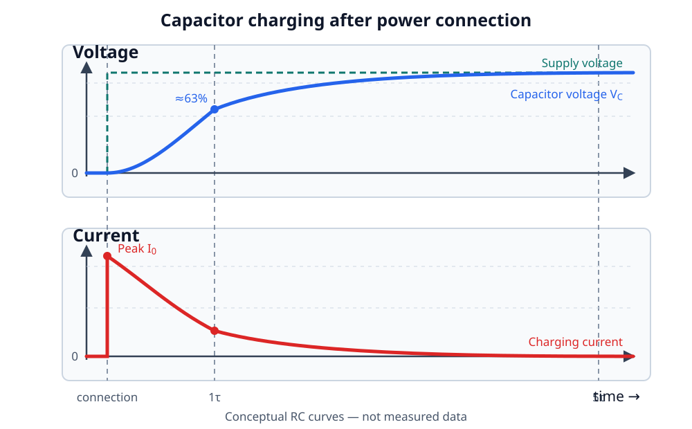
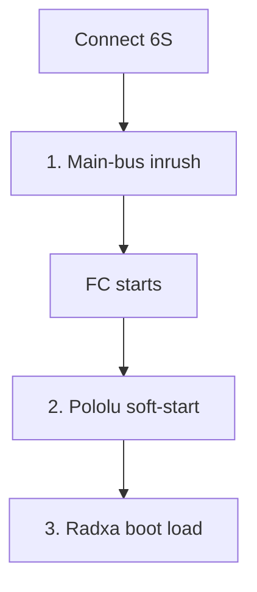
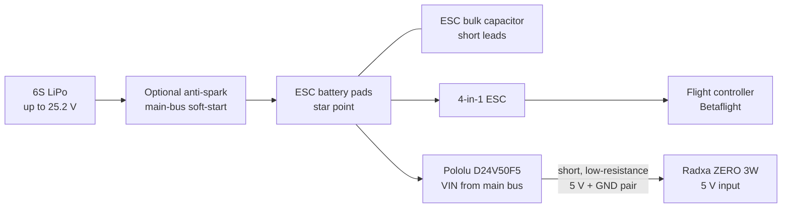
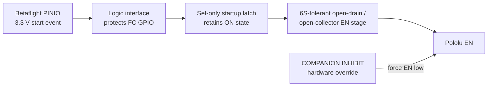
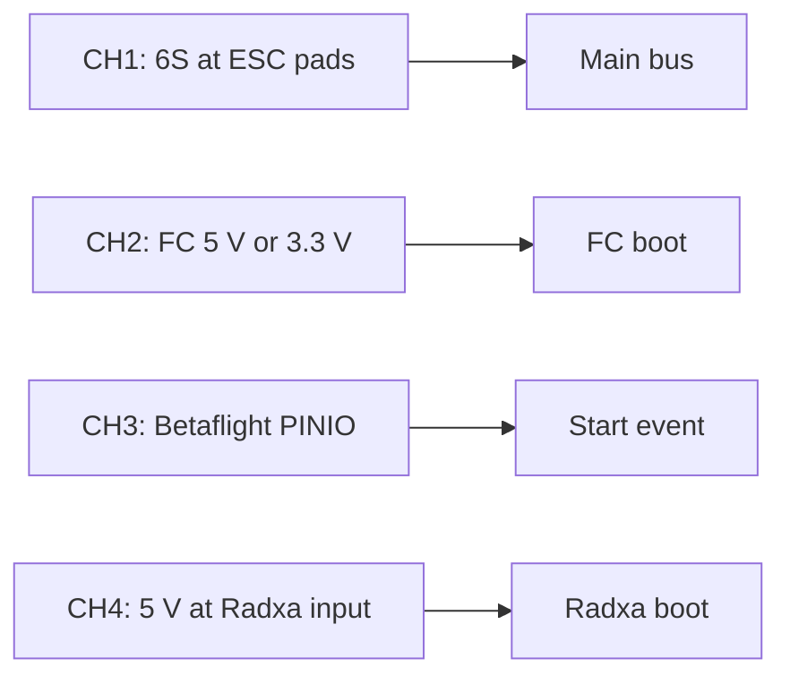

# Inrush Current in FPV Power Systems

Connecting a 6S LiPo to an FPV quad can produce a sharp spark at the XT60 and a
large, short current pulse. Adding a flight controller, large ESC capacitor,
5 V regulator, companion computer, and USB camera creates several startup
events that are related but require different solutions.

This page uses the following example:

| Part | Example |
| --- | --- |
| Battery | 6S LiPo, 25.2 V when fully charged |
| Flight controllers | iFlight BLITZ ATF435 and DAKEFPV F722 Mini |
| Firmware | Betaflight |
| Companion computer | Radxa ZERO 3W |
| Regulator | Pololu D24V50F5, item 2851, fixed 5 V |

!!! danger "Remove the propellers"
    Perform every power-on experiment without propellers. A 6S LiPo can deliver
    destructive current into a wiring error. Start with a current-limited bench
    supply or smoke stopper when practical, then validate the real battery
    connection separately.

## What is inrush current?

A discharged capacitor initially looks close to a short circuit. When the
battery is connected, current flows until the capacitor voltage approaches the
battery voltage:

```text
i = C × dv/dt
```

The ideal equation predicts a very large current for an instantaneous voltage
step. Real peak current is limited by battery impedance, connector and wire
resistance, capacitor ESR and ESL, and any deliberate current limiter.

The charge and stored energy are:

```text
Q = C × V
E = ½ × C × V²
```

Voltage matters twice in the energy equation. For illustration, charging
1000 µF from 0 V to a full 6S voltage stores:

```text
Q = 0.001 F × 25.2 V = 0.0252 C
E = ½ × 0.001 F × (25.2 V)² ≈ 0.318 J
```

This is an example, not an assumed value for the installed ESC capacitor.

### Voltage and current during charging



At connection time, capacitor voltage cannot change instantly, so current is
highest. As the capacitor charges, its voltage rises toward the supply voltage
and current decays toward zero. For an ideal resistor-capacitor pre-charge,
voltage reaches about 63% after one time constant (`τ = R × C`) and more than
99% after five time constants. A direct XT60 connection has no intentional
series resistor, so parasitic resistance and inductance produce a much faster,
less controlled pulse than the simplified RC curves.

## Three startup events



The flow is sequential, but its timescale is not uniform: battery-side inrush
can last microseconds to milliseconds, while FC and Radxa boot take much longer.
The sections below explain each stage.

### 1. Battery and ESC inrush

The main ESC capacitor is directly across the battery input. Current begins
before the XT60 contacts are fully seated, so the electric field can ionize the
small air gap and form an arc. Repeated arcing can pit and oxidize connector
surfaces, increasing resistance and heat under flight current.

A normal brief spark is not the same as a sustained short circuit. A violent or
continuing arc, smoke, heat, or repeated connector welding is a fault: disconnect
power and inspect the build.

### 2. Regulator output inrush

The Pololu D24V50F5 charges its own output network and the capacitance attached
to the 5 V cable. Pololu specifies integrated soft-start, short-circuit,
over-temperature, reverse-voltage and under-voltage protection. Soft-start
reduces its startup inrush, but it does not eliminate battery-side inrush from
the ESC and all other capacitors.

### 3. Companion-computer boot load

After 5 V appears, the Radxa load changes as its processor, storage, radios and
USB devices initialize. This is not purely capacitor inrush. A regulator,
connector or cable that cannot support the transient load can produce a 5 V dip,
reset the Radxa, or disturb other devices sharing the battery and ground path.

Sequencing the Radxa after the FC separates the two boot events. It cannot fix
an undersized regulator, thin cable, poor solder joint or unstable ground path.

## Ways to control inrush

| Method | Where it acts | What it solves |
| --- | --- | --- |
| Pre-charge resistor and bypass | Main battery input | Limits initial capacitor current before establishing the full-current path |
| MOSFET soft-start / anti-spark module | Main battery input | Ramps the bus voltage and reduces connector arcing |
| Regulator soft-start | Inside the DC/DC regulator | Controls the regulator output rise |
| Delayed regulator enable | Companion branch | Prevents FC and companion computer from starting simultaneously |
| Low-resistance 5 V wiring | Regulator to computer | Reduces voltage drop during boot-current pulses |
| Local output capacitance | Close to the computer | Supports brief load steps, but adds startup charge and must be validated |

### Passive pre-charge

For a resistor `R` charging capacitance `C`, the time constant is:

```text
τ = R × C
```

The capacitor reaches about 63% after `1τ` and more than 99% after `5τ`. Initial
resistor current and power are approximately:

```text
I_initial = V / R
P_initial = V² / R
```

The resistor must survive the pulse energy, and a low-resistance main path must
bypass it before motor current flows. A permanent series pre-charge resistor is
not a flight-current path.

### DarwinFPV anti-spark module example

The [DarwinFPV anti-spark filter](https://darwinfpv.com/products/darwinfpv-anti-spark-xt60-filter-for-fpv-drone){:target="_blank"}
is an example of a battery-side solution. DarwinFPV describes an RC-controlled,
high-current MOSFET soft-start that ramps power before providing a low-resistance
flight path. It belongs between the battery connector and the drone power bus.

Treat its current and voltage ratings, cooling, PCB construction and failure
behavior as product claims to verify for the actual aircraft. It does not
replace the Pololu EN sequencer, and the EN sequencer does not replace an
anti-spark device.

!!! note "A smoke stopper has a different purpose"
    A smoke stopper limits current while checking a new build for faults. Many
    are not designed to remain in the power path during flight. An anti-spark
    circuit controls only the connection transient and then provides a
    low-resistance high-current path.

## Recommended system topology



The optional anti-spark stage handles the whole drone's connection transient.
The Pololu branch remains connected to the star point, while its EN input delays
only the companion-computer startup.

## Pololu D24V50F5 enable behavior on 6S

The saved PDF is a Google Search result for **D24V30F5**. The linked Pololu item
2851 is **D24V50F5**; do not copy resistor values or EN behavior from a different
regulator family.

For D24V50F5, Pololu specifies:

- VIN operating range of 6 V to 38 V;
- an onboard 100 kΩ pull-up from EN to reverse-protected VIN;
- enabled operation when EN is left disconnected; and
- shutdown when EN is driven below 0.6 V.

At full 6S voltage, EN is associated with approximately 25.2 V through its
onboard pull-up. **Never connect EN directly to a 3.3 V FC GPIO.** Driving it
high is unnecessary and can destroy or back-power the FC.

### Required conceptual interface



This is a behavioral diagram, **not a finished schematic**. The later circuit
design must satisfy all of these requirements:

1. Hold EN below 0.6 V from the instant 6S is connected.
2. Tolerate 25.2 V plus measured input transients at every EN-facing device.
3. Prevent any EN or 6S voltage from reaching the FC GPIO.
4. Release EN only after Betaflight initializes the selected PINIO.
5. Latch the released state so an FC reset does not power-cycle the Radxa.
6. Reset the latch only after main battery removal.
7. Let the physical inhibit control override the latch and hold EN low.
8. Use the battery/ESC ground as power reference without routing Radxa supply
   current through an FC ground pad.

!!! warning "Startup only"
    This design does not provide graceful Linux shutdown, energy hold-up or
    protection from sudden battery removal. Cutting 6S power can corrupt the
    Radxa filesystem even when startup sequencing works perfectly.

## Betaflight PINIO configuration

Betaflight PINIO is a practical **FC-ready proxy**: the output changes after the
firmware has initialized that resource. It is not a formal health signal and
does not prove that every sensor, receiver or UART application is ready.

An inverted PINIO associated with an inactive USER mode can produce the desired
physical high start event after initialization. The external hardware must
still guarantee companion-off behavior while the MCU pin is floating during
reset.

### Capture the real board configuration first

Connect each FC to Betaflight Configurator and save this output before changing
resources:

```text
status
resource show all
get pinio_config
get pinio_box
diff all
```

Target names, hardware revisions and existing mappings matter more than the
marketing name printed on the board.

### Generic unused LED-pad pattern

If `resource show all` reports the unused LED pad as `<MCU_PIN>`, a clean target
with PINIO slot 1 available can use this pattern:

```text
resource LED_STRIP 1 NONE
resource PINIO 1 <MCU_PIN>
set pinio_config = 129,1,1,1
set pinio_box = 40,255,255,255
save
```

Here, `129` means inverted push-pull output and box ID `40` is USER1. Leave
USER1 inactive; the resulting physical output after initialization is used as
the latch's start event. Do not assign an AUX range that can later remove power.

This is an example for an otherwise unused first PINIO slot. Preserve existing
array entries and choose a different slot when the target already uses PINIO.
Never copy `<MCU_PIN>` literally.

### iFlight BLITZ ATF435

iFlight identifies the firmware target as `IFLIGHT_BLITZ_ATF435` and exposes an
LED pad. Because this AT32 target's live resource mapping has not been captured,
the safe procedure is:

1. Confirm `IFLIGHT_BLITZ_ATF435` in `status`.
2. Find `LED_STRIP` in `resource show all` and record its MCU pin.
3. Confirm the LED pad is unused.
4. Confirm which PINIO slot is unused.
5. Substitute those verified values into the generic pattern.
6. Measure the pad during cold boot before connecting the interface.

Do not infer an STM32 resource from another F435 board; the BLITZ uses an
AT32F435 MCU.

### DAKEFPV F722 Mini

The current standard `DAKEFPVF722` target defines:

| Function | MCU pin | Default configuration |
| --- | --- | --- |
| LED strip | PB3 | LED output |
| PINIO1 / USER1 | PA14 | Inverted output (`129`) |
| PINIO2 / USER2 | PA8 | Inverted output (`129`) |

The `DAKEFPVF722X8` target uses different PINIO pins (`PB1` and `PB10`). The
text “F722 Mini” on the PCB is not sufficient to choose between target maps.
Confirm the actual target and physical pad with `status`, `resource show all`,
the board diagram and a meter. Prefer an already exposed, unused PINIO pad; use
the LED-pad remap only when its MCU pin and solder pad are positively identified.

## Measurement plan

An ordinary multimeter often averages over the event and can display a steady
5 V while a millisecond dip resets a processor.

### Probe points



Capture these events separately:

1. Battery connection with companion inhibited.
2. Betaflight PINIO transition.
3. Pololu 5 V rise after EN release.
4. Minimum Radxa input voltage during boot.
5. Change when the USB camera is attached.
6. FC rail behavior during the same sequence.

Use a differential probe, isolated/battery-powered scope, or another measurement
arrangement known to be safe for the floating battery system. A bench scope's
earth-referenced ground clip can create a destructive short if attached to the
wrong point. Never place a normal ground clip on battery positive.

### Cable voltage drop

Measure at the Radxa, not only at the regulator:

```text
V_drop = I × (R_5V_wire + R_ground_wire + R_connectors)
```

The 30 cm 5 V cable includes both outgoing and return resistance. A short,
known-gauge power pair and sound connectors are as important as regulator
current rating.

## Bench validation

1. Remove all propellers and disconnect the Radxa UART.
2. Save the complete Betaflight configuration.
3. Verify the chosen pad with a meter or oscilloscope before connecting it.
4. Test the inhibit control: FC on, Pololu output off.
5. Test at reduced current with a bench supply: FC boots, PINIO changes, EN is
   released and 5 V rises once.
6. Reset only the FC MCU and confirm Radxa 5 V remains present.
7. Remove all input power, reconnect it and confirm the sequence resets.
8. Repeat at least ten cold starts with the Radxa, then with the USB camera.
9. Verify FC USB access, UART communication and absence of Radxa undervoltage.
10. Test the optional anti-spark device separately with the real 6S battery.
11. Reconnect UART only after both power states are reliable; confirm neither
    TX line back-powers an unpowered device.

Do not install propellers until power sequencing, failsafe and manual disarming
work without assistance from the companion computer.

## References

- [Pololu D24V50F5 product 2851](https://www.pololu.com/product/2851){:target="_blank"}
- [Betaflight PINIO and PINIO BOX](https://betaflight.com/docs/wiki/guides/current/Pinio-and-PinioBox){:target="_blank"}
- [Betaflight resource remapping](https://betaflight.com/docs/wiki/guides/current/Resource-remapping){:target="_blank"}
- [iFlight BLITZ ATF435 specifications](https://shop.iflight.com/BLITZ-ATF435-Flight-Controller-Pro2053){:target="_blank"}
- [Betaflight DAKEFPVF722 target definitions](https://github.com/betaflight/config/tree/master/configs/DAKE){:target="_blank"}
- [DarwinFPV anti-spark explanation](https://darwinfpv.com/blogs/technical-blog/anti-spark-support){:target="_blank"}
- [Switch things on and off with your Betaflight FC pinio and pinio_box in depth tutorial ](https://youtu.be/gnJg6KAJSmo){:target="_blank"}
