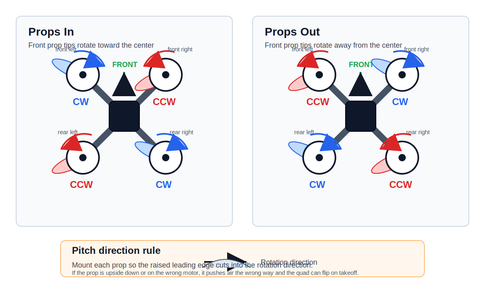
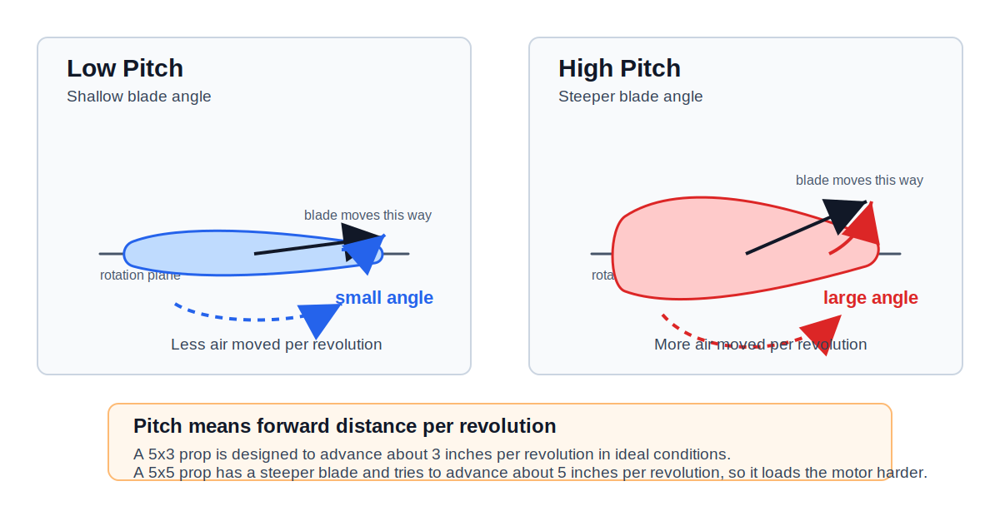

## FPV Propellers Video Summary

Reference video: [FPV #8 - Propellers for FPV Drones - What you need to know](https://youtu.be/WWZImwj-cIc)

The main idea is that propellers are not just a replaceable plastic part. They define a large part of how the quad feels: thrust, efficiency, grip, noise, motor load, battery current, and how quickly the drone reacts to throttle changes.

For FPV drones, prop selection is usually a tradeoff between:

- More efficiency and longer flight time
- More grip and control authority
- More top speed
- Less prop wash
- Less motor heat and current draw
- Better durability after crashes

There is no single best prop. The right prop depends on the frame size, motor KV, battery voltage, aircraft weight, and flying style.

## Propeller Direction

Every quad uses two clockwise props and two counter-clockwise props. This cancels motor torque so the frame does not spin by itself.

The important rule is:

- A clockwise motor needs a clockwise prop.
- A counter-clockwise motor needs a counter-clockwise prop.
- The high leading edge of the blade must cut into the air first.
- If the prop is upside down or on the wrong motor, the quad will push air upward instead of downward and will flip on takeoff.



Always check motor direction in Betaflight or the flight-controller setup tool before installing props.

## Props In

`Props in` is the traditional quadcopter direction.

On the front of the quad, the propeller tips rotate inward toward the center line of the frame. The front-left and front-right props throw air toward the camera and middle of the frame.

Typical behavior:

- Common default setup on many FPV quads
- Slightly more air and debris can be pushed toward the camera
- Can feel stable and predictable
- May collect more grass, dirt, or branches into the frame after a crash

Use `props in` when you want the standard setup and do not have a reason to change it.

## Props Out

`Props out` reverses the motor directions.

On the front of the quad, the propeller tips rotate outward away from the center line of the frame. Instead of throwing air and debris toward the camera, the front props tend to throw them away from the middle of the quad.

Typical behavior:

- Popular on freestyle and whoop builds
- Can reduce dirt, grass, and branches hitting the camera
- Can help the quad slide out of some crashes instead of pulling objects into the frame
- May slightly change yaw and corner feel
- Requires changing both motor direction and prop direction

Use `props out` if you fly close to obstacles, grass, gates, trees, or indoor objects. The performance difference is usually smaller than the practical crash and debris difference.

## Two-Blade Props

Two-blade props have the lowest blade area and usually the lowest drag.

Pros:

- Most efficient blade count
- Lower current draw
- Longer flight time
- Lower motor load and heat
- Often good for long range and lightweight builds
- Can have good top speed when matched correctly

Cons:

- Less grip in corners and throttle punches
- Less braking authority
- Less thrust in limited prop diameter
- Can feel loose compared with tri-blades
- Usually not the default choice for aggressive 5-inch freestyle

Good use cases:

- Long range
- Lightweight cruising
- Efficiency-focused builds
- Small batteries where current draw matters

## Three-Blade Props

Three-blade props are the most common choice for modern 5-inch FPV freestyle and racing.

Pros:

- Good balance between thrust and efficiency
- Strong grip in turns
- Good throttle response
- Better braking than two-blade props
- Works well for freestyle, racing, and general FPV
- Easy to tune because many pilots and manufacturers use them

Cons:

- Less efficient than two-blade props
- More current draw
- More motor load
- Shorter flight time than a similar two-blade prop
- More noise and drag

Good use cases:

- 5-inch freestyle
- Racing
- General FPV flying
- Builds where control feel matters more than maximum endurance

## Four-Blade Props

Four-blade props add more blade area again. They can create more thrust in a small diameter, but they cost more power.

Pros:

- More grip at low speed
- More thrust in limited prop size
- Strong control authority
- Can feel locked-in and smooth
- Useful for cinewhoops, ducts, and small frames where prop diameter is limited

Cons:

- Higher current draw
- Lower efficiency
- Shorter flight time
- More motor heat
- Lower top speed in many setups
- More drag and weight
- Can make tuning more sensitive

Good use cases:

- Cinewhoops
- Ducted builds
- Small frames that need more thrust from limited diameter
- Smooth cinematic flying where control authority is more important than efficiency

## Prop Design Basics

A propeller is a rotating wing. Each blade has an airfoil shape. When the motor spins the prop, the blade accelerates air downward. The drone rises because the prop pushes air down and the air pushes the drone up.

The main design parameters are:

- Diameter: Larger diameter moves more air and can make more thrust, but needs more torque and frame clearance.
- Pitch: Higher pitch moves more air per rotation and can increase speed, but also increases current draw and motor load.
- Blade count: More blades increase blade area and grip, but reduce efficiency.
- Chord: Wider blades create more thrust and drag.
- Airfoil shape: Controls lift, drag, stall behavior, and noise.
- Blade twist: The angle changes from hub to tip so each part of the blade works at a better angle of attack.
- Tip shape: Affects efficiency, noise, and prop wash.
- Material stiffness: Stiffer props feel sharper, but can transfer more vibration and may break instead of bending.
- Weight: Heavier props need more energy to accelerate and slow down.

## Prop Pitch

Pitch describes how far a propeller would move forward in one full revolution if it was moving through a solid material, like a screw moving through wood. Air is not solid, so the real movement is lower, but the number is still useful for comparing props.

Example:

- A `5x3x3` prop is 5 inches diameter, 3 inches pitch, 3 blades.
- A `5x5x3` prop is 5 inches diameter, 5 inches pitch, 3 blades.

The higher-pitch prop has a steeper blade angle. For the same RPM, it tries to move more air and create more forward speed. This also means the motor must work harder.



Low pitch behavior:

- Easier for the motor to spin
- Lower current draw
- Cooler motors
- Better efficiency and longer flight time
- Smoother throttle control at low speed
- Less top speed and less aggressive punch

High pitch behavior:

- Moves more air per revolution
- More thrust at higher speed
- Higher possible top speed
- Stronger throttle response when the motor can handle it
- Higher current draw
- More motor and ESC heat
- Shorter flight time
- Can feel rough or inefficient if the pitch is too high for the motor

Pitch is linked to motor KV and battery voltage. A high-KV motor on 6S already spins very fast, so a high-pitch prop can overload the motor and ESC. A lower-KV motor may handle more pitch because it has more torque and lower RPM.

For freestyle, medium pitch is usually easier to control. For racing, pilots may choose more pitch for speed. For long range, lower pitch is usually better because efficiency matters more than maximum acceleration.

!!! tip
    If motors are hot after a short flight, try a lower-pitch prop before changing the tune.

## Prop Size Numbers

FPV props are usually named with **diameter**, **pitch**, and **blade** count.

Example:

```text
5x4.3x3
```

Meaning:

- `5`: 5 inch diameter
- `4.3`: 4.3 inch pitch
- `3`: three blades

A higher pitch or more blades does not automatically mean a better prop. It means the prop loads the motor harder. If the motor, ESC, and battery cannot supply the power cleanly, the quad may feel hot, inefficient, noisy, or hard to tune.

## Choosing Props

Start with the common prop type for the frame size:

- 5-inch freestyle: 5 inch tri-blade, medium pitch
- 5-inch racing: light tri-blade or aggressive high-pitch tri-blade
- Long range: efficient two-blade or low-pitch tri-blade
- Cinewhoop: three-blade, four-blade, or more blades depending on duct and motor size
- Tiny whoop: small multi-blade props are common because diameter is limited

Then tune by flight feel:

- If motors are hot, reduce pitch or blade count.
- If flight time is too short, reduce pitch, blade count, or prop weight.
- If the quad feels weak, increase pitch or blade area carefully.
- If the quad feels loose in corners, try more blade area or a different prop shape.
- If there is vibration or bad video, check for bent, damaged, or unbalanced props.

## Practical Notes

Props are consumables. Replace them when they are bent, cracked, chipped, or causing vibration.

Do not mix different prop models on the same quad. Different blade count, pitch, or shape creates different thrust on each motor and makes the flight controller work harder.

After changing props, check:

- Motor temperature
- Hover throttle
- Full-throttle current
- Vibration
- Prop wash
- Flight time
- Tune quality

Small prop changes can make a large difference in FPV flight feel.

---

## Reference
- [ My Search for the Best 5” FPV Prop ](https://youtu.be/JzcIJuwH-0g)