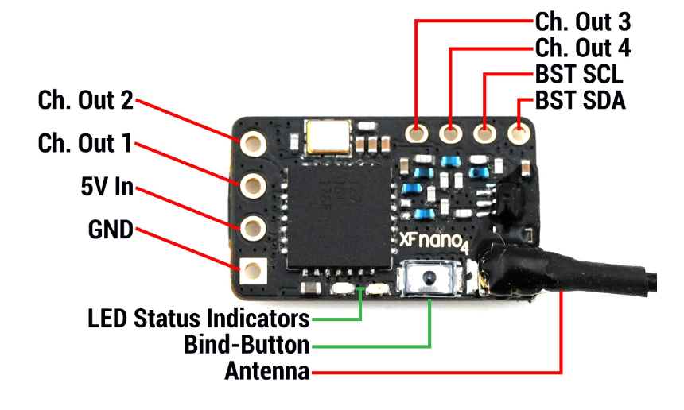
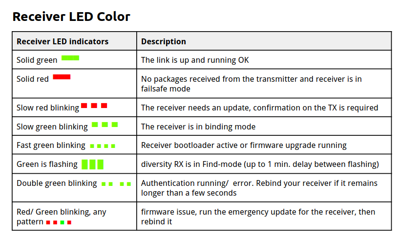

## Overview

`TBS Crossfire` is a long-range RC link from Team BlackSheep. It commonly uses the `868 MHz` or `915 MHz` band and sends receiver data to the flight controller using `CRSF`.

## Pros And Cons

| Pros | Cons |
| ---- | ---- |
| Mature long-range system | More expensive than many alternatives |
| Strong telemetry support | Larger antennas than 2.4 GHz systems |
| Reliable `CRSF` integration with Betaflight | Usually needs an external transmitter module |
| Good for long range and penetration | Not as tiny as some ELRS receiver options |

## Betaflight Connection

Crossfire receivers usually use a full UART:

```text
Crossfire CH1 TX -> Flight controller RX
Crossfire CH2 RX -> Flight controller TX
5V -> 5V
GND -> GND
```



In Betaflight:

- Ports tab: enable `Serial RX`.
- Receiver protocol: `CRSF`.

## Receiver LED color




---

## Reference

- [tbs-crossfire-nano quickstart](https://www.team-blacksheep.com/media/files/tbs-crossfire-nano-quickstart.pdf)
