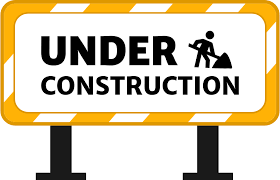
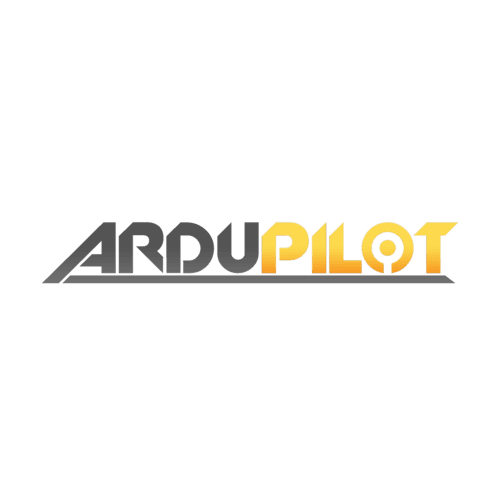

---
tags:
    - ardupilot
    - mavlink
---

# Ardupilot and Mavlink

    

        <a href="geometric_control">
                
                
sensors
</a>
    

    

        <a href="math">
                
                
Math

            </a>
    

    

        <a href="slam">
                
                
SLAM

            </a>
    

    

         <a href="uav">
                
                
Ardupilot and Mavlink

            </a>
    

    

        
Block 5 Description

    

    

        
Block 6 Description

    

