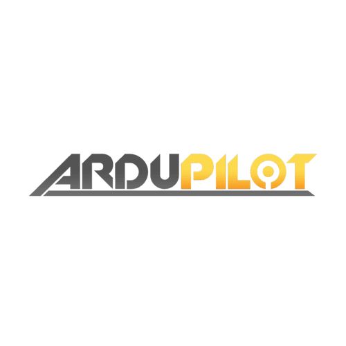
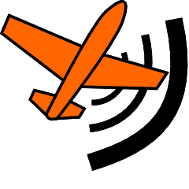

    

        <a href="ardupilot">
                
                
Ardupilot

            </a>
    

    

        <a href="betaflight">
                
                
betaflight

            </a>
    

    

        <a href="mavlink">
                
                
Mavlink

            </a>
    

    

        <a href="openhd">
            
                
OpenHD

            </a>
    

    

        <a href="fpv">
                
FPV

            </a>
    

    

---

## To read and watch
- [seeed studio esp32 drone](https://www.seeedstudio.com/ESP-FLY-co-create-p-6744.html)
- [IL

  
    
    
    
  

  
    
      
      
    
    
      
      
    
  
DIY 3D Printed VTOL UAV](https://youtu.be/FE3cvICdO2A)
- [Building a sub 250g Autonomous Drone with Ardupilot and ExpressLRS AirPort Telemetry](https://youtu.be/u_ArriXbrR0)
    - [part list](https://www.thingiverse.com/thing:6699961)

- [fpv simulators](https://oscarliang.com/fpv-simulator/)
- [expresslrs](https://www.expresslrs.org/)
