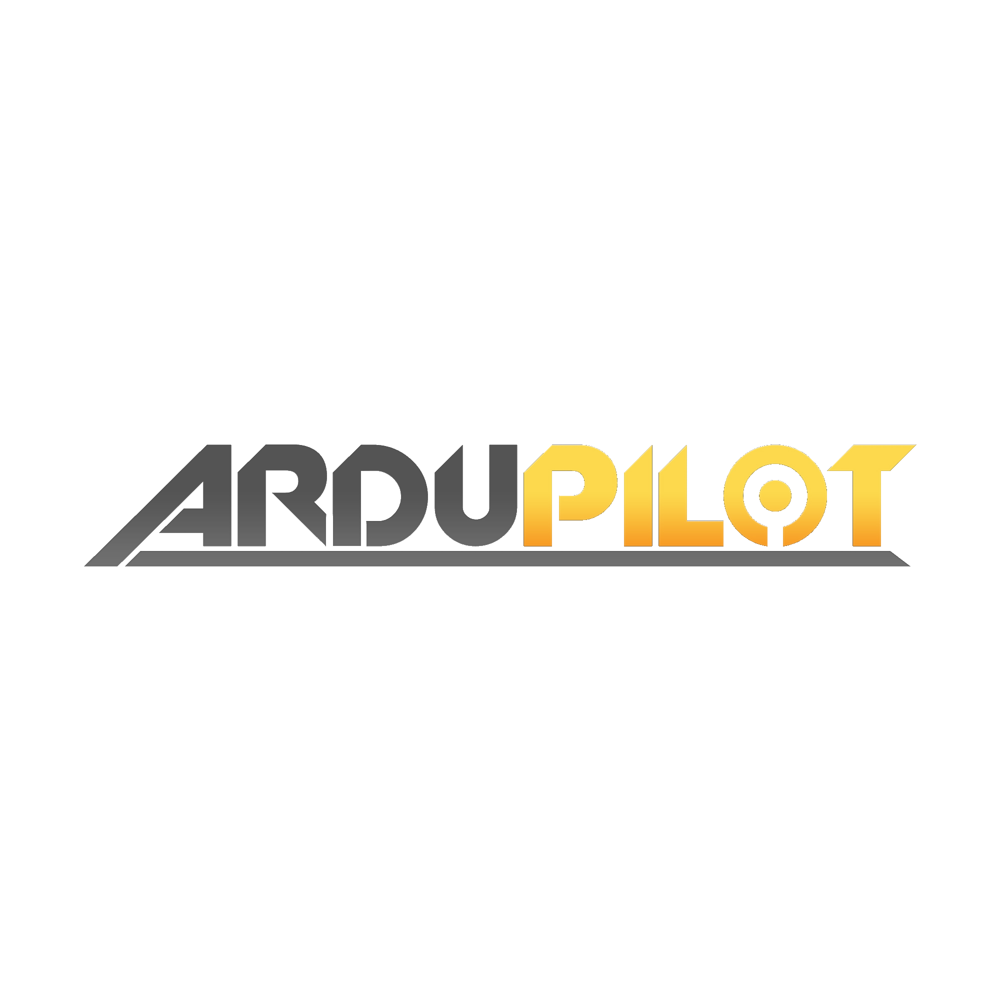

---
tags:
    - uav
    - ugv
    - ardupilot
    - mavlink
---

# uXv

    

        <a href="qgc">
                
                
QGroundControl
</a>
    

    

        <a href="px4">
                
                
PX4

            </a>
    

    

        <a href="ardupilot">
                
                
Ardupilot

            </a>
    

    

        <a href="betaflight">
                
                
betaflight

            </a>
    

    

        <a href="fpv">
                
                
FPV

            </a>
    

    

## To read and watch
- [Building a sub 250g Autonomous Drone with Ardupilot and ExpressLRS AirPort Telemetry](https://youtu.be/u_ArriXbrR0)
    - [part list](https://www.thingiverse.com/thing:6699961)
- [BETAFLIGHT Tutorial for Beginners!!! - Updated & Step by Step](https://youtu.be/If1DEpShDV8)

- [fpv simulators](https://oscarliang.com/fpv-simulator/)
- [expresslrs](https://www.expresslrs.org/)