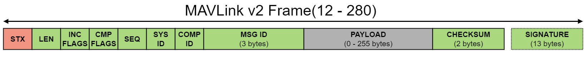
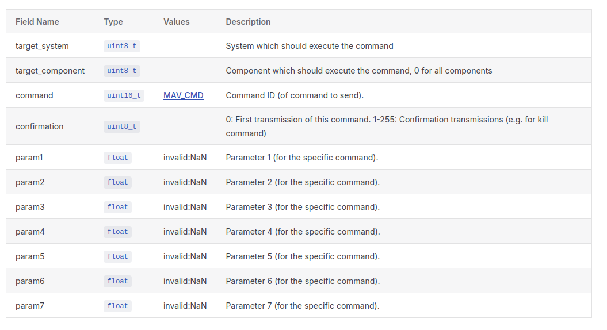

MAVLink is used as the messaging layer between the main parts of a UAV system. It carries telemetry, commands, mission data, parameters, status updates, and sensor information over serial links, UDP/TCP, radios, or onboard networks.

The main MAVLink components are:

- **Autopilot / flight controller**: controls the vehicle and publishes telemetry.
- **Ground control station (GCS)**: monitors the vehicle and sends commands or mission plans.
- **Companion computer**: runs higher-level software such as computer vision, autonomy, or payload control.
- **MAVLink router or bridge**: forwards MAVLink traffic between links, tools, and components.


<div class="grid-container">
    <div class="grid-item">
        <a href="pymavlink">
            <p>pymavlink</p>
        </a>
    </div>
    <div class="grid-item">
        <a href="network_tools">
            <p>wireshark and network debug tools</p>
        </a>
    </div>
     <div class="grid-item">
        <a href="mavlink_network">
            <p>mavlink network</p>
        </a>
    </div>
</div>
<div>
    <div class="grid-item">
        <a href="heartbeat">
            <p>heartbeat</p>
        </a>
    </div>
</div>

---

## Mavlink
MAVLink has been deployed in a number of versions:

- MAVLink 1: **0xFE**
- MAVLink 2: **0xFD**


[more](https://mavlink.io/en/guide/serialization.html)


---


## SYSID (System ID)
A number that identifies the vehicle/system. (1-255)
Distinguishes different vehicles on the same MAVLink network (Vehicle ID)

Examples:

- **Drone #1** → SYSID = 1
- **Drone #2** → SYSID = 2
- **Simulator (SITL)** → often SYSID = 1 (configurable)
- **GCS ()** = 255

## COMPID (Component ID)
A number that identifies a **component** inside a system. (1-255)
Distinguishes subsystems within the same vehicle

Think of it as the process/module ID

Common COMPIDs:
- **1** → Autopilot (flight controller)
- **190** → Companion computer
- **191** → GCS (ground control station)
- **200+** → Custom components

## Source / Target / Broadcast
MAVLink separates the **sender identity** from any optional **receiver target**:

1. Message header → source

Every MAVLink frame contains the sender IDs in the header:

- `sysid` / `source_system` - the system that sent the message
- `compid` / `source_component` - the component that sent the message

These identify **who sent the message**. They are normally set by the MAVLink library or connection configuration.


2. Payload fields → target

Only some MAVLink messages are addressed to a receiver. Those messages include target fields in the payload, for example:

- `target_system`
- `target_component`

These identify **who should handle or execute the message**. Common examples are command, mission, and parameter messages.

### Example: COMMAND_LONG(76)



### Broadcast

For messages that have target fields, `0` means broadcast:

```
target_system    = 0
target_component = 0
```

- `target_system = 0` - send to all systems
- `target_component = 0` - send to all components in the selected system

**Telemetry messages** <u>usually do not have target fields</u>. They are simply published by the sender, and any MAVLink peer on the link may consume them.

Avoid broadcasting **control commands** unless the intended behavior is clear and safe.
