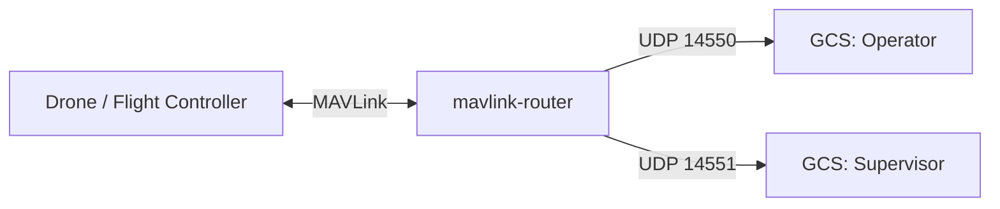

MAVLink is a message based network protocol. Every packet identifies the sender
with two fields:

- `sysid`: the system id. This usually identifies one vehicle, ground station,
  antenna tracker, camera rig, or other MAVLink node on the network.
- `compid`: the component id inside that system. For example, one vehicle may
  use the same `sysid` for its autopilot, camera, gimbal, and companion
  computer, while each component uses a different `compid`.

Together, `sysid` and `compid` form the **source address** of a MAVLink component.
Messages that target a specific receiver usually include `target_system` and
`target_component` fields in the **message payload**. A ground station can use these
fields to send a command to one vehicle, or to one component on that vehicle.

Some MAVLink messages are effectively broadcast. They are sent on the link and
any receiver that understands the message may consume them. Heartbeats,
position, attitude, and status messages commonly work this way: each component
publishes its state, and routers or endpoints forward the packet to other links.
Broadcast is also commonly represented by target values of `0`, meaning all
systems or all components, when the message type has target fields.

In a routed MAVLink network, tools such as `mavlink-router` forward messages
between serial, UDP, and TCP links. The router does not assign vehicle identity;
it forwards packets while preserving the sender `sysid` and `compid`, so every
endpoint can decide whether a message is relevant.


---


## Mavlink router

MAVLink Router is a proxy that forwards MAVLink traffic between several endpoints, such as a flight controller, ground control station, simulator, companion computer, or telemetry radio.
It lets one MAVLink source be shared by multiple clients and can route traffic across UDP, TCP, and serial links.

[more project github](https://github.com/mavlink-router/mavlink-router)

```bash title="route SITL to udp"
./mavlink-routerd-glibc-x86_64 -e 127.0.0.1:14550  -p 127.0.0.1:5760
```

---

### Demo: route message using mavlink-router



```bash title="route serial telemetry to UDP"
./mavlink-routerd-glibc-x86_64 \
  -e 192.168.1.20:14550 \
  -e 192.168.1.21:14551 \
  /dev/ttyACM0:57600
```

In this example, `/dev/ttyACM0:57600` is the serial MAVLink source from the
flight controller. Each `-e` option adds a UDP endpoint that receives the routed
MAVLink stream.

The same route can be written as a `mavlink-router` config file:

```ini title="main.conf"
[General]
ReportStats=false

[UartEndpoint flight_controller]
Device=/dev/ttyACM0
Baud=57600

[UdpEndpoint operator_gcs]
Mode=Normal
Address=192.168.1.20
Port=14550

[UdpEndpoint supervisor_gcs]
Mode=Normal
Address=192.168.1.21
Port=14551
```

```bash title="run mavlink-router with config"
./mavlink-routerd-glibc-x86_64 -c main.conf
```

The config file is split into endpoint sections:

- `[General]` contains router-wide settings.
- `ReportStats=false` disables periodic traffic statistics in the router log.
- `[UartEndpoint flight_controller]` defines a serial MAVLink link named
  `flight_controller`.
- `Device=/dev/ttyACM0` selects the serial device connected to the flight
  controller.
- `Baud=57600` sets the serial baud rate for that device.
- `[UdpEndpoint operator_gcs]` and `[UdpEndpoint supervisor_gcs]` define UDP
  outputs for two ground stations.
- `Mode=Normal` makes the UDP endpoint send MAVLink packets to the configured
  address and port.
- `Address=192.168.1.20` and `Address=192.168.1.21` are the destination IP
  addresses for each ground station.
- `Port=14550` and `Port=14551` are the destination UDP ports.

With this config, MAVLink packets arriving from the flight controller serial
port are forwarded to both ground stations over UDP.


### Demo: control traffic

Use endpoint filters when the supervisor station is only a monitor. This example
sends only heartbeat and GPS position messages to the supervisor endpoint, and
drops any MAVLink packets received from that supervisor endpoint before they can
be routed back to the flight controller.

```ini title="monitor-supervisor.conf"
[General]
ReportStats=false

[UartEndpoint flight_controller]
Device=/dev/ttyACM0
Baud=57600

[UdpEndpoint operator_gcs]
Mode=Normal
Address=192.168.1.20
Port=14550

[UdpEndpoint supervisor_monitor]
Mode=Normal
Address=192.168.1.21
Port=14551
AllowMsgIdOut=0,24,33
AllowSrcSysIn=0
```

The supervisor receives:

- `0`: `HEARTBEAT`
- `24`: `GPS_RAW_INT`
- `33`: `GLOBAL_POSITION_INT`

`AllowMsgIdOut=0,24,33` is applied only to traffic leaving the router through
`supervisor_monitor`; the operator ground station still receives the full
stream. `AllowSrcSysIn=0` drops normal MAVLink packets received from the
supervisor, because MAVLink source system id `0` is reserved for broadcast
targets and should not be used by a real sender. For a passive monitor, you do
not need to allow heartbeat from the supervisor. Only allow it if the supervisor
should become an active MAVLink participant that the router discovers and routes
messages to.
