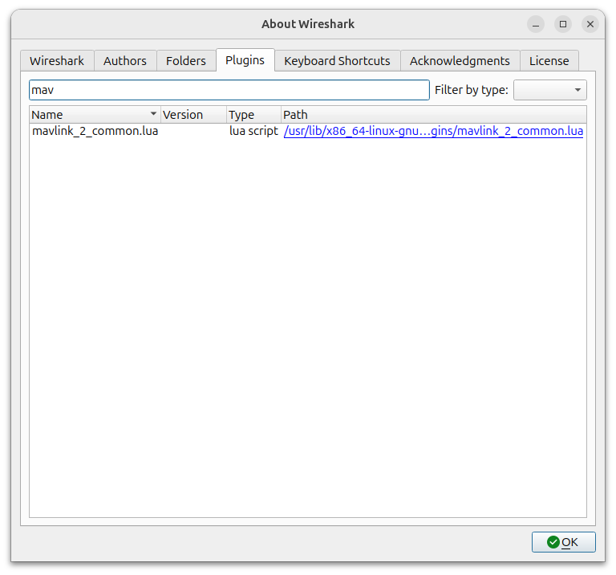

## Wireshark

Add mavlink parser to wireshark as LUA plugin [read more](https://mavlink.io/en/guide/wireshark.html)

### Create lua plugin

```bash
.venv/bin/mavgen.py \
    --lang=WLua \
    --wire-protocol=2.0 \
    --output=mavlink_2_common \
    .venv/lib/python3.11/site-packages/pymavlink/dialects/v20/common.xml 
```

### Install the plugin
TODO: run wireshark with user permission, install the lua plugin in user `.local` folder

```
sudo cp mavlink_2_common.lua /usr/lib/x86_64-linux-gnu/wireshark/plugins

```


```python title="line to fix"
f.CAMERA_IMAGE_CAPTURED_capture_result = ProtoField.new("capture_result (MAV_BOOL)", "mavlink_proto.CAMERA_IMAGE_CAPTURED_capture_result", ftypes.INT8, nil, base.DEC)
```




### Capture mavlink traffic


---

## Play mavlink pcap files

!!! warning "tcpreplay"
    I try this tool without success

    ```bash
    sudo apt install tcpreplay
    ```

    ```bash
    sudo tcpreplay -i eth0 capture.pcap
    ```
    
### Play pcap using scapy script

```python


from scapy.all import rdpcap, IP, UDP, send
import time
PCAP = "mavlink.pcap"
pkts = rdpcap(PCAP)

t0 = None
start = None

for p in pkts:
    if IP in p and UDP in p:
        if t0 is None:
            t0 = float(p.time)
            start = time.time()

        pkt_time = float(p.time)
        delay = (pkt_time - t0) - (time.time() - start)

        if delay > 0:
            time.sleep(delay)

        del p[IP].len
        del p[IP].chksum
        del p[UDP].len
        del p[UDP].chksum

        send(p[IP], verbose=False)

```