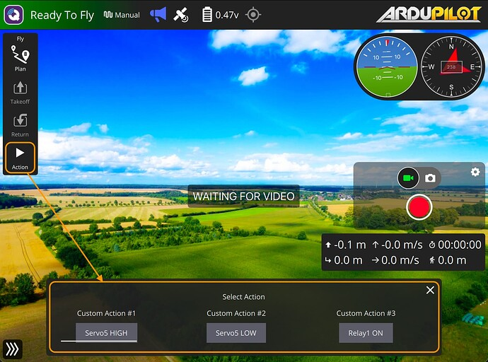

{{ page_folder_links() }}


## Customization
### Sending custom mavlink commands
[Sending custom mavlink commands](https://discuss.bluerobotics.com/t/sending-custom-mavlink-commands-with-qgc/17070)



[Custom Mavlink Action json file](https://docs.qgroundcontrol.com/master/en/qgc-user-guide/custom_actions/custom_actions.html#custom-actions-file)
```json
{
    "version":    1,
    "fileType":   "MavlinkActions",
    "actions": [
        {
            "label":        "First Mavlink Command",
            "description":  "This is the first command",
            "mavCmd":       10,
            "compId":       100,
            "param1":       1,
            "param2":       2,
        },
        {
            "label":        "Second Mavlink Command",
            "description":  "This is the second command",
            "mavCmd":       20,
        }
    ]
}
```