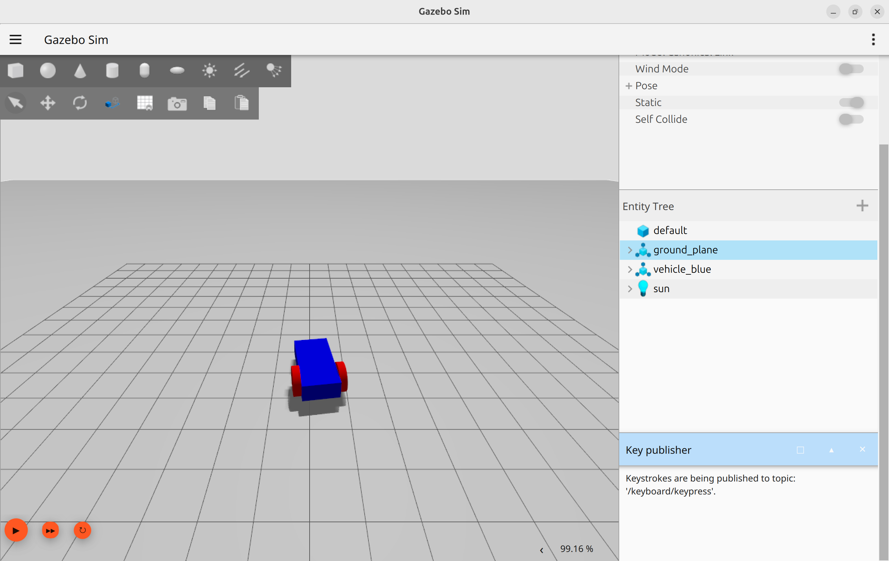

Using gazebo documentation for diff drive
using arrows key to move the robot (send twist command)

!!! warning "Add key publisher"
    



<details>
<summary>World source code</summary>
```xml
--8<-- "docs/Simulation/Gazebo/demo_worlds/diff_drive/code/moving.sdf"
```
</details>