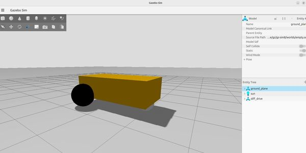

    

        <a href="rrbot">
        
        
RRBOT

        </a>
    

     

        <a href="diff_drive">
        
        
Diff Drive

        </a>
    

    

        <a href="heightmap">
        
Heightmap Terrain

        </a>
    

    

        <a href="dem_terrain">
        
DEM Terrain

        </a>
    

## World to check
- [Simulating multiple connected drone](https://discuss.px4.io/t/simulating-multiple-physically-connected-drones-in-gazebo/31153/12)
- [SubT](https://www.openrobotics.org/blog/2022/2/3/open-robotics-and-the-darpa-subterranean-challenge)
- [check the world](https://discourse.openrobotics.org/t/announcement-of-rgl-gazebo-plugin/48907)
