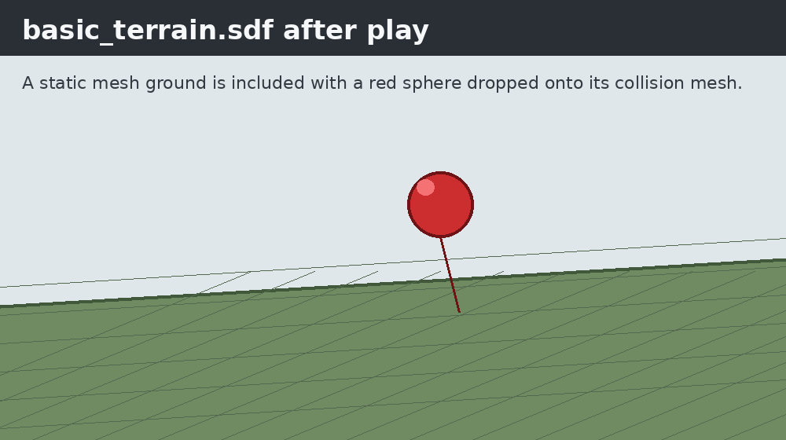
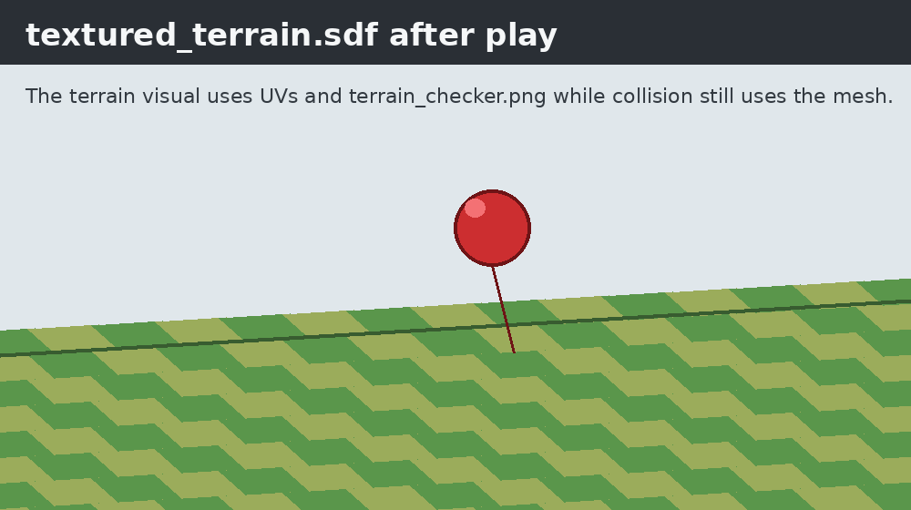
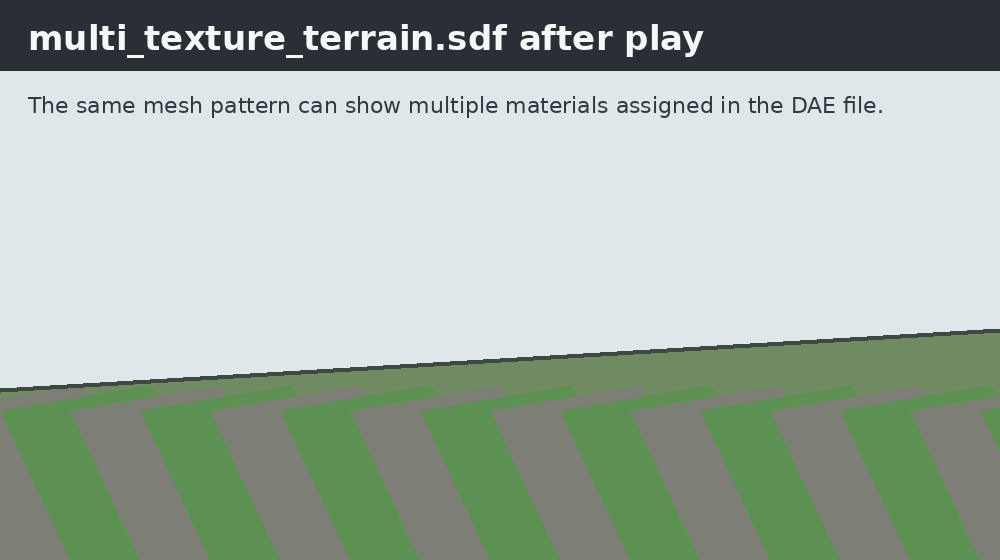
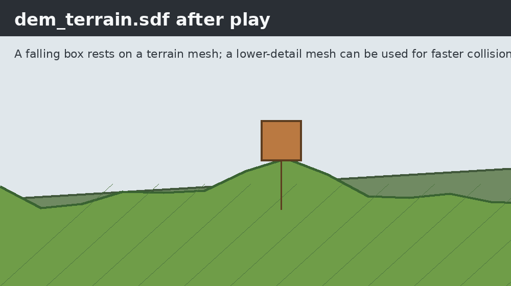

# Gazebo mesh terrain

Mesh terrain is useful when the ground is not only a height field. Use it for
artist-authored ground, imported CAD surfaces, caves, overhangs, vertical walls,
or terrain exported from a DEM pipeline as `.dae`, `.obj`, or `.stl`.

In Gazebo, a mesh ground is just a static model whose `<visual>` and
`<collision>` use `<mesh>` geometry. The world includes that model with a
`model://` URI.

## Run the examples

The basic examples keep their model folders next to the world files:

```bash
cd /home/user/projects/new_blog/docs/Simulation/Gazebo/demo_worlds/mesh_terrain/code/basic_mesh
export GZ_SIM_RESOURCE_PATH=$PWD/models
gz sim basic_terrain.sdf
```

Run the other basic worlds the same way:

```bash
gz sim textured_terrain.sdf
gz sim multi_texture_terrain.sdf
```

The DEM mesh example has its own model folder:

```bash
cd /home/user/projects/new_blog/docs/Simulation/Gazebo/demo_worlds/mesh_terrain/code/simple_mesh
export GZ_SIM_RESOURCE_PATH=$PWD/models
gz sim dem_terrain.sdf
```

## Basic mesh ground

`basic_terrain.sdf` includes `model://ground_terrain` and drops a red sphere
above the world. After pressing play, gravity pulls the sphere onto the mesh
collision surface.



The world file is small because the terrain geometry lives in a reusable model
folder:

```xml
<include>
  <pose>0 0 1 0 0 0</pose>
  <uri>model://ground_terrain</uri>
</include>
```

The model resolves through:

```text
code/basic_mesh/models/ground_terrain/
|-- model.config
|-- model.sdf
`-- meshes/
    `-- ground_terrain.dae
```

Inside `model.sdf`, the mesh is used for both rendering and physics:

```xml
<visual name="terrain_visual">
  <geometry>
    <mesh>
      <uri>model://ground_terrain/meshes/ground_terrain.dae</uri>
    </mesh>
  </geometry>
</visual>
<collision name="terrain_collision">
  <geometry>
    <mesh>
      <uri>model://ground_terrain/meshes/ground_terrain.dae</uri>
    </mesh>
  </geometry>
</collision>
```

## Textured terrain

`textured_terrain.sdf` uses the same pattern, but includes
`model://textured_terrain`. The mesh has UV coordinates, and the DAE references
`terrain_checker.png`.



The world contains simulation setup, light, the terrain include, and a falling
sphere used to check collision:

```xml
<include>
  <uri>model://textured_terrain</uri>
</include>
```

The model layout is:

```text
code/basic_mesh/models/textured_terrain/
|-- model.config
|-- model.sdf
|-- meshes/
|   `-- textured_terrain.dae
`-- materials/
    `-- textures/
        `-- terrain_checker.png
```

`model.config` makes the folder discoverable as a Gazebo model:

```xml
<model>
  <name>textured_terrain</name>
  <version>1.0</version>
  <sdf version="1.10">model.sdf</sdf>
</model>
```

`model.sdf` defines a static model. Static is important for terrain because the
ground should not move when other objects collide with it:

```xml
<model name="textured_terrain">
  <static>true</static>
  <link name="terrain_link">
    <visual name="terrain_visual">
      <geometry>
        <mesh>
          <uri>model://textured_terrain/meshes/textured_terrain.dae</uri>
        </mesh>
      </geometry>
    </visual>
    <collision name="terrain_collision">
      <geometry>
        <mesh>
          <uri>model://textured_terrain/meshes/textured_terrain.dae</uri>
        </mesh>
      </geometry>
    </collision>
  </link>
</model>
```

The texture is not listed directly in the SDF. It is referenced by the DAE
material data, so keep the texture path beside the mesh and do not move it
without updating the DAE.

## Multi-texture terrain

`multi_texture_terrain.sdf` includes `model://multi_texture_terrain`. This is
the same terrain model structure, but the mesh references two texture images.



Use this approach when the material assignment belongs to the mesh authoring
tool. Gazebo loads the DAE, and the DAE decides which triangles use each
material.

## DEM mesh terrain and collision decimation

`dem_terrain.sdf` includes a mesh terrain and a falling box. After pressing
play, the box lands on the terrain collision surface.



The example includes two terrain meshes:

```text
code/simple_mesh/models/dem_terrain/meshes/
|-- example_dem_100m.dae
`-- example_dem_100m_collision.dae
```

The visual mesh can stay detailed so the terrain looks good. The collision mesh
can be decimated so physics has fewer triangles to test. A common layout is:

```xml
<visual name="terrain_visual">
  <geometry>
    <mesh>
      <uri>model://dem_terrain/meshes/example_dem_100m.dae</uri>
    </mesh>
  </geometry>
</visual>
<collision name="terrain_collision">
  <geometry>
    <mesh>
      <uri>model://dem_terrain/meshes/example_dem_100m_collision.dae</uri>
    </mesh>
  </geometry>
</collision>
```

The `decimation_mesh.py` script shows the idea for a regular DEM grid:

```python
vertices = mesh.vertices.reshape((grid_size, grid_size, 3))
reduced_vertices = vertices[::step, ::step]
```

It keeps every second grid point, rebuilds triangle faces, and exports a lower
resolution collision DAE.

### Pros

- Faster physics because there are fewer collision triangles.
- More stable contact in large worlds when the visual mesh is very dense.
- Keeps visual quality high while reducing collision cost.
- Smaller collision meshes are easier to inspect and debug.

### Cons

- Collision no longer perfectly matches the rendered ground.
- Small rocks, sharp ridges, curbs, or holes can disappear from physics.
- Vehicles may appear to float above or sink into visual details.
- Too much decimation can create artificial ramps or cliffs.

Use a separate collision mesh when the visual terrain is dense. Keep the same
mesh for visual and collision when exact contact matters more than performance.

## Common issues

- If Gazebo cannot find `model://textured_terrain`, set
  `GZ_SIM_RESOURCE_PATH` to the local `models` directory before running.
- If the terrain renders but objects fall through it, check that the model has a
  `<collision>` block and that the collision mesh URI is valid.
- If the texture is missing, keep the DAE and `materials/textures` folder
  together or update the texture path inside the DAE.
- If simulation is slow, use a decimated collision mesh and keep the dense mesh
  only for `<visual>`.
