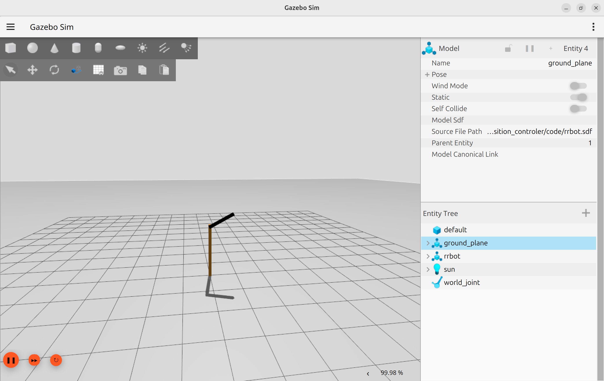

JointPositionController uses a PID controller to reach a desired joint position.

```xml title="joint position control plugin"
<plugin
 filename="gz-sim-joint-position-controller-system"
 name="gz::sim::systems::JointPositionController">
    <joint_name>j1</joint_name>
    <topic>topic_name</topic>
    <p_gain>1</p_gain>
    <i_gain>0.1</i_gain>
    <d_gain>0.01</d_gain>
    <i_max>1</i_max>
    <i_min>-1</i_min>
    <cmd_max>1000</cmd_max>
    <cmd_min>-1000</cmd_min>
</plugin>
```


```bash title="cli command"
gz topic -t "/topic_name" -m gz.msgs.Double -p "data: -1.0"
```

---

## Demo: Control joint position

<details>
<summary>robot sdf</summary>
```
--8<-- "docs/Simulation/Gazebo/plugins/joint_position_controler/code/rrbot.sdf"
```
</details>


!!! warning "Don't forget joint damping section"
    
    ```xml
    <dynamics>
          <damping>0.7</damping>
          <friction>0.0</friction>          
          <spring_reference>0</spring_reference>
          <spring_stiffness>0</spring_stiffness>
        </dynamics>
    ```
    

```bash title="send position command"
gz topic -t "/joint2_position" -m gz.msgs.Double -p "data: -1.0"
```



### how to tune

- Set **i_gain** = 0 first
- Increase **p_gain** until the joint reaches the target fast enough
- Add **d_gain** to reduce overshoot and oscillation
- Only then add a small **i_gain** if you still have steady-state error
- Clamp the controller output with **cmd_max/cmd_min** and the integrator with **i_max/i_min**

---

## Reference
- [gazebo docs: Joint Controllers](https://gazebosim.org/api/sim/10/jointcontrollers.html)