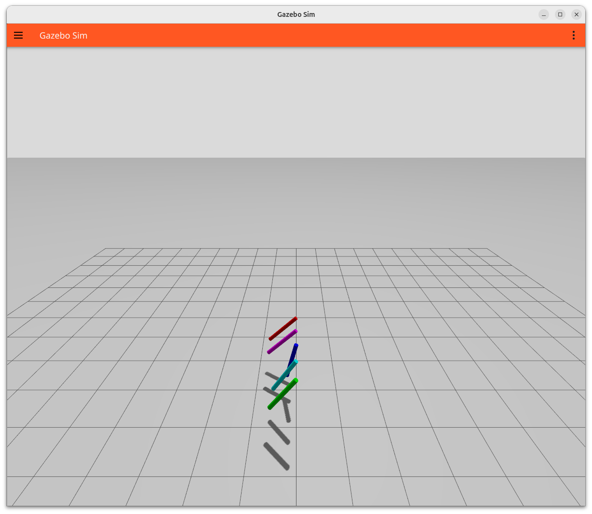

```xml
<joint name="joint1" type="revolute">
  <axis>
    <xyz>0 0 1</xyz>

    <dynamics>
      <friction>0.2</friction>
      <damping>0.1</damping>
    </dynamics>
  </axis>
</joint>
```

### friction
Joint friction is the resistance inside the joint motion itself

- constant resistance
- independent of speed
  
!!! warning "Too much friction"
    - joint won’t move
    - controller seems broken

!!! warning "Too little friction"
    - joint oscillates
    - unstable control

### Damping
behaves like viscous friction

- increases with velocity
- smooth effect

## Demo:

```bash title="run xacro and load the world"
xacro joint_friction.sdf.xacro > /tmp/my_world.sdf && gz sim /tmp/my_world.sdf
```



- [code](code/joint_friction.sdf.xacro)
  - [helper macro](code/macros.xacro)


--- 

## Reference
- [original code](https://github.com/athackst/ignition_vs_gazebo/blob/main/joint-friction/README.md)