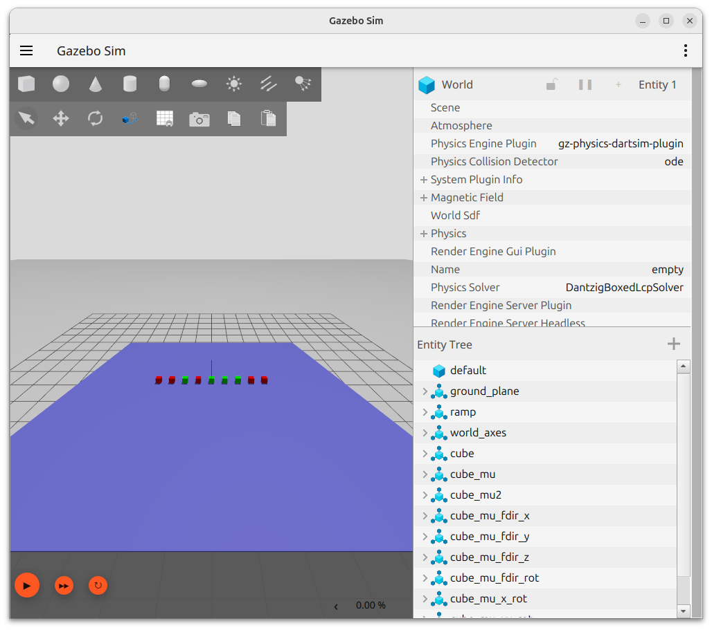

Gazebo default physics engine (DART) use **Coulomb friction** model

friction force = coefficient * how hard you press

In Gazebo / SDF, mu and mu2 are friction coefficients in two perpendicular directions on the contact surface.

```
      ↑ normal (N)
      |
------•------→ direction 1 (mu)
      |
      ↓ direction 2 (mu2)
```

for example for wheels we set

- forward/backward direction → you want low resistance to rolling
- sideways direction → you want high resistance to slipping

```xml
<mu>0.1</mu>   <!-- rolling direction -->
<mu2>1.0</mu2> <!-- sideways grip -->
```


!!! info "DART support"
    The friction `mu`, `mu2` support by dart engine event that is declare under  `ode` tag

    ```xml
    <friction>
      <ode>
        <mu>1</mu>
        <mu2>0</mu2>
      </ode>
    </friction>
    ```
    
## Demo:

```bash title="run xacro and load the world"
xacro friction.sdf.xacro > /tmp/my_world.sdf && gz sim /tmp/my_world.sdf
```




- Cube1 Default friction. sdformat states that if no friction is set, mu1 and mu2 are set to 1 (high friction). Therefore, this cube shouldn't move.
- Cube2 mu=1, mu2=0. The ramp is pointed down the X axis. Therefore, I expect that with a high mu along that axis, the cube will not move
- **Cube3** mu=0, mu2=1. The ramp is pointed down the X axis. Therefore, I expect that with no friction along this direction, the cube will move down the ramp.
- Cube4 mu=1, mu2=0, fdir1=1 0 0 (pointed down the ramp). Since the mu value is aligned with the ramp, I expect the block to stay still.
- **Cube5** mu=1, mu2=0, fdir1=0 1 0 (pointed toward the sides of the ramp). Since the mu value is perpendicular to the ramp, I expect the block to move.

- [source code](code/friction.sdf.xacro)
    - [source code helper macros](code/macros.xacro)

## Reference
- [Explain Gazebo friction coefficients <mu> and <mu2>?](https://robotics.stackexchange.com/questions/27714/explain-gazebo-friction-coefficients-mu-and-mu2)
- [https://github.com/athackst/ignition_vs_gazebo/blob/main/friction/README.md](https://www.allisonthackston.com/articles/ignition-vs-gazebo)
- [gazebo physics](https://classic.gazebosim.org/tutorials?tut=physics_params)