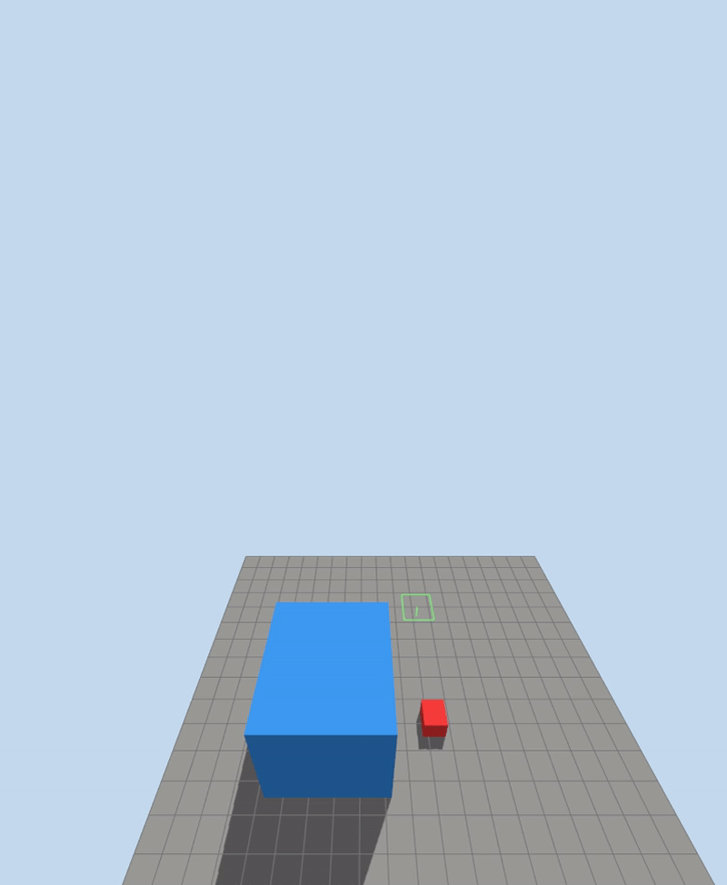
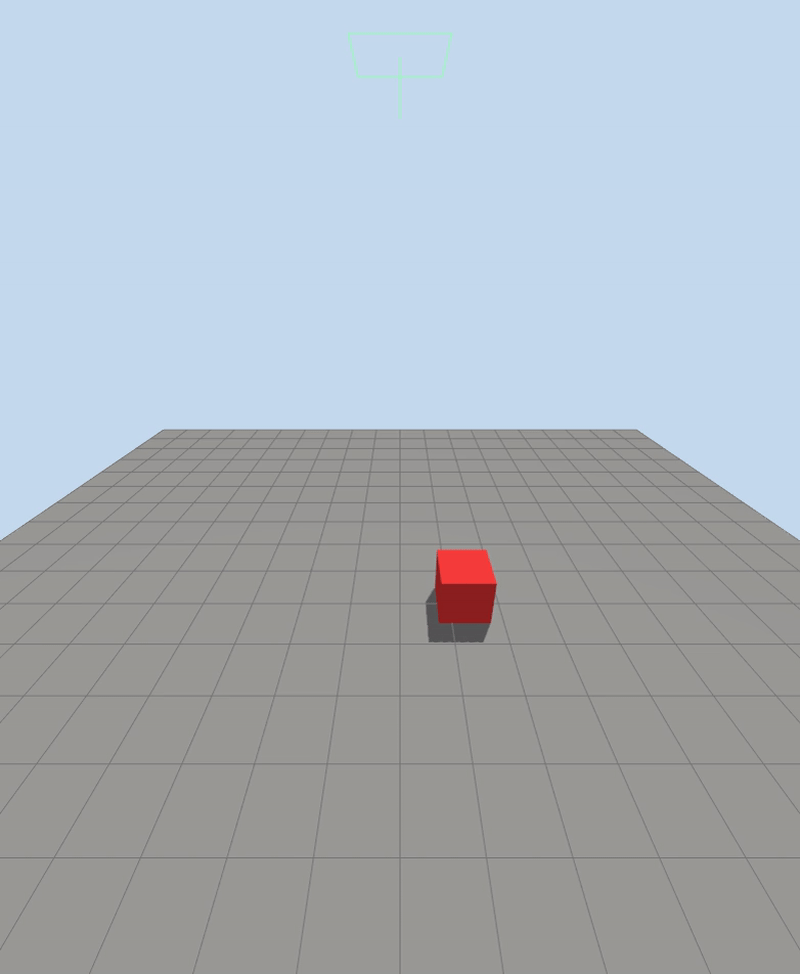

# Gazebo wind effect

Gazebo wind starts as a world-level air velocity:

```xml
<wind>
  <linear_velocity>5 0 0</linear_velocity>
</wind>
```

`linear_velocity` is the wind vector in the world frame, in meters per second.
For example, `5 0 0` means air moving toward `+X`.

The `<wind>` tag only defines the wind field. To make it create force on rigid
objects, load the `WindEffects` system plugin:

```xml
<plugin filename="gz-sim-wind-effects-system" name="gz::sim::systems::WindEffects">
  <force_approximation_scaling_factor>1</force_approximation_scaling_factor>
</plugin>
```

The plugin estimates a force for each affected link from:

- the link mass
- the link velocity relative to the wind velocity
- the scaling factor

Gazebo applies that force at the link frame origin. This is a simple wind model:
it is good for pushing objects around, but it is not a full aerodynamic model.

## Enable wind on a link

A link must opt in:

```xml
<link name="link">
  <enable_wind>true</enable_wind>
</link>
```

If `enable_wind` is missing or false, the object will ignore the wind even if the
world has a `<wind>` value and the plugin is loaded.

## Wind velocity to force

A simple way to estimate wind force is the drag equation:

```text
F = 0.5 * rho * Cd * A * v^2
```

Where:

- `F` is force in newtons
- `rho` is air density, about `1.225 kg/m^3` at sea level
- `Cd` is drag coefficient
- `A` is the area facing the wind
- `v` is wind speed relative to the object

For a `1 x 1 x 1 m` cube, the face area is:

```text
A = 1 * 1 = 1 m^2
```

A flat-front cube has a drag coefficient around:

```text
Cd ~= 1.05
```

With `5 m/s` wind and a box that starts at rest:

```text
F = 0.5 * 1.225 * 1.05 * 1 * 5^2
F = 16.1 N
```

For a `1 kg` box, Newton's law gives:

```text
a = F / m
a = 16.1 / 1
a = 16.1 m/s^2
```

This is the first-moment estimate, before friction and before the box starts
moving with the wind. As the box velocity approaches the wind velocity, the
relative wind speed goes down, so the force goes down too.

Gazebo `WindEffects` does not expose this exact drag equation in SDF. It uses a
simplified force approximation based on link mass and velocity relative to wind,
then multiplies it by `force_approximation_scaling_factor`. Use the math above
to choose a reasonable starting wind speed, then tune the scaling factor until
the simulation behavior matches the effect you want.

---

## Demo: Simple box lab

The example world in [wind_box_lab.sdf](code/wind_box_lab.sdf) sets up a light
dynamic box with low ground friction:

```xml
<model name="wind_box">
  <static>false</static>
  <pose>0 0 0.5 0 0 0</pose>
  <link name="link">
    <enable_wind>true</enable_wind>
    <inertial>
      <mass>1.0</mass>
    </inertial>
    ...
  </link>
</model>
```

The ground and box both use low friction:

```xml
<mu>0.2</mu>
<mu2>0.2</mu2>
```

That makes the wind effect visible: the box does not need a large force before
it starts sliding.

The copied lab file uses:

```xml
<wind>
      <linear_velocity>0 0 0</linear_velocity>
</wind>
<plugin filename="gz-sim-wind-effects-system" name="gz::sim::systems::WindEffects">
  <force_approximation_scaling_factor>1</force_approximation_scaling_factor>
</plugin>
```

publish wind message (under 3m/s there in no movement):

```bash
gz topic -t /world/wind_box_lab/wind \
    -m gz.msgs.Wind \
    -p 'linear_velocity: {x: 3, y: 0, z: 0}, \
    enable_wind: true'
```




!!! warning "both box slide in the same rate"
    The default wind system is intended to provide an **inexpensive environmental disturbance** applicable to arbitrary robots. It deliberately leaves real aerodynamics to specialized models
    **The box mass and size not play part in wind effect**

---

## Demo : wind effect

  - Steady wind: constant push in one direction, like 5 m/s from west to east.
  - Gusts: short bursts of stronger wind.
  - Turbulence/noise: random changing wind that makes the drone wobble.
  - Vertical wind: updrafts/downdrafts that affect altitude hold.
  - Wind shear: wind changes with altitude, useful for testing transitions.
  - Directional changes: wind direction rotates over time.
  - Localized wind zones: wind only inside an area, like near a fan, building, or obstacle.
  - Wake/building effects: disturbed air behind objects, if your sim/plugin supports it.


### Gusts

```xml
 <wind>
      <linear_velocity>3 0 0</linear_velocity>
  </wind>

  <plugin filename="gz-sim-wind-effects-system" name="gz::sim::systems::WindEffects">
    <force_approximation_scaling_factor>1</force_approximation_scaling_factor>
    <horizontal>
      <magnitude>
        <time_for_rise>0.5</time_for_rise>
        <sin>
          <amplitude_percent>1.0</amplitude_percent>
          <period>4</period>
        </sin>
      </magnitude>
    </horizontal>
  </plugin>
```
    


if we want the gust every 10 sec, replace the `magnitude` tag

```xml
<magnitude>
    <time_for_rise>0.5</time_for_rise>
    <sin>
      <amplitude_percent>1.0</amplitude_percent>
      <period>10</period>
    </sin>
</magnitude>
```


- **horizontal**: Controls wind in the XY plane.
- **magnitude**: Controls wind strength, not direction.
- **time_for_rise**: Smooths changes instead of jumping instantly. Smaller = sharper gust, larger = softer ramp.
- **sin**: Makes the wind strength vary as a sine wave.
- **amplitude_percent**: How strong the variation is relative to base wind.

  Example with base wind 3 m/s:

  0.5 => varies about +/- 50%  => 1.5 to 4.5 m/s
  1.0 => varies about +/- 100% => 0 to 6 m/s

- **period**: How long one full gust cycle takes, in simulation seconds.

  period 10 => full cycle every 10s
  - peak to peak = 10s
  - peak to low = 5s


## TODO: check more effect and try to implement