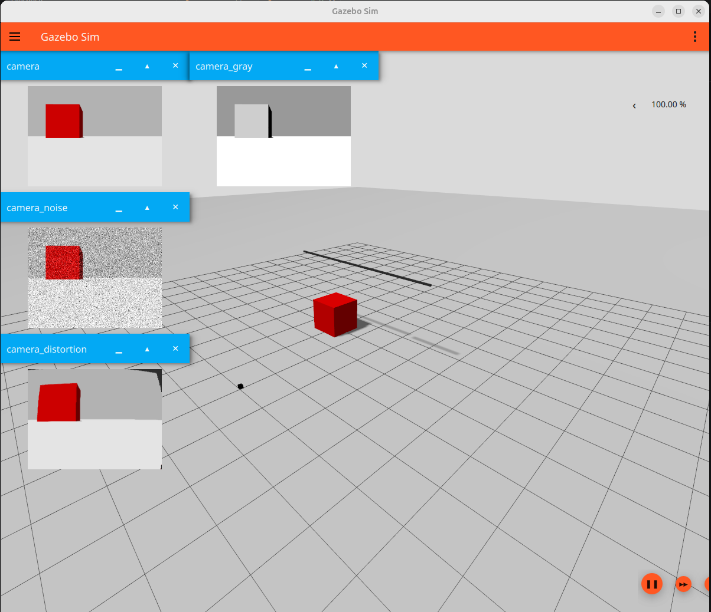
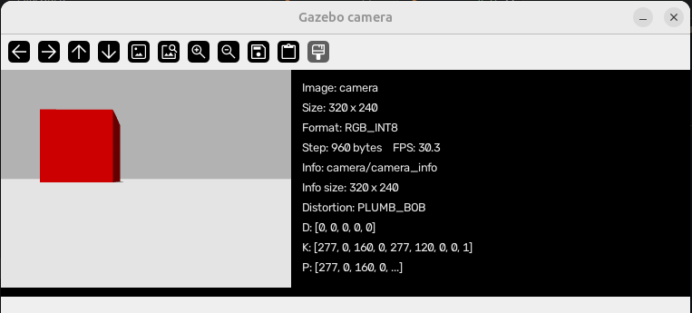
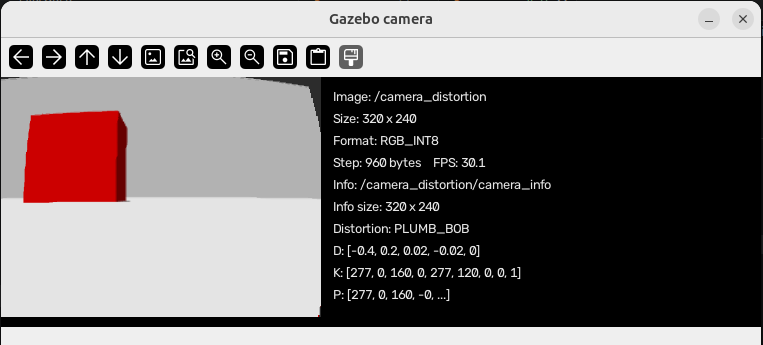
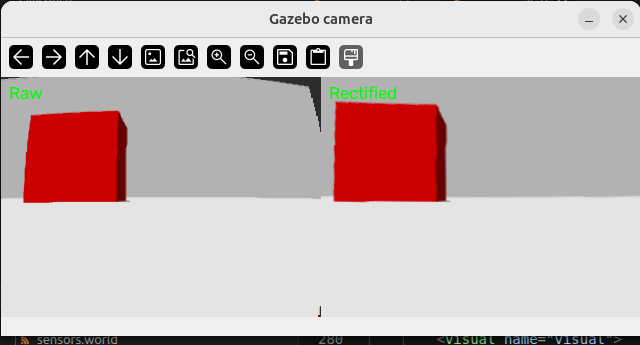

This tutorial builds one Gazebo Sim Harmonic world that compares four views of
the same scene:

- an ideal RGB camera;
- an `L8` grayscale camera;
- a camera with approximate Gaussian noise;
- a camera with Brown lens distortion.

The goal is not only to learn camera tags. The goal is to understand how a
physical camera's measurable properties map into simulation. Depth, thermal,
RGB-D, segmentation, and other camera types are intentionally left for later
tutorials.

The complete runnable example is [`code/camera.sdf`](code/camera.sdf).

## Run the example

```bash
gz sim -r code/camera.sdf -v 4
```





The high-contrast red box and straight reference line make differences between
the outputs easier to see. All four sensors belong to the same link and have no
individual pose, so they observe the scene from the same viewpoint.

Inspect the published topics with:

```bash
gz topic -l
gz topic -i -t camera
gz topic -e -t camera_distortion/camera_info
```

---

## Camera configuration has two layers

A camera sensor is easier to understand when its tags are divided into two
groups.

### Sensor-control tags

These tags belong directly under `<sensor>`:

```xml
<sensor name="camera" type="camera">
  <always_on>true</always_on>
  <update_rate>30</update_rate>
  <visualize>true</visualize>
  <topic>camera</topic>
  <camera>
    <!-- Image-formation settings go here. -->
  </camera>
</sensor>
```

| Tag | Purpose |
| --- | --- |
| `name` | Identifies the sensor inside its parent link. |
| `type="camera"` | Selects the ordinary image camera sensor. |
| `<pose>` | Positions and rotates the sensor relative to its parent link. |
| `<always_on>` | Keeps the sensor active. |
| `<update_rate>` | Requested publication frequency in Hz. A value of `0` means every simulation cycle. |
| `<visualize>` | Makes the sensor available to Gazebo's GUI visualization. |
| `<topic>` | Selects the Gazebo Transport image topic. |

`<update_rate>` is a requested rate, not proof of the achieved rate. Rendering
load, image size, and available hardware can reduce the observed publication
frequency.

### Image-formation tags

These tags belong under `<camera>`:

```xml
<camera>
  <camera_info_topic>camera/camera_info</camera_info_topic>
  <horizontal_fov>1.047</horizontal_fov>
  <image>
    <width>320</width>
    <height>240</height>
    <format>R8G8B8</format>
  </image>
  <clip>
    <near>0.1</near>
    <far>100</far>
  </clip>
</camera>
```

| Tag | Purpose |
| --- | --- |
| `<horizontal_fov>` | Horizontal field of view in radians. `1.047` is approximately 60 degrees. |
| `<image>/<width>` | Image width in pixels. |
| `<image>/<height>` | Image height in pixels. |
| `<image>/<format>` | Pixel format. `R8G8B8` is RGB and `L8` is 8-bit grayscale. |
| `<clip>/<near>` | Objects closer than this distance are not rendered. |
| `<clip>/<far>` | Objects farther than this distance are not rendered. |
| `<camera_info_topic>` | Topic carrying dimensions, intrinsics, distortion, and projection metadata. |

Choose the near plane as large as the application permits. An unnecessarily
small near plane combined with a very large far plane reduces depth-buffer
precision.

---

## Grayscale output

The grayscale sensor changes only the image format:

```xml
<image>
  <width>320</width>
  <height>240</height>
  <format>L8</format>
</image>
```

Its topic is `camera_gray`. The field of view, clipping range, frame rate, and
pose remain equal to the RGB camera, which makes the comparison fair.

---

## Approximate image noise

Gazebo can apply independent Gaussian noise to the generated pixels:

```xml
<noise>
  <type>gaussian</type>
  <mean>0.0</mean>
  <stddev>0.20</stddev>
</noise>
```

- `mean` shifts the average noise value.
- `stddev` controls the random variation.

This is an approximation, not a complete physical camera-noise model. Real
cameras can also contain shot noise, fixed-pattern noise, exposure and gain
effects, hot pixels, and compression artifacts. Use this model when controlled
random pixel variation is sufficient; do not claim that it completely
calibrates a physical sensor.

---

## Brown lens distortion

The distorted sensor uses the Brown model:

```xml
<distortion>
  <k1>-0.4</k1>
  <k2>0.2</k2>
  <k3>0.0</k3>
  <p1>0.02</p1>
  <p2>-0.02</p2>
  <center>0.5 0.5</center>
</distortion>
```

`k1`, `k2`, and `k3` are radial coefficients. They bend straight features more
strongly as the features move away from the principal point. `p1` and `p2` are
tangential coefficients that model decentering between the lens and image
plane. `center` is normalized: `0.5 0.5` places the distortion center in the
middle of the image.

For a teaching example, place straight lines near the image boundaries. A line
through the optical center may show little visible radial distortion even when
the coefficients are active.

### Ogre versus Ogre2 in Harmonic

The Sensors system in this example deliberately uses Ogre:

```xml
<plugin filename="gz-sim-sensors-system"
        name="gz::sim::systems::Sensors">
  <render_engine>ogre</render_engine>
</plugin>
```

Ogre2 is the newer backend and generally offers more modern rendering features.
However, the tested Gazebo Harmonic installation does not register the Brown
`DistortionPass` for Ogre2. The world loads and publishes an image, but the
image remains undistorted and the verbose log reports:

```text
RenderPass ... DistortionPass ... is not registered
ImageBrownDistortionModel is not supported in ogre2
```

Increasing `k1` cannot fix an unsupported render pass. Use Ogre for this
example and always check both the image and startup log when changing Gazebo or
rendering-engine versions. A newer Gazebo release should not be assumed to fix
this automatically; verify it in that release.

---

## Separate camera-info topics require SDF 1.7

`<camera_info_topic>` was introduced in SDF 1.7 and remains available in later
versions. It is unavailable in SDF 1.6, so this world declares:

```xml
<sdf version="1.7">
```

Every camera uses a distinct metadata topic:

| Image topic | Camera-info topic |
| --- | --- |
| `camera` | `camera/camera_info` |
| `camera_gray` | `camera_gray/camera_info` |
| `camera_noise` | `camera_noise/camera_info` |
| `camera_distortion` | `camera_distortion/camera_info` |

This naming is a convention created by our SDF. It is not inferred by Gazebo
from the image topic. The Python example can derive the name because the world
uses this convention.

---

## Read an image with Python and OpenCV

Gazebo's Python bindings are installed system-wide. Create a `uv` environment
that can see them, then install only the Python image dependencies into the
environment:

```bash
uv venv --python /usr/bin/python3 --system-site-packages .venv
source .venv/bin/activate
uv pip install numpy opencv-python
```

!!! info "system-site-packages"
    Selecting `/usr/bin/python3` keeps the virtual environment on the same Python
    version as Ubuntu's Gazebo bindings. The `--system-site-packages` option is
    required here because the Harmonic
    `gz-transport13` and `gz-msgs10` bindings come from the operating-system
    packages rather than this project's Python environment.

[`display_camera.py`](code/display_camera.py) subscribes to `gz.msgs.Image` and
the matching `gz.msgs.CameraInfo` topic. It displays the measured FPS, image
size, pixel format, row step, distortion model and coefficients, intrinsic
matrix, and projection matrix beside the image. It also handles row stride and
RGB/grayscale pixel formats before converting the image to a NumPy array:

```bash
python3 code/display_camera.py
python3 code/display_camera.py camera_gray
python3 code/display_camera.py camera_noise
python3 code/display_camera.py camera_distortion
```

!!! info "camera_info"
    By default, the script derives the metadata topic as `<image topic>/camera_info`.




### step / row stride
The number of bytes used one complete image row in memory

For example, an RGB image with 320 pixels per row normally needs:

$  320 \times 3 = 960\ \text{bytes}$

  So its metadata may report:

  width: 320
  format: RGB_INT8
  step: 960 bytes

  Sometimes a system adds padding bytes to align each row efficiently in memory:

  Pixel data: 960 bytes
  Padding:      64 bytes
  Step:       1024 bytes

  The next row begins after step bytes—not necessarily immediately after the visible pixels.

  Why it matters:

  - Locates the beginning of each image row.
  - Handles memory alignment and padding correctly.
  - Prevents distorted, shifted, or diagonally torn images.
  - Helps transfer images between Gazebo, OpenCV, cameras, GPUs, and middleware.

### Distortion and camera matrices


The `D`, `K`, and `P` values describe how a point in the 3D camera frame is
projected into the image and how the lens changes its pixel position.

#### Distortion model and `D`

`PLUMB_BOB` is the Brown-Conrady distortion model commonly used by OpenCV. It
represents two effects:

- radial distortion, which bends straight lines toward or away from the image
  edges;
- tangential distortion, which approximates misalignment between the lens and
  image sensor.

Its distortion vector is:

$$
D = [k_1, k_2, p_1, p_2, k_3]
$$

The coefficients $k_1$, $k_2$, and $k_3$ control radial distortion. The
coefficients $p_1$ and $p_2$ control tangential distortion. The screenshot
shows:

```text
D: [0, 0, 0, 0, 0]
```

This means the camera uses the `PLUMB_BOB` model but has no configured lens
distortion. A distorted camera could instead report values such as:

```text
D: [-0.4, 0.2, 0.02, -0.02, 0]
```

#### Intrinsic matrix `K`

`K` describes the internal camera geometry:

$$
K = \begin{bmatrix}
f_x & s & c_x \\
0 & f_y & c_y \\
0 & 0 & 1
\end{bmatrix}
$$

The screenshot contains:

```text
K: [277,   0, 160,
       0, 277, 120,
       0,   0,   1]
```

- $f_x = 277$ and $f_y = 277$ are the focal lengths in pixels.
- $c_x = 160$ and $c_y = 120$ are the principal-point coordinates.
- $s = 0$ means that the image axes have no skew.

For this `320 x 240` image, `(160, 120)` is exactly the image center. An
undistorted 3D point $(X,Y,Z)$ is projected to a pixel with:

$$
u = f_x\frac{X}{Z} + c_x, \qquad
v = f_y\frac{Y}{Z} + c_y
$$

A point on the optical axis has $X=0$ and $Y=0$, so it appears at the principal
point `(160, 120)`.

#### Projection matrix `P`

`P` is the complete $3 \times 4$ projection matrix:

$$
P = \begin{bmatrix}
f'_x & 0 & c'_x & T_x \\
0 & f'_y & c'_y & T_y \\
0 & 0 & 1 & T_z
\end{bmatrix}
$$

For this monocular camera, it is approximately:

```text
P: [277,   0, 160, 0,
       0, 277, 120, 0,
       0,   0,   1, 0]
```

The zero fourth column means there is no stereo-camera translation. `P`
transforms a homogeneous 3D point into image coordinates:

$$
\begin{bmatrix}u' \\ v' \\ w'\end{bmatrix}
=
P
\begin{bmatrix}X \\ Y \\ Z \\ 1\end{bmatrix},
\qquad
u=\frac{u'}{w'}, \quad v=\frac{v'}{w'}
$$

The practical image-formation order is:

```text
3D point -> projection using K/P -> lens distortion using D -> image pixel
```

OpenCV rectification uses `K` and `D` to reverse the distortion and create a
corrected image.

---

## Rectify the distorted image

Camera info does not rectify an image by itself. It supplies the parameters
that OpenCV needs:

$$
K = \begin{bmatrix}
f_x & s & c_x \\
0 & f_y & c_y \\
0 & 0 & 1
\end{bmatrix}
$$

- `K` / `intrinsics.k` contains the $3 \times 3$ intrinsic matrix.
- `D` / `distortion.k` uses the OpenCV plumb-bob order
  `[k1, k2, p1, p2, k3]`.
- `width` and `height` identify the image size for which the calibration is
  valid.



[`rectify_camera.py`](code/rectify_camera.py) subscribes to `camera_distortion`, derives `camera_distortion/camera_info`, checks that the dimensions agree, builds OpenCV remap tables, and displays raw and rectified images side by side:





```bash
python3 code/rectify_camera.py camera_distortion
```

!!! warning ""
    Rectification usually removes invalid pixels near the image boundary or changes
    the usable field of view. A rectified image is therefore not expected to retain
    every raw pixel.

---

## Map a real calibration into SDF

Calibrate the physical camera at the resolution and focus setting that will be
used on the robot. A typical OpenCV calibration provides:

- image width and height;
- `fx`, `fy`, `cx`, `cy`, and optionally skew `s`;
- `k1`, `k2`, `p1`, `p2`, and `k3`;
- a reprojection error used to judge the calibration quality.

Map those measurements into the ordinary camera configuration:

```xml
<camera>
  <camera_info_topic>camera/camera_info</camera_info_topic>
  <horizontal_fov>1.047</horizontal_fov>
  <image>
    <width>1280</width>
    <height>720</height>
    <format>R8G8B8</format>
  </image>
  <clip>
    <near>0.1</near>
    <far>100</far>
  </clip>
  <distortion>
    <k1>-0.21</k1>
    <k2>0.08</k2>
    <k3>0.0</k3>
    <p1>0.001</p1>
    <p2>-0.002</p2>
    <center>0.5 0.5</center>
  </distortion>
  <lens>
    <type>gnomonical</type>
    <scale_to_hfov>true</scale_to_hfov>
    <intrinsics>
      <fx>910.4</fx>
      <fy>908.7</fy>
      <cx>638.2</cx>
      <cy>361.1</cy>
      <s>0.0</s>
    </intrinsics>
  </lens>
</camera>
```

Replace every example number with values from the real calibration. Explicit
`fx` overrides the projection derived from `horizontal_fov`; keep the FOV tag
because it is required by this SDF camera schema, but treat the calibrated
intrinsics as authoritative.

OpenCV and Gazebo use the same five common Brown coefficients, but the SDF tags
are grouped differently. The mapping is:

| OpenCV `D` index | SDF tag |
| --- | --- |
| `D[0]` | `<k1>` |
| `D[1]` | `<k2>` |
| `D[2]` | `<p1>` |
| `D[3]` | `<p2>` |
| `D[4]` | `<k3>` |

The camera's measured mounting transform is separate from its intrinsics. Put
that translation and rotation in the sensor `<pose>` relative to the robot link:

```xml
<sensor name="front_camera" type="camera">
  <pose>0.20 0 0.12 0 0 0</pose>
  <!-- camera configuration -->
</sensor>
```

Calibration target poses estimated by OpenCV are observations of the target;
they are not the robot mounting pose.

---

## Validate the result

### Minimum validation

1. Confirm image width, height, and pixel format.
2. Confirm `K` and `D` on the camera-info topic match the intended values.
3. Run with verbose logging and confirm there is no unsupported-distortion
   warning.
4. Compare checkerboard lines near the center and image edges.
5. Confirm the camera pose matches its measured robot mounting pose.

These checks show that the intended configuration is active and broadly
correct.

### High-fidelity validation

1. Measure the achieved image publication rate.
2. Capture checkerboards at several known distances and orientations.
3. Compare real and simulated detected corner coordinates numerically.
4. Compare horizontal and vertical field of view.
5. Record reprojection error instead of relying only on visual similarity.
6. Estimate real pixel-noise statistics from repeated images of a static,
   evenly lit target, while keeping Gazebo's Gaussian model limitations clear.

Matching parameter text is not sufficient if the renderer ignores a feature.
Validation must inspect the generated image.

---

## Summary

A useful real-camera simulation combines several independent controls:

- sensor control: pose, activation, publication rate, visualization, and topic;
- image geometry: resolution, FOV or calibrated intrinsics, and clipping;
- output representation: RGB or grayscale format;
- approximate imperfections: Gaussian noise and Brown distortion;
- metadata: a unique camera-info topic carrying `K`, `D`, and image dimensions;
- verification: logs, image comparisons, and checkerboard measurements.

The next camera tutorials can build on this ordinary calibrated camera before
introducing depth, thermal, RGB-D, segmentation, or other sensor types.

---

## References

- [SDFormat 1.7 camera sensor specification](http://sdformat.org/spec?ver=1.7&elem=sensor#sensor_camera)
- [Gazebo Harmonic sensor tutorial](https://gazebosim.org/docs/harmonic/sensors/)
- [Gazebo Transport 13 installation and Python bindings](https://gazebosim.org/api/transport/13/installation.html)

<!-- post-content-skill: 1.0.0 -->
