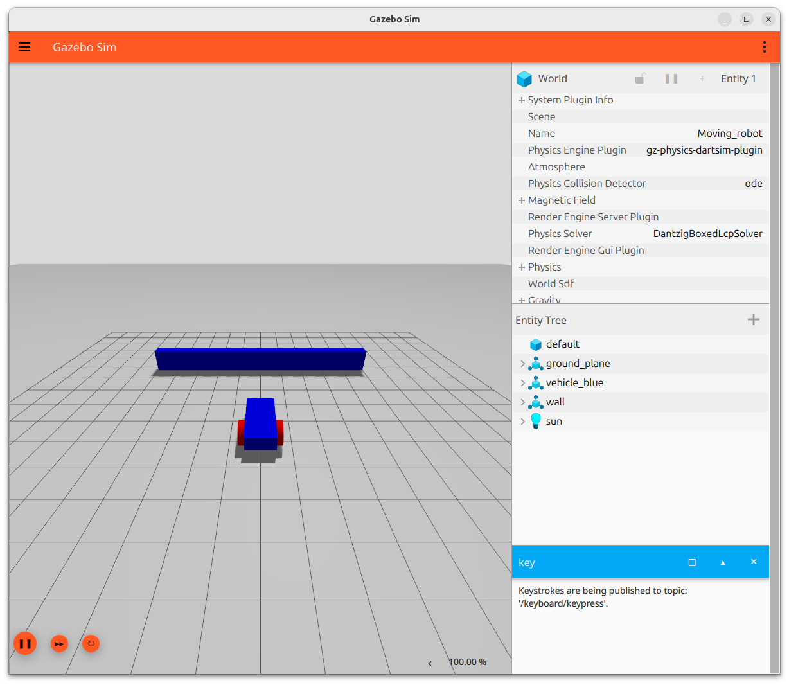

```xml title="plugin"
<plugin
      filename="gz-sim-contact-system"
      name="gz::sim::systems::Contact">
</plugin>
```

```xml title="sensor add to link"
<sensor name='sensor_contact' type='contact'>
    <contact>
        <collision>collision_name</collision>
        <topic>/test_contact</topic>
    </contact>
    <always_on>1</always_on>
    <update_rate>1000</update_rate>
</sensor>
```

### Contacts msg
The plugin return `gz.msgs.Contacts` message that can contain multiple `gz.msgs.Contact` msg, each `Contact` describe **one collision interaction between two objects**

```title="gz.msgs.Contact"
message Contact {
  .gz.msgs.Header header = 1;
  .gz.msgs.Entity collision1 = 2;
  .gz.msgs.Entity collision2 = 3;
  repeated .gz.msgs.Vector3d position = 4;
  repeated .gz.msgs.Vector3d normal = 5;
  repeated double depth = 6;
  repeated .gz.msgs.JointWrench wrench = 7;
  .gz.msgs.Entity world = 8;
}
```

### Todo : explain the contact message


---

## Demo
- Drive the vehicle into the wall
- Add Contact sensor in the wall link
- Use Arrow key to drive the vehicle (Key publisher need to be focus)
- Listen to `/wall_contact` topic

[World contact demo](docs/Simulation/Gazebo/sensors/contact/code/contact.sdf)


