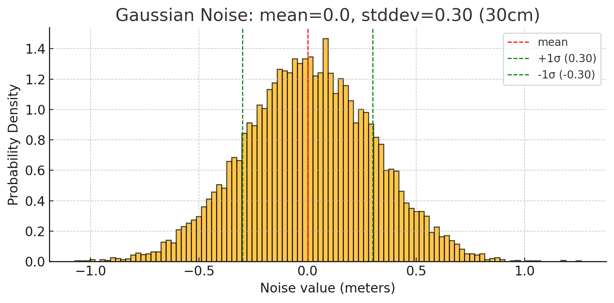

{{ page_folder_links() }}

!!! warning "ray sensor"
    For the current state gazebo not support ray and ultrasonic sensor
    when we declare ray sensor we got the following error
    ```
    [Wrn] [SdfEntityCreator.cc:1097] Sensor type LIDAR not supported yet. Try using a GPU LIDAR instead.
    ```

    use `<sensor name="ultrasonic" type="gpu_ray">` and **not** `<sensor name="ultrasonic" type="ray">`


```xml title="plugin"
<plugin
    filename="gz-sim-sensors-system"
    name="gz::sim::systems::Sensors">
    <render_engine>ogre2</render_engine>
</plugin>
```

## Sensor definition

[Sdf specification](http://sdformat.org/spec?ver=1.12&elem=sensor)

```xml title="gpu_ray sensor"
<sensor name="ultrasonic" type="gpu_ray">
    <pose>0 0 0.1 0 0 0</pose>
    <always_on>true</always_on>
    <update_rate>10</update_rate>
    <visualize>true</visualize>
    <topic>ultrasonic_range</topic>

    <ray>
        <scan>
            <horizontal>
                <samples>1</samples>
                <resolution>1</resolution>
                <min_angle>0.0</min_angle>
                <max_angle>0.0</max_angle>
            </horizontal>
        </scan>
        <range>
            <min>0.02</min>      <!-- 2 cm -->
            <max>4.0</max>       <!-- 4 meters -->
            <resolution>0.001</resolution>
        </range>
    </ray>
</sensor>
```

### Add noise

```xml title="sensor with noise"
<sensor name="ultrasonic" type="gpu_ray">
  <pose>0.5 0 0.5 0 0 0</pose>
  <always_on>true</always_on>
  <update_rate>10</update_rate>
  <visualize>true</visualize>
  <topic>ultrasonic_range</topic>

  <ray>
      <scan>
          <horizontal>
              <samples>1</samples>
              <resolution>1</resolution>
              <min_angle>0.0</min_angle>
              <max_angle>0.0</max_angle>
          </horizontal>
      </scan>
      <range>
          <min>0.02</min>      <!-- 2 cm -->
          <max>4.0</max>       <!-- 4 meters -->
          <resolution>0.001</resolution>

      </range>
      <noise>
          <type>gaussian</type>
          <mean>0.0</mean>
          <stddev>0.30</stddev>  <!-- 30cm noise -->
      </noise>
  </ray>
</sensor>
```

#### Noise explain



- The mean (red dashed line at 0.0) is the average noise, meaning most measurements will center around the true value.

- The standard deviation (σ = 0.30 m) controls the spread:
  - ~68% of readings fall between −0.30 m and +0.30 m (green dashed lines).
  - Occasionally, the noise will be larger, simulating sensor error or measurement variation.

---

## message

- [laserscan.proto](https://github.com/gazebosim/gz-msgs/blob/gz-msgs11/proto/gz/msgs/laserscan.proto)


```json
header {
  stamp {
    sec: 20
    nsec: 200000000
  }
  data {
    key: "frame_id"
    value: "my_box::box_link::ultrasonic"
  }
  data {
    key: "seq"
    value: "202"
  }
}
frame: "my_box::box_link::ultrasonic"
world_pose {
  position {
    x: 0.5
    z: 0.5
  }
  orientation {
    w: 1
  }
}
angle_step: nan
range_min: 0.02
range_max: 4
count: 1
vertical_angle_step: nan
vertical_count: 1
ranges: 1.0000607967376709
intensities: 0
```

!!! note "world_pose"
    The sensor position and orientation inside the container link
     

!!! note "Range"
    `ranges` field contain reading for each ray in our case just one reading
     
---

<details>
    <summary>world with ray sensor</summary>

```xml
--8<-- "docs/Simulation/Gazebo/sensors/code/gpu_ray_sesnor.sdf"
```

</details>