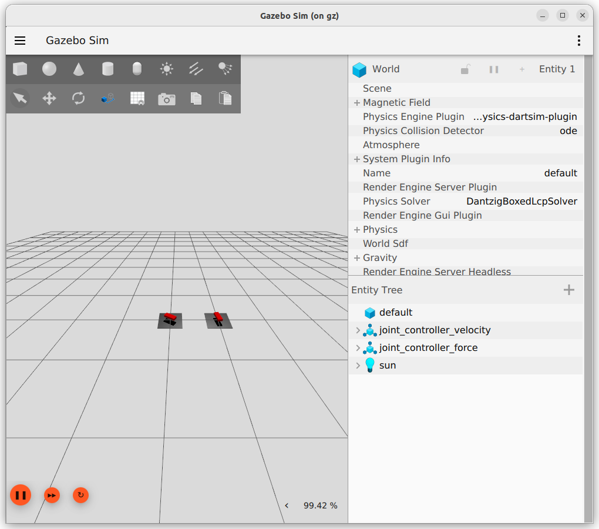

---
tags:
    - gazebo
    - joint
    - control
---

# Gazebo Joint Control

[joint controllers from gazebo sim  api reference tutorials](https://gazebosim.org/api/sim/8/jointcontrollers.html)

Gazebo provides three joint controller plugins which are JointController, JointPositionController, and JointTrajectoryController.

## JointController

- **Velocity mode**: This mode lets the user control the desired joint velocity directly.
- **Force mode**: A user who wants to control joint velocity using a PID controller can use this mode.

All the parameters related to this controller can be found [here](https://gazebosim.org/api/sim/8/classgz_1_1sim_1_1systems_1_1JointController.html).

### Velocity mode
```xml title="joint velocity with initial velocity and topic"
<plugin
 filename="gz-sim-joint-controller-system"
 name="gz::sim::systems::JointController">
 <joint_name>j1</joint_name>
 <initial_velocity>1.0</initial_velocity>
 <topic>velocity_topic</topic>
</plugin>

```

```bash title="control velocity speed"
gz topic -t "/topic_name" -m gz.msgs.Double -p "data: 10.0"
```

### Force mode

```xml title="joint force mode"
<plugin
 filename="gz-sim-joint-controller-system"
 name="gz::sim::systems::JointController">
 <joint_name>j1</joint_name>
 <use_force_commands>true</use_force_commands>
 <p_gain>0.2</p_gain>
 <i_gain>0.01</i_gain>
</plugin>

```

!!! tip "joint state"
    ```xml
    <plugin
        filename="gz-sim-joint-state-publisher-system"
        name="gz::sim::systems::JointStatePublisher">
        <joint_name>j1</joint_name>
        <topic>force_topic</topic>
    </plugin>

    ```
     
    ```bash title="echo joint state"
    gz topic -e -t /world/default/model/joint_controller_demo/joint_state

    ```


## Demo

<details>
    <summary>world demo</summary>

```xml
--8<-- "docs/Simulation/Gazebo/tutorials/code/worlds/joint_control_demo.sdf"
```
</details>


```bash title="command and state topics" linenums="1" hl_lines="4 10 12 13"
gz topic --list
#
/clock
/force_j1_state
/gazebo/resource_paths
/gui/camera/pose
/gui/currently_tracked
/gui/track
/stats
/velocity_j1_state
...
/force_topic
/velocity_topic
```

```bash title="publish velocity to force controller"
gz topic -t "/force_topic" -m gz.msgs.Double -p "data: 10.0"
```


