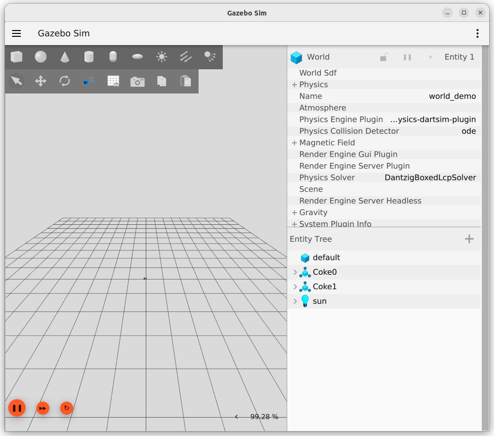

---
tags:
    - gazebo
    - gz
    - harmonic
    - docker
    - vscode
---

# Run gazebo harmonic on docker
Build a docker container base on cuda runtime and ubuntu 22.04 to run Gazebo harmonic simulation.
The dockerfile base on [Allison Thackston](https://github.com/athackst/dockerfiles/blob/main/gz/harmonic-cuda.Dockerfile)

Use vscode devcontainer to run the docker image. using docker compose. [vscode devcontainer](#use-vscode-and-docker)

## Prerequisites
- Check nvidia version using `nvidia-smi`
- Pull the cuda runtime
- Install nvidia-container-toolkit [more](/DevOps/docker/docker_images/docker_nvidia/)


```bash title="pull cuda runtime"
# my current cuda version is 12.4
docker pull nvidia/cuda:12.4.0-runtime-ubuntu22.04
docker run --gps all -it --rm  nvidia/cuda:12.4.0-runtime-ubuntu22.04 /bin/bash
# from docker 
nvida-smi
```

## Dockerfile

<details>
    <summary>Docker file</summary>

```dockerfile
--8<-- "docs/Simulation/Gazebo/vscode/code/Dockerfile"
```
</details>

!!! note "Docker environment variables"

    - **QT_X11_NO_MITSHM=1** is used to disable the MIT-SHM extension for X11, which can cause issues with some applications running in Docker containers.
    - **NVIDIA_DRIVER_CAPABILITIES=graphics,utility,compute** is used to specify the capabilities of the NVIDIA driver that should be exposed to the container. This is important for GPU-accelerated applications.
    - **NVIDIA_VISIBLE_DEVICES=all** is used to make all NVIDIA GPUs visible to the container. This is important for GPU-accelerated applications that need access to the GPU.

## Build the image

```bash
docker build -t gz:harmonic .
```

## Run the image

```bash
xhost +local:docker

docker run --gpus all -it --rm \
--name gz \
--hostname gz \
--user user \
--network host \
--env="QT_X11_NO_MITSHM=1"  \
--env="DISPLAY"  \
-v /tmp/.X11-unix:/tmp/.X11-unix:rw \
-v /dev/dri:/dev/dri \
-v /dev/nvidia0:/dev/nvidia0 \
-v /dev/nvidiactl:/dev/nvidiactl \
-v /dev/nvidia-modeset:/dev/nvidia-modeset \
gz:harmonic
```

---

## Use VSCode and docker
- Using docker-compose
- Using devcontainer to run the docker compose

```
├── .devcontainer
│   └── devcontainer.json
├── docker-compose.yaml
├── .gitignore
└── gz_tutorial
    └── worlds
        └── empty.world

```

```yaml title="docker-compose.yaml"
--8<-- "docs/Simulation/Gazebo/vscode/code/docker-compose.yaml"
```

```yaml title=".devcontainer/devcontainer.json"
--8<-- "docs/Simulation/Gazebo/vscode/code/devcontainer.json"
```

---

## Run the simulation

<details>
    <summary>minimal world</summary>

```xml
--8<-- "docs/Simulation/Gazebo/vscode/code/minimal.world"
```
</details>


```bash
# run the simulation
gz sim -r v4 gz_tutorial/worlds/empty.world 
```




```bash title="gz topic"
gz topic --list
gz topic -e -t /clock
#

sim {
  sec: 326
  nsec: 476000000
}
```

---

## Gz Transport
gz_transport is Gazebo's communication middleware, used for inter-process communication (IPC) between different Gazebo components — like sensors, plugins, UI, and even ROS bridges.


- **GZ_PARTITION**:	Isolates topic namespaces between different simulations
- **GZ_DISCOVERY_SERVER**:	IP address of the main discovery server (usually the Gazebo server machine)
- **GZ_TRANSPORT_IP**:	IP address the local process uses to advertise itself to others

---

## Resource
- [Gazebo Simulator : 5 Ways to Speedup Simulations](https://www.blackcoffeerobotics.com/blog/gazebo-simulator-5-ways-to-speedup-simulations)