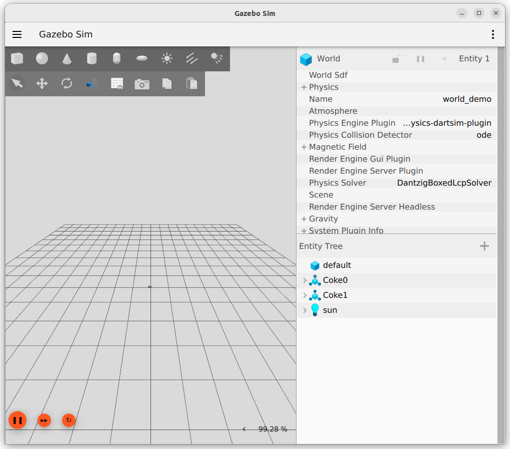

## Use VS Code and Docker
- Using Docker Compose
- Using devcontainer to run Docker Compose

```text
├── .devcontainer
│   ├── Dockerfile
│   └── devcontainer.json
├── docker-compose.yaml
├── env.sh
├── .gitignore
└── worlds
    └── minimal.world
```

Download the complete project archive:

[gz_harmonic_vscode.zip](code/gz_harmonic_vscode.zip)

Extract it and open the folder in VS Code:

```bash
unzip gz_harmonic_vscode.zip
cd gz_harmonic_vscode
code .
```


<details>
<summary>Dockerfile</summary>

```dockerfile
--8<-- "docs/Simulation/Gazebo/vscode/code/gz_harmonic_vscode/.devcontainer/Dockerfile"
```

</details>


<details>
<summary>Docker Compose</summary>

```yaml title="docker-compose.yaml"
--8<-- "docs/Simulation/Gazebo/vscode/code/gz_harmonic_vscode/docker-compose.yaml"
```

</details>

!!! tip "nvidia glx"
    - __NV_PRIME_RENDER_OFFLOAD=1
    - __GLX_VENDOR_LIBRARY_NAME=nvidia


```yaml title=".devcontainer/devcontainer.json"
--8<-- "docs/Simulation/Gazebo/vscode/code/gz_harmonic_vscode/.devcontainer/devcontainer.json"
```

---

## Run the simulation

### Using Docker Compose

```bash
docker compose up --build -d
```

Then open a shell in the container:

```bash
docker compose exec gazebo bash
```

Run the world:

```bash
source env.sh
gz sim -v 4 -r worlds/minimal.world
```

### Using Docker without Compose

Build the image:

```bash
docker build \
  -t gz-harmonic-vscode \
  -f .devcontainer/Dockerfile \
  .
```

Allow local Docker containers to connect to the X server:

```bash
xhost +local:docker
```

Run the container:

```bash
mkdir -p .gz

docker run \
  --rm \
  -it \
  --name gz-harmonic \
  --network host \
  --hostname gz \
  --user user \
  --workdir /workspace \
  --gpus all \
  -e DISPLAY="${DISPLAY}" \
  -e QT_X11_NO_MITSHM=1 \
  -e NVIDIA_VISIBLE_DEVICES=all \
  -e NVIDIA_DRIVER_CAPABILITIES=all \
  -e __NV_PRIME_RENDER_OFFLOAD=1 \
  -e __GLX_VENDOR_LIBRARY_NAME=nvidia \
  -e GZ_PARTITION=my_simulation \
  -v "${PWD}:/workspace:rw" \
  -v "${PWD}/.gz:/home/user/.gz:rw" \
  -v /tmp/.X11-unix:/tmp/.X11-unix:rw \
  -v /dev/dri:/dev/dri \
  --device /dev/nvidia0 \
  --device /dev/nvidiactl \
  --device /dev/nvidia-modeset \
  gz-harmonic-vscode
```

Inside the container:

```bash
source env.sh
gz sim -v 4 -r worlds/minimal.world
```

<details>
    <summary>minimal world</summary>

```xml
--8<-- "docs/Simulation/Gazebo/vscode/code/gz_harmonic_vscode/worlds/minimal.world"
```

</details>

### Environment helper file
- Change prompt
- Set Environment variables
- Add keyboard shortcuts

```bash title="env.sh"
--8<-- "docs/Simulation/Gazebo/vscode/code/gz_harmonic_vscode/env.sh"
```

### Usage

```bash
# run the simulation
gz sim -v 4 -r worlds/minimal.world
```




```bash title="gz topic"
gz topic --list
gz topic -e -t /clock
#

sim {
  sec: 326
  nsec: 476000000
}
```

---

## Gz Transport
gz_transport is Gazebo's communication middleware, used for inter-process communication (IPC) between different Gazebo components — like sensors, plugins, UI, and even ROS bridges.


- **GZ_PARTITION**:	Isolates topic namespaces between different simulations
- **GZ_DISCOVERY_SERVER**:	IP address of the main discovery server (usually the Gazebo server machine)
- **GZ_TRANSPORT_IP**:	IP address the local process uses to advertise itself to others

---

## Resource
- [Gazebo Simulator : 5 Ways to Speedup Simulations](https://www.blackcoffeerobotics.com/blog/gazebo-simulator-5-ways-to-speedup-simulations)
