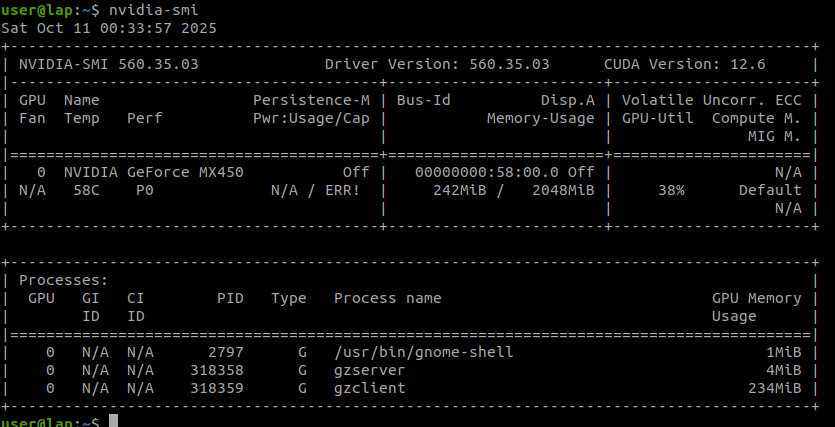

{{ page_folder_links() }}

## Docker with nvidia support
### Docker runtime on host

- install nvidia-container-toolkit on host
- Config docker run time

```bash
docker info | grep -i runtime
#
 Runtimes: runc io.containerd.runc.v2
 Default Runtime: runc
```

```bash
sudo nvidia-ctk runtime configure --runtime=docker
sudo systemctl restart docker
```

```bash title="runtime changed to nvidia"
docker info | grep -i runtime
 Runtimes: nvidia runc io.containerd.runc.v2
```

```bash
cat /etc/docker/daemon.json
#
{
    "runtimes": {
        "nvidia": {
            "args": [],
            "path": "nvidia-container-runtime"
        }
    }
}
```

---

### Dev environment using docker

```
├── CMakeLists.txt
├── .devcontainer
│   ├── devcontainer.json
│   └── Dockerfile
├── docker-compose.yaml
├── .gitignore
├── src
│   ├── CMakeLists.txt
│   └── listener.cpp
└── .vscode
    ├── c_cpp_properties.json
    └── settings.json
```

<details>
    <summary>Docker</summary>

```docker
--8<-- "docs/Simulation/Gazebo_Classic/dev/code/.devcontainer/Dockerfile"
```
</details>


<details>
    <summary>devcontainer.json</summary>

```json
--8<-- "docs/Simulation/Gazebo_Classic/dev/code/.devcontainer/devcontainer.json"
```
</details>

<details>
    <summary>docker-compose.yaml</summary>

```yaml
--8<-- "docs/Simulation/Gazebo_Classic/dev/code/docker-compose.yaml"
```
</details>

!!! tip "check OpenGL"
    ```bash
    glxinfo | grep "OpenGL vendor"
    #
    OpenGL vendor string: NVIDIA Corporation
    ```
     

#### Run

```
gazebo --verbose
```

!!! tip "fps"
    The fps on my machine is about 62

!!! tip "pmap"
    The pmap command is a Linux utility that reports the memory map of a process. The memory map provides a detailed look at how a process uses memory, including all of the components it uses, such as libraries, executable code, and data
     
    ```bash
    pmap -x $(pgrep gzclient) | grep "nvidia"
    ```

!!! note "nvidia-smi"
    The process gzclient and gzserver shown on the host but not from the docker image shell why?
     


---

TODO: simple app and config the compiler and cmake


---

## Reference
- [Download all source code](docs/Simulation/Gazebo_Classic/dev/code.zip)