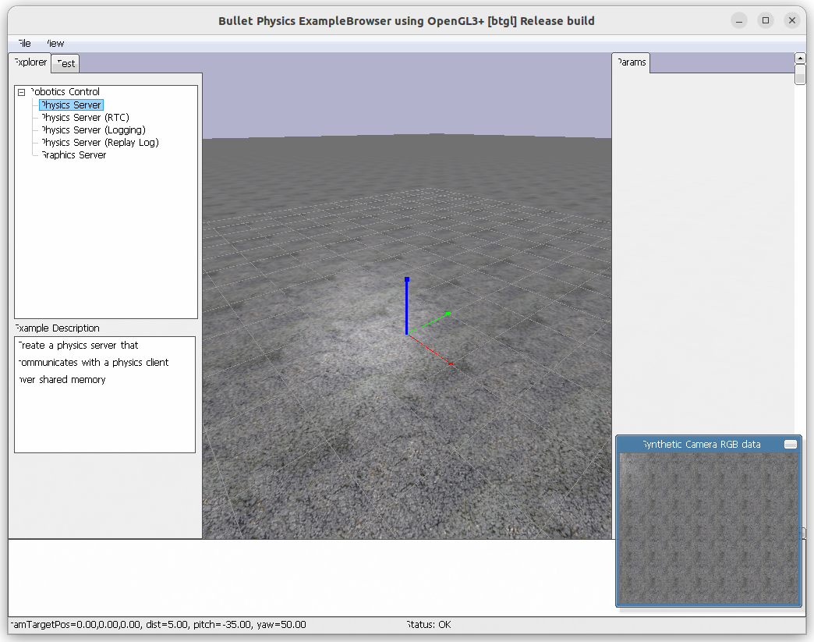

{{ page_folder_links() }}

Physics simulation for games, visual effects, robotics and reinforcement learning.

## Install
Dowload git

```bash
#run
pip install -e .
```

## Demo

```python title="hello.py"
import pybullet as p
import pybullet_data
import time

# Connect to PyBullet with GUI
p.connect(p.GUI, options="--opengl2 --egl")

# Set search path to PyBullet’s default data
p.setAdditionalSearchPath(pybullet_data.getDataPath())

# Load a simple plane and a cube
plane_id = p.loadURDF("plane.urdf")
cube_id = p.loadURDF("r2d2.urdf", [0, 0, 1])

# Add gravity
p.setGravity(0, 0, -9.8)

# Run simulation loop
while True:
    p.stepSimulation()
    time.sleep(1./240.)


```

```bash title="force opengl run on nvidia"
__NV_PRIME_RENDER_OFFLOAD=1 __GLX_VENDOR_LIBRARY_NAME=nvidia python3 hello.py
```

---

### Change ground texture

[tarmac.png](http://models.gazebosim.org/asphalt_plane/materials/textures/tarmac.png){:target="_blank"}


```python
import pybullet as p
import pybullet_data
import time

# Initialize PyBullet
physicsClient = p.connect(p.GUI)
p.setAdditionalSearchPath(pybullet_data.getDataPath())

# Create ground plane
planeId = p.loadURDF("plane.urdf")

# Add texture to the ground
textureId = p.loadTexture("tarmac.png")
p.changeVisualShape(planeId, -1, textureUniqueId=textureId)

# Set gravity and run simulation
p.setGravity(0, 0, -9.81)

while True:
    p.stepSimulation()
    time.sleep(1./240.)
```

---

### Camera

<details>
    <summary>camera</summary>

```python
--8<-- "docs/Simulation/PyBullet/code/camera.py"
```
</details>


#### computeProjectionMatrixFOV
```
projection_matrix = p.computeProjectionMatrixFOV(fov, aspect, near, far)
```

Creates a projection matrix for a virtual camera using a perspective (field-of-view) projection.  
**Parameters**:

- fov: Field of view in degrees (vertical angle).
- aspect: Aspect ratio (width/height).
- near: Near clipping plane distance.
- far: Far clipping plane distance.

**Result**:
Returns a 4x4 matrix that transforms 3D points into 2D camera space, simulating a real camera lens.
</details>

#### getCameraImage
```python
_, _, rgb, _, _ = p.getCameraImage(width, height, view_matrix, projection_matrix, renderer=p.ER_BULLET_HARDWARE_OPENGL)
```

Renders an image from the simulation as seen by the virtual camera.
**Parameters**:

- width, height: Output image size.
- view_matrix: Defines the camera’s position and orientation (where it looks from and to).
- projection_matrix: Defines how the 3D scene is projected onto the 2D image (from computeProjectionMatrixFOV).
- renderer: Rendering backend (here, OpenGL).

**Returns**:
A tuple containing image data, including the RGB image (rgb), depth, and segmentation masks.




<details>
    <summary>opencv view</summary>

```python
--8<-- "docs/Simulation/PyBullet/code/opencv.py"
```
</details>


---
- [PyBullet](https://simulately.wiki/docs/category/pybullet)
- https://medium.com/@reflectrobotics/scara-robot-modeling-and-simulation-with-pybullet-7bb204958763
- [ROS-PyBullet Interface](https://ros-pybullet.github.io/ros_pybullet_interface/)
- [ akinami3PybulletRobotics ](https://github.com/akinami3/PybulletRobotics)
- [PyBullet and Control Algorithms Workshop - La Robo Liga Event ](https://www.youtube.com/watch?v=RkHvUSGgw6Q)
- [Quick start guide](https://raw.githubusercontent.com/bulletphysics/bullet3/master/docs/pybullet_quickstartguide.pdf)
- [PyBullet Webinar 1](https://github.com/reflectrobotics/webinar/blob/master/robot.py)
- [pybullet-imu-viz](https://github.com/robofoundry/pybullet-imu-viz/tree/main)
- [intor](https://github.com/assadollahi/pyBulletIntro)