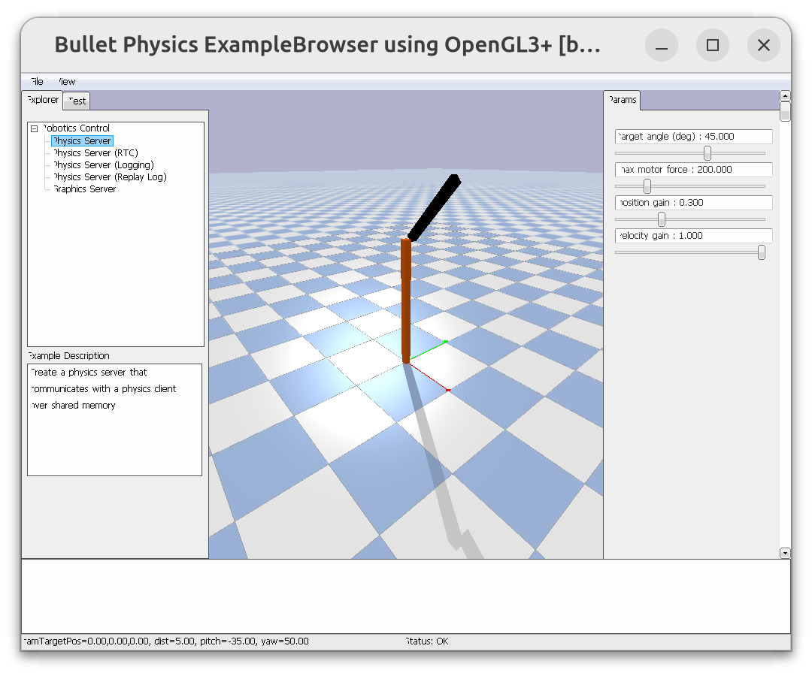

!!! tip "Default motor"
    for revolute and prismatic joint pybullet automatically **create motor that tries to hold the joint at its current position**

    to disabled the motor we changed to **Velocity control** and **force=0** on request joint

### Demo: 
- load robot urdf
- disabled default motor

[robot urdf](code/urdf/rrbot.urdf)

<details>
<summary>Robot without control</summary>
```
--8<-- "docs/Simulation/PyBullet/tutorials/control/code/no_control.py"
```
</details>

---

## Position control

<details>
<summary>Robot without control</summary>
```
--8<-- "docs/Simulation/PyBullet/tutorials/control/code/position.py"
```
</details>



#TODO: explain setJointMotorControl2

---

## Force Control with PID

<details>
<summary>Robot force control with custom PID</summary>
```
--8<-- "docs/Simulation/PyBullet/tutorials/control/code/force_control_pid.py"
```
</details>

# TODO: explain the pid part
