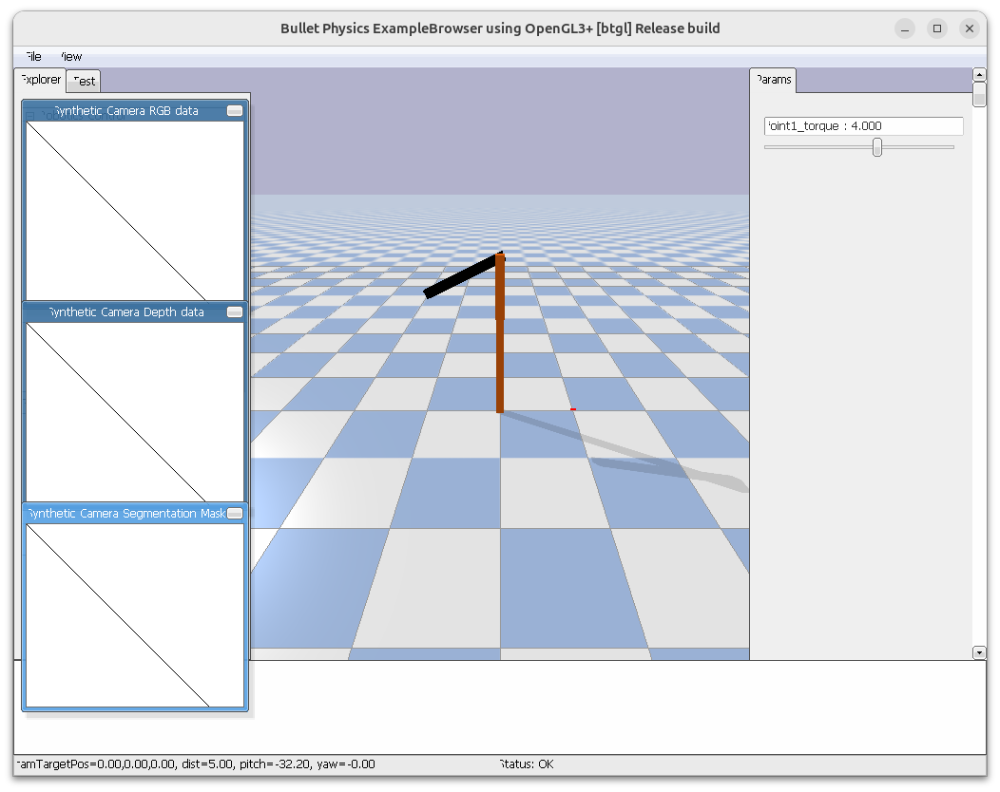

## Joint and Link info
```python
import pybullet as p
import pybullet_data

# setup
p.connect(p.DIRECT)
p.resetSimulation()
p.setGravity(gravX=0, gravY=0, gravZ=-9.8)
p.setAdditionalSearchPath(path=pybullet_data.getDataPath())

# load URDF
robo = p.loadURDF(
    "franka_panda/panda.urdf", basePosition=[1, 0, 0.1], useFixedBase=True
)

# joints
dic_info = {
    0: "joint Index",  # starts at 0
    1: "joint Name",
    2: "joint Type",  # 0=revolute (rotational), 1=prismatic (sliding), 4=fixed
    3: "state vectorIndex",
    4: "velocity vectorIndex",
    5: "flags",  # nvm always 0
    6: "joint Damping",
    7: "joint Friction",  # coefficient
    8: "joint lowerLimit",  # min angle
    9: "joint upperLimit",  # max angle
    10: "joint maxForce",  # max force allowed
    11: "joint maxVelocity",  # max speed
    12: "link Name",  # child link connected to this joint
    13: "joint Axis",
    14: "parent FramePos",  # position
    15: "parent FrameOrn",  # orientation
    16: "parent Index",  # −1 = base
}
for i in range(p.getNumJoints(bodyUniqueId=robo)):
    joint_info = p.getJointInfo(bodyUniqueId=robo, jointIndex=i)
    print(f"--- JOINT {i} ---")
    print({dic_info[k]: joint_info[k] for k in dic_info.keys()})

# links
for i in range(p.getNumJoints(robo)):
    link_name = p.getJointInfo(robo, i)[12].decode("utf-8")  # field 12="link Name"
    dyn = p.getDynamicsInfo(robo, i)
    pos, orn, *_ = p.getLinkState(robo, i)
    dic_info = {"Mass": dyn[0], "Friction": dyn[1], "Position": pos, "Orientation": orn}
    print(f"--- LINK {i}: {link_name} ---")
    print(dic_info)

```

- **getNumJoints**: getNumJoints returns an integer value representing the number of joints. (page 23)
- **getJointInfo**: query joint information (page 23)
- **getDynamicsInfo**: get information about the mass, center of mass, friction and other properties of the
base and links. (page 37-38)
- **getLinkState**: query the Cartesian world position and orientation for the link center of mass (page 31)

---

## Movement Control

- Force / Torque
- Velocity
- Position


[robot urdf](code/rrbot.urdf)


### Position control
```python title="position control"
import pybullet as p
import time
import pybullet_data


p.connect(p.GUI)
p.setGravity(0, 0, -9.8)

# Default PyBullet assets
p.setAdditionalSearchPath(pybullet_data.getDataPath())
plane_id = p.loadURDF("plane.urdf")

# Additional URDFs location
p.setAdditionalSearchPath("/workspaces/pybullet_tutorial/demos/urdf")
# fix base to world
robot_id = p.loadURDF("rrbot.urdf", useFixedBase=True)

# add slider for each joint
joint_sliders = {}
num_joints = p.getNumJoints(robot_id)
for i in range(num_joints):
    info = p.getJointInfo(robot_id, i)
    j_name = info[1].decode("utf-8")
    j_type = info[2]

    slider_id = p.addUserDebugParameter(j_name, -3.14, 3.14, 0.0)
    joint_sliders[i] = slider_id


while p.isConnected():
    for j, slider_id in joint_sliders.items():
        target = p.readUserDebugParameter(slider_id)
        # set joint position
        p.setJointMotorControl2(
            robot_id,
            j,
            controlMode=p.POSITION_CONTROL,
            targetPosition=target,
            force=5.0
        )
    p.stepSimulation()
    time.sleep(1./240.)


```


### setJointMotorControl2

We can control a robot by setting a desired control mode for one or more joint motors. During the stepSimulation the physics engine will simulate the motors to reach the given target value that can be reached within the **maximum motor forces and other constraints**. (page 25)

---

### Control Velocity

```python
import pybullet as p
import time
import pybullet_data


p.connect(p.GUI)
p.setGravity(0, 0, -9.8)

# Default PyBullet assets
p.setAdditionalSearchPath(pybullet_data.getDataPath())
plane_id = p.loadURDF("plane.urdf")

# Additional URDFs location
p.setAdditionalSearchPath("/workspaces/pybullet_tutorial/demos/urdf")
# fix base to world
robot_id = p.loadURDF("rrbot.urdf", useFixedBase=True)

# add slider for each joint
joint_sliders = {}
num_joints = p.getNumJoints(robot_id)
for i in range(num_joints):
    info = p.getJointInfo(robot_id, i)
    j_name = info[1].decode("utf-8")
    j_type = info[2]

    slider_id = p.addUserDebugParameter(j_name, -2, 2, 0.0)
    joint_sliders[i] = slider_id


while p.isConnected():
    for j, slider_id in joint_sliders.items():
        target = p.readUserDebugParameter(slider_id)
        # set joint position
        p.setJointMotorControl2(
            robot_id,
            j,
            controlMode=p.VELOCITY_CONTROL,
            targetVelocity=target,
            force=5.0
        )
    p.stepSimulation()
    time.sleep(1./240.)

```

### control with force / torque

!!! Tip Disable default motors

    ```python
    # Disable default motors
    for j in range(num_joints):
        p.setJointMotorControl2(robot_id, j, p.VELOCITY_CONTROL, force=0)
    ```

!!! Tip
    Start slightly away from upright so gravity is non-zero

    ```python
    # 
    p.resetJointState(robot_id, 0, 0.2)
    ```

```python
import pybullet as p
import time
import pybullet_data

p.connect(p.GUI)
p.setGravity(0, 0, -9.8)

# Default assets
p.setAdditionalSearchPath(pybullet_data.getDataPath())
plane_id = p.loadURDF("plane.urdf")

# Your URDFs
p.setAdditionalSearchPath("/workspaces/pybullet_tutorial/demos/urdf")
robot_id = p.loadURDF("rrbot.urdf", useFixedBase=True)

num_joints = p.getNumJoints(robot_id)

# Disable default motors
for j in range(num_joints):
    p.setJointMotorControl2(robot_id, j, p.VELOCITY_CONTROL, force=0)

# Optional: reduce damping so it moves easier
for j in range(num_joints):
    p.changeDynamics(robot_id, j, linearDamping=0, angularDamping=0)

# Start slightly away from upright so gravity is non-zero
p.resetJointState(robot_id, 0, 0.2)

# Torque slider ONLY for joint 1 (revolute)
MAX_TORQUE = 20.0
slider_id = p.addUserDebugParameter("joint1_torque", -MAX_TORQUE, MAX_TORQUE, 0.0)

while p.isConnected():
    torque = p.readUserDebugParameter(slider_id)

    p.setJointMotorControl2(
        robot_id,
        0,  # control joint1 only
        controlMode=p.TORQUE_CONTROL,
        force=torque
    )

    p.stepSimulation()
    time.sleep(1./240.)

```



TODO: show joint angel
TODO: calc the torque need to apply for this angel

$$\tau = m g r \sin(\theta)$$

$$\tau_\text{max,gravity} = m g r ≈ 1 \cdot 9.81 \cdot 0.45 ≈  4.4 \text{Nm}$$

If the joint comes to rest at some angle θ because of damping, static equilibrium is roughly:

$$\tau_\text{applied} + \tau_\text{gravity}(\theta) = 0$$

$$4.0 - (m g r \sin\theta) = 0
\Rightarrow \sin\theta = \frac{4.0}{1 \cdot 9.81 \cdot 0.45} ≈ 0.906$$

$$ \sin\theta = 0.906 ; \theta=65deg$$