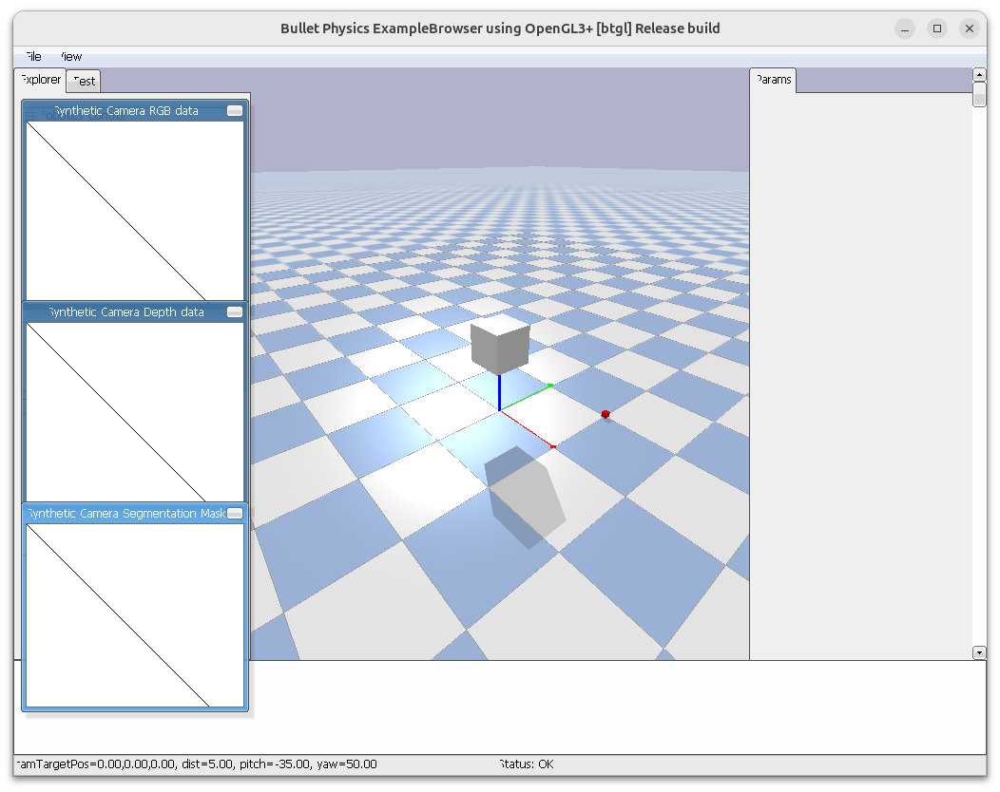

```python
import pybullet as p
import pybullet_data
import time

# setup
p.connect(p.GUI)
p.resetSimulation()
p.setGravity(gravX=0, gravY=0, gravZ=-9.8)
p.setAdditionalSearchPath(path=pybullet_data.getDataPath())

# load URDF
plane = p.loadURDF("plane.urdf")

cube = p.loadURDF(
    "cube.urdf", basePosition=[0, 0, 1], globalScaling=0.5, useFixedBase=True
)

obj = p.loadURDF("cube_small.urdf", basePosition=[1, 1, 0.1], globalScaling=1.5)
p.changeVisualShape(objectUniqueId=obj, linkIndex=-1, rgbaColor=[1, 0, 0, 1])  # red

p.setRealTimeSimulation(True)
while p.isConnected():
    time.sleep(0.01)

```



- **useFixedBase**: force the base of the loaded object to be static
- **basePosition**: create the base of the object at the specified position in
world space coordinates [X,Y,Z].
- **globalScaling**: globalScaling will apply a scale factor to the URDF
model


## changeVisualShape
check page 53 in pybullet guid

You can use changeVisualShape to change the texture of a shape, the RGBA color and other
properties.

---

## Change ground Texture

[tarmac.png](http://models.gazebosim.org/asphalt_plane/materials/textures/tarmac.png){:target="_blank"}


```python
import pybullet as p
import pybullet_data
import time
import pathlib

# Initialize PyBullet
physicsClient = p.connect(p.GUI)
p.setAdditionalSearchPath(pybullet_data.getDataPath())

# Create ground plane
planeId = p.loadURDF("plane.urdf")

# Add texture to the ground
image_path = pathlib.Path(__file__).parent.joinpath("tarmac.png").as_posix()
textureId = p.loadTexture(image_path)
p.changeVisualShape(planeId, -1, textureUniqueId=textureId)

# Set gravity and run simulation
p.setGravity(0, 0, -9.81)

while True:
    p.stepSimulation()
    time.sleep(1./240.)

```