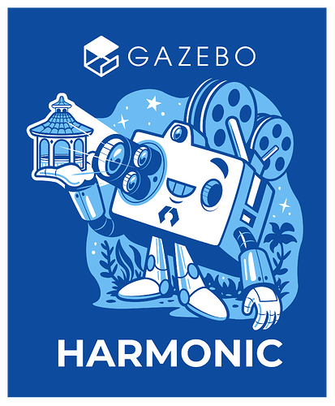
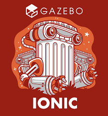
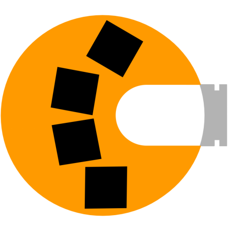

# Simulation

     

            <a href="Gazebo_Classic">
            
            
Gazebo Classic
</a>
        

    

       <a href="Gazebo">
            
            
Gazebo Harmonic
</a>
    

    

        <a href="gazebo_ionic">
            
            
Gazebo ionic
</a>
    

     

        <a href="PyBullet">
            
            
PyBullet
</a>
    

     

        <a href="godot">
            
            
Godot
</a>
    

   

## Resources
- [best-of-robot-simulators](https://github.com/knmcguire/best-of-robot-simulators)
- [Gazebo meeting](https://vimeo.com/osrfoundation)

