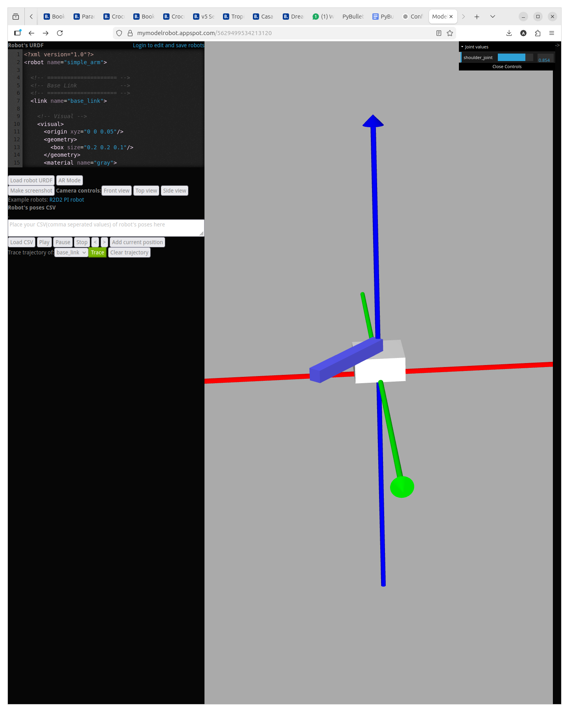

**URDF** = Unified Robot Description Format

It is an XML format that describes:

- Links (rigid bodies)
- Joints (connections)
- Visual shape
- Collision shape
- Inertial properties


!!! tip "Robot = Links + Joints"
    


---

```xml
<?xml version="1.0"?>
<robot name="box_robot">

  <link name="base_link">

    <visual>
      <geometry>
        <box size="0.5 0.3 0.2"/>
      </geometry>
      <origin xyz="0 0 0"/>
    </visual>

    <collision>
      <geometry>
        <box size="0.5 0.3 0.2"/>
      </geometry>
    </collision>

    <inertial>
      <mass value="1.0"/>
      <inertia 
        ixx="0.01" ixy="0.0" ixz="0.0"
        iyy="0.01" iyz="0.0"
        izz="0.01"/>
    </inertial>

  </link>

</robot>

```


| Tag         | Purpose               |
| ----------- | --------------------- |
| `visual`    | What you see          |
| `collision` | What physics uses     |
| `inertial`  | Mass + inertia tensor |


!!! tip "quick preview"
    - web: [MyModelRobot](https://mymodelrobot.appspot.com) 
    - app: [urdf-viz](https://github.com/openrr/urdf-viz/releases)
    


---

## URDF rules

- Rule1: urdf is a **tree** (not a graph) no loop allowed
- Rule2: Every link need **inertia** if it move
- Rule3: Visual and collision should usually math, but collision can be simplified for performance

---

## Joints
A joint defines:

- Where the child frame is placed relative to the parent
- Around which axis it moves
- Motion limits

!!! info 
    The joint defines the **child link frame**.


joint types: 

- fixed
- revolute
- continuous
- prismatic
- floating
- planar

!!! tip "Joint does TWO things"
    
- Places child frame relative to parent
- Allows motion of child frame relative to parent


### Limits

#### effort
maximum torque allowed (Nm)

Physics engines simulate motors.
If no effort limit exists:

- The motor could apply infinite torque
- That is non-physical
- Simulation becomes unstable

##### Example
Arm:
- mass = 0.5 kg
- COM = 0.2 m
- gravity = 9.81

$$\tau = 0.5 \cdot 9.81 \cdot 0.2 ≈ 0.98 \text{ Nm}$$

so effort 20 Nm is plenty but if we set the `effort="0.5"` the motor might not lift the arm


#### velocity
Maximum allowed joint speed.

In real motors:
- Motors have max RPM.
- Gearboxes limit speed.

Physics engine enforces:
- If you command faster motion,
- It will clamp at velocity limit.

---

### Demo: Revolute Joint

```
base_link → revolute joint → arm_link
```

<details>
<summary>Arm</summary>
```xml
--8<-- "docs/Simulation/urdf/code/arm.urdf"
```
</details>


```xml
<joint name="shoulder_joint" type="revolute">
    <parent link="base_link"/>
    <child link="arm_link"/>
    <origin xyz="0 0 0.1" rpy="0 0 0"/>

```

```
base_link frame
   |
   | 0.1m up
   ↓
arm_link frame (this is defined by joint origin)
```




---

# Center Of Mass (COM)
The **center of mass** is the point where the mass of the object is balanced

Physics engine assume:

- Gravity acts at COM
- Force apply at COM
- Inertia is compute around COM

## origin
Where is the element locate relative to is parent frame

| Tag                | Meaning                  |
| ------------------ | ------------------------ |
| `visual/origin`    | Where the shape is drawn |
| `collision/origin` | Where collision shape is |
| `inertial/origin`  | Where COM is             |


