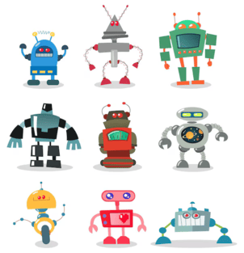
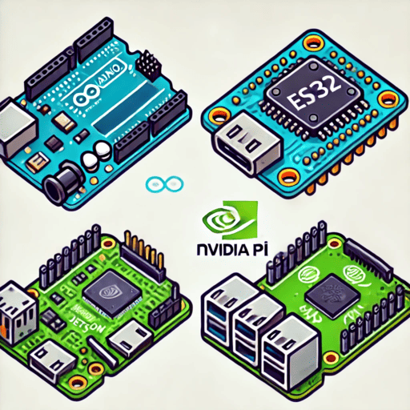

    

        <a href="ROS">
        
        
ROS
</a>
    

    

        <a href="Simulation">
        
        
Simulation
</a>
    

    

        <a href="Robotics">
        
        
Robotics
</a>
    

    

        <a href="Programming">
        
        
Programming
</a>
    

    

        <a href="Embedded">
        
        
Embedded
</a>
    

    

        <a href="DevOps">
        
        
DevOps
</a>
    

